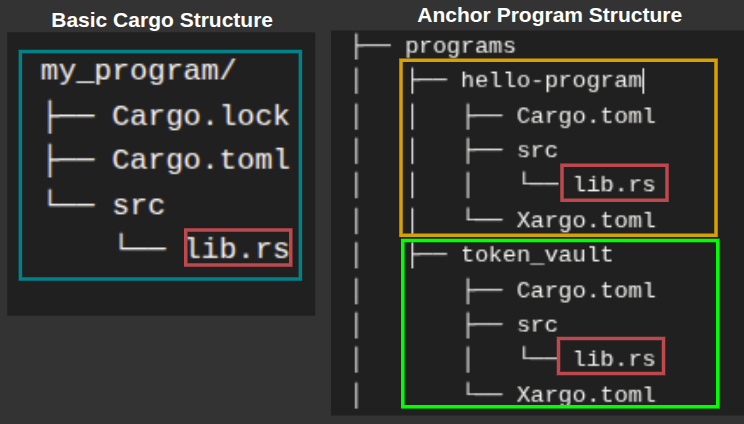
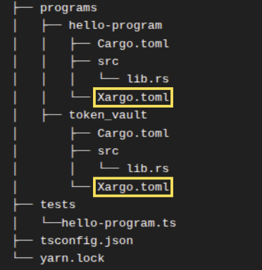
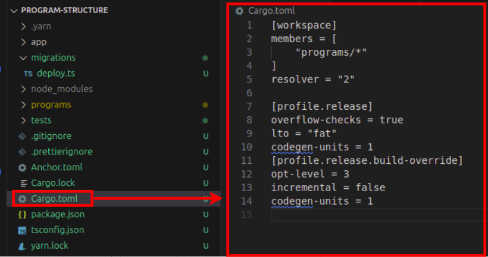
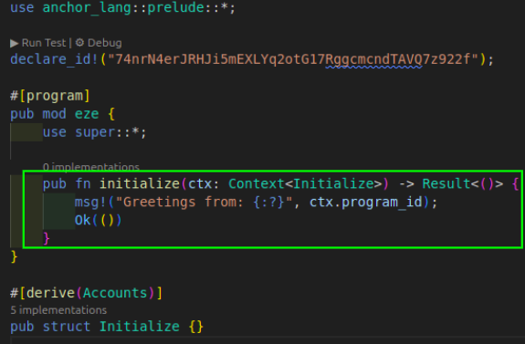
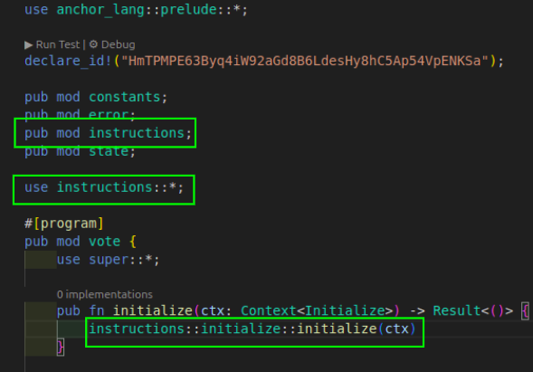

# Organizing a Solana Program

Solana programs don’t enforce a particular codebase structure, so code organization often depends on the developer’s preference and program complexity. In fact, a Solana program can exist as a single `lib.rs` file, as we’ve seen so far in this series.

But as your program grows in complexity, you’ll want to separate logic and data into contextual files and a clear folder structure to make the code easier to locate, maintain, and extend.

The Solana development ecosystem follows a common pattern for organizing the different parts of a program. This article teaches how to organize a Solana program following this pattern for both Anchor and raw Solana programs.

## Components of a Solana program structure

### Basic unit structure of a Solana program

Every Solana program is a Rust Cargo library crate. That means the default structure starts as a Cargo project, with `Cargo.toml` which defines dependencies and build configuration, and `lib.rs` which contains the program logic. You can generate this structure by running the command `cargo init --lib my_program` and the generated program structure will be as shown below:

```bash
my_program/
├── Cargo.lock
├── Cargo.toml
└── src
    └── lib.rs
```

To make this a Solana program, we’ll need to add the code below to the `Cargo.toml` file.

```bash
[lib]
crate-type = ["cdylib", "lib"]

[dependencies]
solana-program = "2.0.0"
```

Here is what the configuration above mean:

- The `[lib]` section with `crate-type = ["cdylib", "lib"]` tells Cargo to compile the program both as a dynamic library (`cdylib`), which Solana requires for deployment as a `.so` file, and as a standard Rust library (`lib`) for local testing or reusing logic across programs.
- The `solana-program = "2.0.0"` dependency pulls in the Solana SDK crates, which provide access to Solana’s runtime types, macros, and helper functions for writing on-chain programs.

### Components of a Solana program

To properly understand how to structure a Solana program codebase, let’s first understand the logical components ****that make up a Solana program. Each program typically includes the following parts:

- **Entry point**: defines the first function the Solana runtime will call.
- **Instructions:** define what actions the program can perform and how input data is serialized and deserialized, i.e. how the arguments to functions are structured.
- **Instruction processing:** implements the logic that executes each instruction — this is where the core computation happens.
- **Accounts:** describe the on-chain data layout. Each account type specifies what state it holds and how it’s serialized (commonly with the `borsh` crate directly or `Anchor` macros). We also need to define accounts we will interact with.
- **Error handling:** provides descriptive error codes to simplify debugging and client-side error interpretation.
- **Tests:** verify that your program behaves as expected when deployed locally.

We can structure a simple Solana program with files that represent the above concepts as shown below. In this structure, `lib.rs` serves as the program’s root; it exposes modules and links them together. The `entrypoint.rs` file defines the function that Solana’s runtime calls when the program is invoked. This entrypoint function, conventionally named `process_instruction`, implements a dispatcher that routes each incoming instruction to its corresponding handler (as discussed in previous tutorials).

Each remaining file corresponds to one of the logical components described above. 

```
program/
   ├── src/
   │   ├── entrypoint.rs      // Program entry point (process_instruction)
   │   ├── instruction.rs     // Instruction enum and data structures
   │   ├── processor.rs       // Business logic for each instruction
   │   ├── state.rs          // Account data structures
   │   ├── error.rs          // Custom error types
   │   └── lib.rs            // Module declarations and re-exports
```

While, these file names can be arbitrary, it’s conventional to use names that relate to the concept being implemented.

The above structure is similar in both Anchor and raw Solana programs. The main difference is that Anchor uses macros to generate the entrypoint and the processors automatically, while in raw Solana programs, you define it manually. This structure works for simple programs, as your program grows larger, you’ll have multiple instructions, processors, or states which means you might need to organize them in folders.

Let’s dive into how a Solana program should be organized.

## Anchor project structure

Anchor simplifies Solana program development by abstracting most of the boilerplate required in raw Solana programs. It also provides a consistent project template that supports the entire workflow, from writing the program to building, testing, and deploying it.

Below is a typical structure of an Anchor project, which you’ve already seen several times in this series. 

```bash
├── Anchor.toml
├── app
├── Cargo.lock
├── Cargo.toml
├── migrations
│   └── deploy.ts
├── package.json
├── programs
│   ├── hello-program
│   │   ├── Cargo.toml
│   │   ├── src
│   │   │   └── lib.rs
│   │   └── Xargo.toml
│   ├── token_vault
│       ├── Cargo.toml
│       ├── src
│       │   └── lib.rs
│       └── Xargo.toml
├── tests
│   └──hello-program.ts
├── tsconfig.json
└── yarn.lock
```

Each part of this structure serves a specific role in Anchor’s workflow: 

- **The `Anchor.toml` file** defines build and deployment settings
- **The `migrations`** folder stores deployment scripts
- **The `tests`** directory includes integration tests that run on a local validator
- **The `app`** directory can contain client code that interacts with the deployed program

Observe that the `programs` directory in Anchor contains subdirectories that mirror the basic Cargo boilerplate structure we discussed earlier, which was only for one program.

An Anchor project is structured so you can work on multiple on-chain Solana programs within one project. The illustration below compares a typical Rust Cargo project to how Anchor organizes its projects.



### **Difference between both Anchor and raw Solana structures**

- **Anchor** generates these files fully configured for immediate compilation. You can run `anchor build` right after creating the project and get a working program binary.
- **For the raw Solana program setup with Cargo**, you manually configure the Cargo boilerplate as a Solana program by adding the dependencies and crate type settings to `Cargo.toml` as we discussed earlier. And if you want to run multiple programs in one project, you need a `programs` directory, like Anchor’s `programs` directory. It’s conventional to use the name `programs` to hold program directories, even though you can use any name, and you configure each program through its own `Cargo.toml` file.

Notice that `Xargo.toml` files are in the Anchor’s generated project structure. 



They are Anchor’s default configuration file that handles how Anchor programs are compiled to the  [Extended Berkeley Packet Filter (eBPF) bytecode](https://rareskills.io/post/solana-compute-unit-price#what-is-ebpf?). We’ll learn more about this in the next section.

### **How Anchor handles cross-compilation to eBPF**

The `Xargo.toml` file inside each program tells Rust how to compile your code for Solana's blockchain environment. Your Solana program runs in the Solana Virtual Machine (SVM) on validators, which executes [Extended Berkeley Packet Filter (eBPF) bytecode](https://rareskills.io/post/solana-compute-unit-price#what-is-ebpf?). 

When you write Rust code on your machine and compile it, the Rust compiler normally produces instructions for your computer's processor (such as x86 or ARM). But Solana validators can't execute those instructions. They only understand eBPF bytecode.

This compilation process for a different architecture is called cross-compilation. The `Xargo.toml` file specifies how the Rust compiler should build your code for eBPF instead of your local machine. The file controls which parts of Rust's standard library get included in the final compiled program.

Solana programs have strict size limits (10 MB), so the `Xargo.toml` configuration ensures the compiled program includes only what your program needs. Anchor generates the `Xargo.toml` file automatically when you run `anchor init {project-name}` or `anchor new {program-name}`. You won't need to modify it. The content of the `Xargo.toml` file looks like this:

```bash
[target.bpfel-unknown-unknown.dependencies.std]
features = []
```

The target name `bpfel-unknown-unknown` is a **Rust compilation target triple**. It tells the Rust compiler what kind of machine and environment it’s building for. It has 3 parts, separated by hyphen. Here is what each part means:

- `bpfel` - compile for the BPF architecture with little-endian byte ordering
- `unknown` - the first unknown means, do not compile for any specific OS
- `unknown` - the last unknown means, do not compile for any specific ABI (Application Binary Interface)

The empty `features` ( `features = []`) array means you're using a minimal version of the standard library optimized for blockchain deployment.

Raw Solana programs handle cross-compilation differently. You build your program with `cargo-build-sbf`, which compiles your Rust code to eBPF bytecode without needing a separate `Xargo.toml` file.

### How Anchor structures multiple programs

Anchor uses Cargo workspace to manage multiple programs in one project. A workspace allows you to work on several related programs that share dependencies and build configurations. 

Anchor uses two types of `Cargo.toml` files with different purposes. The root `Cargo.toml` defines the workspace structure and shared build configurations. Each program directory contains its own `Cargo.toml` that declares that specific program's dependencies.

Even if two Solana programs use the same Rust crate, each one must declare it separately in the `Cargo.toml` file inside the program’s directory. You can't declare a dependency once at the workspace level and have all programs inherit it.

If two programs in the same Anchor workspace, say `A` and `B`, depend on the same crate, they may use it differently. Program `A` might use one library function while program `B` uses five. This affects how much of the library can be pruned during compilation.

**But programs share build configurations.** Workspace dependencies and build configurations are defined in the `Cargo.toml` file located in your Anchor project root which also contains several default settings as shown in the screenshot below. 

The `[workspace]` section of the `Cargo.toml` file in the root directory defines a `members` array which defines specific directories that are part of the workspace. Observe that it contains `[”programs/”]` which is the name of your default Solana programs directory. The Cargo file below is a root `Carog.toml` file:



Here is what each section in the root `Cargo.toml` file means:

**The `[workspace]`** section defines which program belongs to the workspace and controls how Cargo handles dependencies across multiple related packages.

- `members = ["programs/*"]` - Every sub-directory inside `programs` belongs to this workspace
- `resolver = "2"` - This setting tells Cargo to use its newer dependency resolution algorithm (the version 2)

**The `[profile.release]`** section controls compilation settings when building in release mode. It allows you to configure optimization levels, debug information, and code generation behavior

- `overflow-checks = true` - Keeps arithmetic overflow checks enabled in release builds, preventing integer overflow bugs that could corrupt your program's state
- `lto = "fat"` -  This setting enables link-time optimization, which analyzes the entire program during compiler linking (a process where the compiler combines all compiled code into the final executable) to remove unused code and inline functions, reducing the final binary size. If we don’t want a faster LTO but with with less optimization we can set the `lto` parameter to `thin`
- `codegen-units = 1` - Compiles your entire program in one pass instead of splitting the compilation work across multiple parallel chunks, the higher the value, the more chunks the compilation will be divided into. Setting it to `1` allows the compiler to perform optimization across the codebase at once, producing smaller and more optimized binaries but at the cost of longer compile times. The default Rust setting is `codegen-units = 16`, which speeds up builds but can lead to slightly larger binaries.

**The `[profile.release.build-override]`** section specifies compilation settings specifically for build scripts, which are programs that run before your main code compiles to generate code or configure the build.

- `opt-level = 3` - Applies maximum optimization to build scripts
- `incremental = false` - Disables incremental compilation. Each compilation is done from start to finish. This slows down compile time but reduces the risk of leftover artifacts messing up the compilation process
- `codegen-units = 1` - Applies the same single-unit optimization to build scripts

### Anchor auto-generated code

The entire Anchor project and the individual programs within it doesn’t include an explicit `entrypoint.rs` and `processor.rs` files which are key requirements in Solana projects.  As we’ve discussed earlier, the `#[program]` attribute inside the `lib.rs` file automatically generates the entrypoint source code along with the logic to handle instruction decoding, dispatching, and account deserialization (which will normally be in the `processor.rs` file in raw Solana programs). 

The code below shows how the `#[program]` attribute is used in Anchor programs:

```bash
#[program]
pub mod hello_program {
    use super::*;

    pub fn initialize(ctx: Context<Initialize>) -> Result<()> {
        msg!("Program initialized!");
        Ok(())
    }
}
```

## **Better project organization in Anchor 1.0**

Anchor 1.0 introduces a project layout that encourages better file organization inside each program.

Running `anchor init` in Anchor 1.0 will generate all the standard projects components like instructions, state, errors, and constants in separate modules.

This change helps new developers learn cleaner patterns for organizing larger Solana programs. You can still generate the old single-file layout using the `--template single` flag (`anchor init --template single` ).

Here’s an example of what the new default structure will look like:

```bash
programs
└── vote
    ├── Cargo.toml
    └── src
        ├── instructions
        │   ├── initialize.rs
        │   └── mod.rs
        ├── state
        │   └── mod.rs
        ├── constants.rs
        ├── error.rs
        └── lib.rs

```

There are two new items to note: the `mod.rs` files inside each directory and the `initialize.rs` instruction module. We’ll discuss them in a later section.

With this new structure, you no longer begin a program with a single `lib.rs` file that mixes accounts and instructions. Instead, your state lives in its own directory, and each instruction sits in its own module.

The example below shows the older single-file pattern that Anchor used by default, where the program logic and account types sit together inside `lib.rs`.

```bash
use anchor_lang::prelude::*;

declare_id!("6uAEFiYjmgJhCCqw8JPH8chZRWJPzHFBJYuZFMWaML3w");

#[program]
pub mod program_structure {
    use super::*;

    pub fn initialize(ctx: Context<Initialize>) -> Result<()> {
        msg!("Greetings from: {:?}", ctx.program_id);
        Ok(())
    }
}

#[derive(Accounts)]
pub struct Initialize {}
```

## Standard Solana program structure

At this point, you’ve seen what each part of a Solana program does and how Anchor organizes them automatically. But even without Anchor, you can follow a consistent, modular layout that ensures your program is maintainable.

We’ve studied how some of the top Solana projects structure their programs and noticed a consistent pattern that promotes collaboration, maintainability, and scalability. A typical Solana program follows the structure below, with an entrypoint and processor directories defined explicitly only in raw Solana programs.

```bash
program/
├── Cargo.toml
└── src/
    ├── entrypoint.rs
    ├── instructions/
		│   ├── mod.rs
		│   ├── initialize.rs
		│   └── transfer.rs
    ├── processor/
    │   ├── mod.rs
    │   ├── initialize.rs
    │   └── transfer.rs
    ├── state/
    │   ├── mod.rs
    │   ├── account.rs
    │   └── config.rs
    ├── error.rs
    ├── utils/
		│   ├── mod.rs
		│   ├── pda.rs
		│   ├── math.rs
		│   └── validation.rs
    └── lib.rs
```

We introduced new files: the `mod.rs` for each directory and the `initialize.rs` in the previous section and in the structure above. Let’s explain them:

### **`mod.rs` file**

The `mod.rs` file serves as the module declaration point for a directory in Rust. When you organize related code into a folder like `instructions/`, Rust doesn't automatically recognize the files inside as part of your program. You need to explicitly tell Rust which files should be compiled and made accessible to other parts of your codebase, that’s the job of `mod.rs`(and it’s not arbitrary, Rust expects this exact filename when defining a module through a directory).

Here's what `instructions/mod.rs` looks like:

```rust
pub mod initialize;
pub mod transfer;
```

Each line declares a file in the directory as a module. The `pub` keyword makes these modules publicly accessible outside the instructions directory. Without these declarations, Rust won't compile `initialize.rs` or `transfer.rs`, and other parts of your program can't import their contents.

In your `lib.rs` file, you then expose the instructions module to make it available throughout your program:

```rust
pub mod instructions;
pub use instructions::*;
```

This pattern repeats for every directory in your program. 

- The `processor/mod.rs` file declares processor modules
- The `state/mod.rs` declares state modules
- and `utils/mod.rs` declares utility modules.

### `instructions/initialize.rs` file

The initialize function in an Anchor lib.rs file is an Anchor convention for setting up your programs initial state for your instructions. We can relocate that state initialization to a different file to keep your lib.rs file clean.

This is how the default generated initialize function looks in the lib.rs file:



Here is how you’ll use the initialize function in your `lib.rs` file for Anchor projects when you’ve moved it to a dedicated `initialize.rs` file and made it a module in the instructions directory:



### `processors` directory

In raw Solana, `processor/` implements the instruction handlers. Each processor module corresponds to an instruction module in `instructions/`.

### Anchor Structure modularized

A standard Anchor style program structure for individual programs would look like the one below, without an entrypoint or a processor file. This structure mirrors Anchor version 1.0 project structure:

```bash
programs/
└── my_program/
    ├── Cargo.toml
    └── src/
        ├── lib.rs             
        ├── instructions/
        │   ├── transfer.rs
        │   └── mod.rs
        ├── state/
        │   ├── config.rs
        │   ├── account.rs
        │   └── mod.rs
        ├── error.rs
		    ├── utils/
				│   ├── mod.rs
				│   ├── pda.rs
				│   ├── math.rs
				│   └── validation.rs

```

With this structure, it becomes easier for developers to locate related logic, reason about the program flow, and extend functionality without breaking existing behavior regardless of whether it’s a raw Solana program or Anchor.

*This article is part of a [tutorial series on Solana](http://rareskills.io/solana-tutorial).*