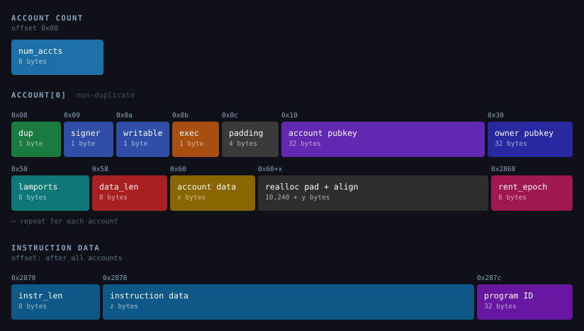
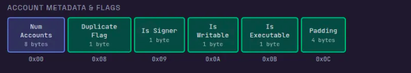
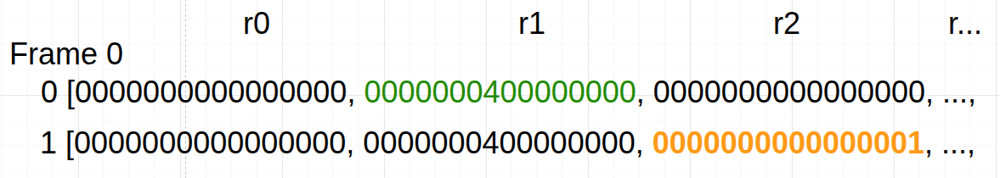
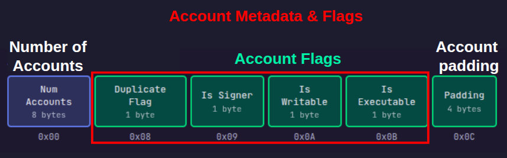
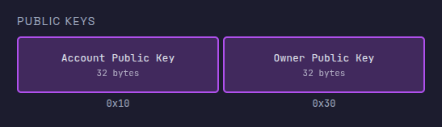
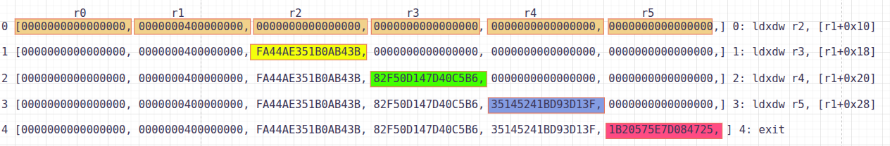
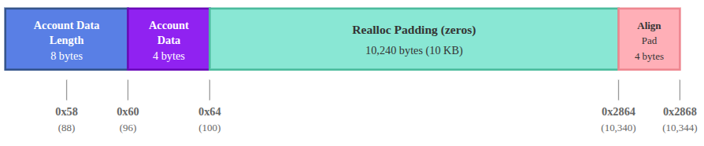

# Reading Solana Instruction inputs using sBPF assembly

In the previous tutorial, we introduced the sBPF memory layout and explained the purpose of each register during program execution.

In this tutorial, we'll demonstrate how to read instruction input fields like account keys, program ID, and instruction data using sBPF assembly. In doing so, we’ll observe how they are laid out in memory.

## Writing Assembly to read data from sBPF memory

**When a Solana program runs, the runtime serializes the program’s instruction inputs (accounts, instruction data, program ID) and loads them into the input memory region starting at `0x400000000`**. 

We'll write simple assembly programs that read data from this input memory region into registers.

### **Setup**

Create a new folder named `assembly-experiment`. Open a terminal in this folder and run `solana-test-validator`. This starts a local Solana cluster and creates a `test-ledger` directory to store ledger data.

Create the following folders and files in the `assembly-experiment` directory:

- A `src` folder to hold your assembly program and trace output
- A `src/inputs.asm` file for your assembly code
- A `src/instructions.json` file for the transaction data that gets serialized and sent to the program

After creating the folder and files, the `assembly-experiment` folder should look like this:

```bash
assembly-experiment/
├── test-ledger/
└── src/
    ├── inputs.asm
    └── instructions.json
```

**Instruction serialization layout reference diagram**

Remember the instruction serialization diagram from the previous tutorial? It maps the byte offset for each serialized field in memory. We'll use these offsets to read specific data from the input region in our assembly code.



### Using the ldxdw instruction to load data from memory into registers

In our assembly program, we’ll use the sBPF instruction `ldxdw` to load data from memory. This instruction performs an indexed load, where the final address is computed from a base register plus an offset.

This is what each part of the instruction means:

- `ldx` means load from memory using a register plus an offset to calculate the address (indexed load). For example: `[r1 + offset]`.  The `offset` variable will be replaced by the offset of the specific field within the serialized input.
- `dw` means the width of the load is a double-word, which is 64 bits or 8 bytes.

Each experiment must use an assembly program structured like the code below to load a value from memory into a register. The registers used in this example are arbitrary; any register would work. We use `r1` here because it contains the instruction input at entry, while `r2` has no special meaning and is used only for demonstration.

```nasm
ldxdw r2, [r1 + offset]
exit
```

This program loads 8 bytes from memory address `[r1 + offset]` into register `r2`, then exits. Register `r1` points to the start of the serialized instruction input at `0x400000000`. We’ll replace `offset` with the actual byte offset of whichever field in memory we’re reading.

To see how the `ldxdw` instruction loads values from memory, consider this part of the instruction input serialization layout shown below:



In this layout, the account count (`Num Accounts`) starts at offset `0x00`, and the duplicate flag starts at offset `0x08`. To load each value, replace `offset` with the field’s byte offset, and the VM reads from that location relative to the input base stored in `r1`. 

Unlike the EVM where instruction inputs are accessed from `calldata`, Solana loads the instruction inputs into memory before execution begins. Here's how this works in practice:

- To read the account count, use offset `0x00` and load it from memory into `r2` with `ldxdw r2, [r1 + 0x00]`. This reads from address `0x400000000` (`0x400000000 + 0`). If the instruction contains two accounts, `r2` will contain `2`.
- To read the duplicate flag, use offset `0x08` and load it with `ldxdw r2, [r1 + 0x08]`. This reads from address `0x400000008` (`0x400000000 + 8`), which is where the flag field begins.

Throughout this article, we'll use different offset values to inspect various parts of the memory region where the runtime stored the serialized instruction inputs.

Now that we've laid the foundation for understanding how to read from memory using the `ldxdw` instruction, let's create our test data.

### Setting up test input

We’ll create a test transaction instruction with a single account in the accounts array, owned by the BPF Loader. This will allow us to illustrate how the VM reads the serialized instruction input.

The test data below includes:

- An accounts array with the following format:
    - public key
    - owner
    - Account flags: not a signer, writable, not executable
    - 1,000 lamports balance
    - 4 bytes of account data: `[0, 0, 0, 3]`
- A program ID
- 4 bytes of instruction data: `[2, 0, 0, 0]`

Here is the test data, paste it into `src/instructions.json`. The runtime will use this to load the instruction into memory. Throughout this tutorial, we'll examine how the sBPF VM reads the instruction from memory.

```json
{
  "accounts": [
    {
      "key": "524HMdYYBy6TAn4dK5vCcjiTmT2sxV6Xoue5EXrz22Ca",
      "owner": "BPFLoaderUpgradeab1e11111111111111111111111",
      "is_signer": false,
      "is_writable": true,
      "lamports": 1000,
      "data": [0, 0, 0, 3]
    }
  ],
  "program_id": "HTpqQdG7f44su3QsV3HHurraR1ZNjHAdArCy3qHKyKBC",
  "instruction_data": [2, 0, 0, 0]
}
```

Below is a quick reminder of how to run the agave-ledger-tool.

### Running our assembly code

We'll use `agave-ledger-tool` to run our assembly code and trace register states after each instruction. This tool comes pre-installed with your [Solana development installation](https://rareskills.io/post/hello-world-solana).

The `agave-ledger-tool` generates execution traces showing register state transitions. Since we cannot directly view memory contents, we’ll copy values from memory into registers and inspect those registers in the trace output.

Below is the `agave-ledger-tool` command we’ll use to execute our assembly programs. It will execute our program with a 200,000 compute unit limit, write a trace file showing register states, uses our local test ledger, and takes input from our `instructions.json` file:

```bash
agave-ledger-tool program run inputs/inputs.asm --limit 200000 --trace inputs/trace.txt --ledger test-ledger --input inputs/instructions.json
```

### Reading the account count in our test input

According to the serialization format diagram we showed earlier, the first 8 bytes contain the number of accounts with an offset of `0x00`. Our input parameter contains only one account in the `accounts` list:

```json
{
  "accounts": [
    {
      "key": "524HMdYYBy6TAn4dK5vCcjiTmT2sxV6Xoue5EXrz22Ca",
      "owner": "BPFLoaderUpgradeab1e11111111111111111111111",
      "is_signer": false,
      "is_writable": true,
      "lamports": 1000,
      "data": [0, 0, 0, 3]
    }
  ],
  ... // other input parameters
} 
```

To demonstrate this, replace `offset` with `0x00` in your assembly program. This loads 8 bytes from address `r1` + `0x00` (that is, `0x400000000`) into `r2`. The choice of `r2` is arbitrary, any other argument register could be used here.

```nasm
ldxdw r2, [r1 + 0x00]
exit
```

Run the program using the `agave-ledger-tool` command, then open `inputs/trace.txt` to see the execution trace:

```nasm
Frame 0
    0 [0000000000000000, 0000000400000000, 0000000000000000, 0000000000000000, 0000000000000000, 0000000000000000, 0000000000000000, 0000000000000000, 0000000000000000, 0000000000000000, 0000000200001000]     0: ldxdw r2, [r1+0x0]
    1 [0000000000000000, 0000000400000000, 0000000000000001, 0000000000000000, 0000000000000000, 0000000000000000, 0000000000000000, 0000000000000000, 0000000000000000, 0000000000000000, 0000000200001000]     1: exit

```

The trace shows register states before and after each instruction. The array displays registers in order: `[r0, r1, r2, r3, r4, r5, r6, r7, r8, r9, r10]`.



**Line 0 shows initial state:** `r1` holds `0x400000000` (the input base address) and `r2` is zero. 

**Line 1 shows the state after the** `ldxdw r2, [r1+0x0]` **instruction execution:** `r2` now contains `1` (`0000000000000001`), which is the number of accounts in our transaction input.

### Reading account flags and padding region

The next 8 bytes, starting at offset `0x08`, contain 4 one-byte flags followed by 4 bytes of padding as shown in the diagram below. Since registers hold 8 bytes, we'll load all the flags and padding at once into a register.



The duplicate flag is a single byte at offset `0x08` with the following properties:

- if the account is unique, the duplicate flag will be `0xFF` byte.
- if the account is a duplicate of an earlier account in the accounts array, the duplicate flag should be the index of the original account.

Our test transaction data only has one account, so it cannot be a duplicate. 

We can see the content of these flags in memory by loading them into registers using the `ldxdw r2, [r1 + offset]` instruction. Replacing the `offset` variable with the offset we intend to start reading from.

Let's show that the duplicate flag has the value `0xFF` (indicating a unique account):

```nasm
ldxdw r2, [r1 + 0x08]
exit
```

Remember that `ldxdw` loads 8 bytes, not just 1 byte. So even though the duplicate flag is only the first byte at offset `0x08`, this instruction will load the duplicate flag plus the 7 bytes that follow it into `r2`. This means we'll also see the other account flags and padding that occupy offsets `0x08` through `0x0F`.

Run the program and check `src/trace.txt`:

```nasm
Frame 0
    0 [0000000000000000, 0000000400000000, 0000000000000000, 0000000000000000, 0000000000000000, 0000000000000000, 0000000000000000, 0000000000000000, 0000000000000000, 0000000000000000, 0000000200001000]     0: ldxdw r2, [r1+0x8]
    1 [0000000000000000, 0000000400000000, **00000000000100FF**, 0000000000000000, 0000000000000000, 0000000000000000, 0000000000000000, 0000000000000000, 0000000000000000, 0000000000000000, 0000000200001000]     1: exit

```

The trace shows that register `r2` now contains `00000000000100FF` (In little-endian format—the rightmost byte `FF` is at the lowest memory address `0x08`), hence we will read the highlighted bytes in reverse, which means:

- `FF` (byte 0, offset `0x08`): duplicate flag, `0xFF` means it’s not a duplicate
- `00` (byte 1, offset `0x09`): account is not a signer. In our transaction, we set this to `false` which translates to `0`
- `01` (byte 2, offset `0x0A`): account is writable. In our transaction, we set this to `true` which translates to `1`
- `00` (byte 3, offset `0x0B`): account is not executable. We did not set this, it defaults to `false`
- `00000000` (bytes 4-7, offsets `0x0C`-`0x0F`): account padding

### Reading the account public key

The next 32 bytes of the serialized instruction input contain the account's public key, followed by another 32 bytes for the owner's public key (discussed in the next section).



A register holds 8 bytes. Since we are trying to load more than 8 bytes, we have to use multiple registers. We'll load the account public key in four chunks across registers `r2`, `r3`, `r4`, and `r5`. 

The program below loads four 8-byte chunks from memory into registers. Replace the contents of `src/inputs.asm` with the following code:

```nasm
ldxdw r2, [r1+16]   ; Load bytes 16-23 (first 8 bytes of public key) into r2
ldxdw r3, [r1+24]   ; Load bytes 24-31 (next 8 bytes) into r3
ldxdw r4, [r1+32]   ; Load bytes 32-39 (next 8 bytes) into r4
ldxdw r5, [r1+40]   ; Load bytes 40-47 (last 8 bytes) into r5
exit
```

Run the program with the `agave-ledger-tool`. The trace file should now have this content:

```nasm
Frame 0
    0 [0000000000000000, 0000000400000000, 0000000000000000, 0000000000000000, 0000000000000000, 0000000000000000, 0000000000000000, 0000000000000000, 0000000000000000, 0000000000000000, 0000000200001000]     0: ldxdw r2, [r1+0x10]
    1 [0000000000000000, 0000000400000000, FA44AE351B0AB43B, 0000000000000000, 0000000000000000, 0000000000000000, 0000000000000000, 0000000000000000, 0000000000000000, 0000000000000000, 0000000200001000]     1: ldxdw r3, [r1+0x18]
    2 [0000000000000000, 0000000400000000, FA44AE351B0AB43B, 82F50D147D40C5B6, 0000000000000000, 0000000000000000, 0000000000000000, 0000000000000000, 0000000000000000, 0000000000000000, 0000000200001000]     2: ldxdw r4, [r1+0x20]
    3 [0000000000000000, 0000000400000000, FA44AE351B0AB43B, 82F50D147D40C5B6, 35145241BD93D13F, 0000000000000000, 0000000000000000, 0000000000000000, 0000000000000000, 0000000000000000, 0000000200001000]     3: ldxdw r5, [r1+0x28]
    4 [0000000000000000, 0000000400000000, FA44AE351B0AB43B, 82F50D147D40C5B6, 35145241BD93D13F, 1B20575E7D084725, 0000000000000000, 0000000000000000, 0000000000000000, 0000000000000000, 0000000200001000]     4: exit

```

Remember the string below is the public key we have in the `instructions.json` file that’s being stored in memory and loaded into registers.

```
524HMdYYBy6TAn4dK5vCcjiTmT2sxV6Xoue5EXrz22Ca
```

If we convert the public key from it’s original base58 format to hex, we’ll have this:

```
3BB40A1B35AE44FAB6C5407D140DF5823FD193BD415214352547087D5E57201B
```

We’ll split it into 8-bytes for each register since that’s what each register can store. We’ll have this:

```
0x3bb40a1b35ae44fa 0xb6c5407d140df582 0x3fd193bd41521435 0x2547087d5e57201b
```

Register values are displayed/interpreted in little-endian order, so the 8-byte chunks appear as shown below.

```
FA44AE351B0AB43B 82F50D147D40C5B6 35145241BD93D13F 1B20575E7D084725
```

Let's trace through each step:



- **Line 0**: Initial state before any loads. All registers (`r0`- `r10`) are shown, with `r1` containing `0000000400000000` (MM_INPUT_START).
- **Line 1**: After executing `ldxdw r2, [r1+16]`, register `r2` (third position) now contains `FA44AE351B0AB43B` (the first 8 bytes of the public key in little-endian format).
- **Line 2**: After executing `ldxdw r3, [r1+24]`, register `r3` (fourth position) now contains `82F50D147D40C5B6` (the next 8 bytes).
- **Line 3**: After executing `ldxdw r4, [r1+32]`, register `r4` (fifth position) now contains **`35145241BD93D13F`** (the next 8 bytes).
- **Line 4**: After executing `ldxdw r5, [r1+40]`, register `r5` (sixth position) now contains `1B20575E7D084725` (the last 8 bytes).

Comparing each register (`r2`, `r3`, `r4`, `r5`) to our expected hex values shows they match perfectly.

### Reading the owner public key

The owner public key starts at offset `0x30` (48 decimal) after the account public key and spans 32 bytes. Since each `ldxdw` instruction loads 8 bytes, you need four loads to read the entire key. The owner in our example is `BPFLoaderUpgradeab1e11111111111111111111111`

Let’s demonstrate that with the code below. Update `src/inputs.asm`:

```nasm
ldxdw r2, [r1+48]   ; Load bytes 48-55 (first 8 bytes of owner public key) into r2
ldxdw r3, [r1+56]   ; Load bytes 56-63 (next 8 bytes) into r3
ldxdw r4, [r1+64]   ; Load bytes 64-71 (next 8 bytes) into r4
ldxdw r5, [r1+72]   ; Load bytes 72-79 (last 8 bytes) into r5
exit
```

Run the code. The trace shows each register loading its 8-byte chunk:

```nasm
Frame 0
    0 [0000000000000000, 0000000400000000, 0000000000000000, 0000000000000000, 0000000000000000, 0000000000000000, 0000000000000000, 0000000000000000, 0000000000000000, 0000000000000000, 0000000200001000]     0: ldxdw r2, [r1+0x30]
    1 [0000000000000000, 0000000400000000, B0A1884E91F6A802, 0000000000000000, 0000000000000000, 0000000000000000, 0000000000000000, 0000000000000000, 0000000000000000, 0000000000000000, 0000000200001000]     1: ldxdw r3, [r1+0x38]
    2 [0000000000000000, 0000000400000000, B0A1884E91F6A802, 2BAE63F73E1510E2, 0000000000000000, 0000000000000000, 0000000000000000, 0000000000000000, 0000000000000000, 0000000000000000, 0000000200001000]     2: ldxdw r4, [r1+0x40]
    3 [0000000000000000, 0000000400000000, B0A1884E91F6A802, 2BAE63F73E1510E2, D224C1163DB9C200, 0000000000000000, 0000000000000000, 0000000000000000, 0000000000000000, 0000000000000000, 0000000200001000]     3: ldxdw r5, [r1+0x48]
    4 [0000000000000000, 0000000400000000, B0A1884E91F6A802, 2BAE63F73E1510E2, D224C1163DB9C200, 00008004107A53C0, 0000000000000000, 0000000000000000, 0000000000000000, 0000000000000000, 0000000200001000]     4: exit

```

When you convert the owner address `BPFLoaderUpgradeab1e11111111111111111111111` to hex and split it into 8-byte little-endian chunks, you get:

```
B0A1884E91F6A802 2BAE63F73E1510E2 D224C1163DB9C200 00008004107A53C0
```

These values match what appears in registers `r2` through `r5` in the trace.

### **Reading lamports**

The next 8 bytes after the owner public key contain the account's lamport balance. The lamports field is located at offset `0x50` (80 in decimal) in memory. 

Let's load the lamports field into a register and inspect it. Use `0x50` as the offset in our assembly program:

```nasm
ldxdw r2, [r1 + 0x50]
exit
```

Run the program and check `src/trace.txt`:

```
Frame 0
    0 [0000000000000000, 0000000400000000, 0000000000000000, 0000000000000000, 0000000000000000, 0000000000000000, 0000000000000000, 0000000000000000, 0000000000000000, 0000000000000000, 0000000200001000]     0: ldxdw r2, [r1+0x50]
    1 [0000000000000000, 0000000400000000, **00000000000003E8**, 0000000000000000, 0000000000000000, 0000000000000000, 0000000000000000, 0000000000000000, 0000000000000000, 0000000000000000, 0000000200001000]     1: exit
```

We see that Register `r2` holds `00000000000003E8`, which is the hex representation of 1,000 lamports. This matches the `lamports: 1000` value in our instructions file.

### Reading account data length

The next 8 bytes after the lamports field is the length of the account data, located at offset `0x58`. Update `src/inputs.asm` to read from offset `0x58`:

```nasm
ldxdw r2, [r1 + 0x58]
exit
```

Run the program and check `src/trace.txt`:

```
Frame 0
    0 [0000000000000000, 0000000400000000, 0000000000000000, 0000000000000000, 0000000000000000, 0000000000000000, 0000000000000000, 0000000000000000, 0000000000000000, 0000000000000000, 0000000200001000]     0: ldxdw r2, [r1+0x58]
    1 [0000000000000000, 0000000400000000, **0000000000000004**, 0000000000000000, 0000000000000000, 0000000000000000, 0000000000000000, 0000000000000000, 0000000000000000, 0000000000000000, 0000000200001000]     1: exit

```

Register `r2` contains `0000000000000004`, indicating our account has 4 bytes of data. This matches the 4-element array in the `data: [0, 0, 0, 3]` field of our `instructions.json` file.

### **Reading account data**

The account data starts at offset `0x60`, immediately after the account data length. Our test account has 4 bytes of data spanning offsets `0x60-0x63`. To show this, let’s load the data at `offset` `0x60`:

```nasm
ldxdw r2, [r1 + 0x60]
exit
```

Run the program. The trace shows:

```
Frame 0
    0 [0000000000000000, 0000000400000000, 0000000000000000, 0000000000000000, 0000000000000000, 0000000000000000, 0000000000000000, 0000000000000000, 0000000000000000, 0000000000000000, 0000000200001000]     0: ldxdw r2, [r1+0x60]
    1 [0000000000000000, 0000000400000000, **0000000003000000**, 0000000000000000, 0000000000000000, 0000000000000000, 0000000000000000, 0000000000000000, 0000000000000000, 0000000000000000, 0000000200001000]     1: exit
```

Register `r2` contains `0000000003000000`. The instruction loads 8 bytes, but only the first 4 bytes contain your actual data. Reading those 4 bytes right to left (little-endian) gives `[00, 00, 00, 03]`, matching `data: [0, 0, 0, 3]` from the instruction file.

### **Reading realloc padding**

After the account data, the runtime reserves `10,240` bytes (10 KiB) of zero-filled space for potential account data growth during program execution (via reallocation).

This padding starts at offset `0x64` (where our 4-byte account data ends) and extends to offset `0x2864` (10,340 in decimal).



We can show this by loading a random offset within this range from memory into a register. Let's check offset `0x1388`:

```nasm
ldxdw r2, [r1 + 0x1388]
exit
```

Run the program. Register `r2` should contain `0000000000000000`, showing that this region is filled with zeros.

```nasm
Frame 0
    0 [0000000000000000, 0000000400000000, 0000000000000000, 0000000000000000, 0000000000000000, 0000000000000000, 0000000000000000, 0000000000000000, 0000000000000000, 0000000000000000, 0000000200001000]     0: ldxdw r2, [r1+0x1388]
    1 [0000000000000000, 0000000400000000, **0000000000000000**, 0000000000000000, 0000000000000000, 0000000000000000, 0000000000000000, 0000000000000000, 0000000000000000, 0000000000000000, 0000000200001000]     1: exit

```

### **Reading alignment padding**

After the 10k realloc padding, the next field must start on an 8-byte boundary. The realloc padding ends at offset `0x2864` (10340). Because this offset is not 8-byte aligned, the runtime rounds it up to `10344`, adding 4 bytes of alignment padding.

To examine the memory contents at the boundary between the realloc padding and the next field, let's load from offset `0x2864` into `r2` and inspect the trace.

```nasm
ldxdw r2, [r1 + 0x2864]
exit
```

The trace should show `FFFFFFFF00000000` in register `r2`:

```nasm
Frame 0
    0 [0000000000000000, 0000000400000000, 0000000000000000, 0000000000000000, 0000000000000000, 0000000000000000, 0000000000000000, 0000000000000000, 0000000000000000, 0000000000000000, 0000000200001000]     0: ldxdw r2, [r1+0x2864]
    1 [0000000000000000, 0000000400000000, FFFFFFFF00000000, 0000000000000000, 0000000000000000, 0000000000000000, 0000000000000000, 0000000000000000, 0000000000000000, 0000000000000000, 0000000200001000]     1: exit
```

`FFFFFFFF00000000` in little-endian form corresponds to the bytes `00 00 00 00 FF FF FF FF`. Our `ldxdw` instruction reads across two fields: the first four zero bytes are the alignment padding, and the next four `FF` bytes are the beginning of the rent epoch field. Which we’ll discuss next.

### Reading rent epoch

The next 8 bytes after the alignment padding contain the rent epoch for the account. 

In practice, accounts in Solana are created rent-exempt, so the rent epoch field is set to the default rent-exempt value encoded as **FFFFFFFFFFFFFFFF.**

To show this, we’ll load the rent epoch from offset `10344` (`0x2868`), which is the start of the rent epoch region into `r2`.

```nasm
ldxdw r2, [r1 + 0x2868]
exit
```

Running this should show:

```
Frame 0
    0 [0000000000000000, 0000000400000000, 0000000000000000, 0000000000000000, 0000000000000000, 0000000000000000, 0000000000000000, 0000000000000000, 0000000000000000, 0000000000000000, 0000000200001000]     0: ldxdw r2, [r1+0x2868]
    1 [0000000000000000, 0000000400000000, **FFFFFFFFFFFFFFFF**, 0000000000000000, 0000000000000000, 0000000000000000, 0000000000000000, 0000000000000000, 0000000000000000, 0000000000000000, 0000000200001000]     1: exit
```

Register `r2` contains `FFFFFFFFFFFFFFFF`.

### **Reading instruction data length**

The next 8 bytes after the rent epoch contain the length of the instruction data at offset `10352`. Our test transaction includes 4 bytes of instruction data. Replace `offset` with `10352`:

```nasm
ldxdw r2, [r1 + 10352]
exit
```

The code should produce this trace when you run it:

```
Frame 0
    0 [0000000000000000, 0000000400000000, 0000000000000000, 0000000000000000, 0000000000000000, 0000000000000000, 0000000000000000, 0000000000000000, 0000000000000000, 0000000000000000, 0000000200001000]     0: ldxdw r2, [r1+0x2870]
    1 [0000000000000000, 0000000400000000, 0000000000000004, 0000000000000000, 0000000000000000, 0000000000000000, 0000000000000000, 0000000000000000, 0000000000000000, 0000000000000000, 0000000200001000]     1: exit

```

Register `r2` contains `0000000000000004`, which shows that the instruction data array has 4 bytes as specified in our `instructions.json` file.

### **Reading instruction data**

The next bytes, starting at offset `10360`, contain the instruction data. Our test includes 4 bytes: `[2, 0, 0, 0]`, (but this length varies per transaction). Replace `offset` with `10360` (`0x2878` in hex) to inspect it:

```assembly
ldxdw r2, [r1 + 0x2878]
exit
```

The code produces this trace when you run it:

```
Frame 0
    0 [0000000000000000, 0000000400000000, 0000000000000000, 0000000000000000, 0000000000000000, 0000000000000000, 0000000000000000, 0000000000000000, 0000000000000000, 0000000000000000, 0000000200001000]     0: ldxdw r2, [r1+0x2878]
    1 [0000000000000000, 0000000400000000, **BA2D9AF400000002**, 0000000000000000, 0000000000000000, 0000000000000000, 0000000000000000, 0000000000000000, 0000000000000000, 0000000000000000, 0000000200001000]     1: exit
```

Register `r2` contains `BA2D9AF400000002`. Since `ldxdw` loads 8 bytes but the instruction data is only 4 bytes long, this read also includes the first 4 bytes of the following field. The lower 32 bits (`00000002`) represent our instruction data `[2, 0, 0, 0]` in little-endian format.

### **Reading program ID**

The final 32 bytes contain the program ID of the program being invoked. Since our instruction data is 4 bytes long, it occupies offsets `10360`- `10363`. The program ID begins immediately after at offset 10364 (`0x287C` in hex).

To inspect it, we can load all 32 bytes across four registers:

```nasm
ldxdw r2, [r1+10364]
ldxdw r3, [r1+10372]
ldxdw r4, [r1+10380]
ldxdw r5, [r1+10388]
exit
```

Run the program and check the trace file:

```nasm
Frame 0
    0 [0000000000000000, 0000000400000000, 0000000000000000, 0000000000000000, 0000000000000000, 0000000000000000, 0000000000000000, 0000000000000000, 0000000000000000, 0000000000000000, 0000000200001000]    29: ldxdw r2, [r1+0x287c]
    1 [0000000000000000, 0000000400000000, C512BA35BA2D9AF4, 0000000000000000, 0000000000000000, 0000000000000000, 0000000000000000, 0000000000000000, 0000000000000000, 0000000000000000, 0000000200001000]    30: ldxdw r3, [r1+0x2884]
    2 [0000000000000000, 0000000400000000, C512BA35BA2D9AF4, 08D0A2FB506C1A71, 0000000000000000, 0000000000000000, 0000000000000000, 0000000000000000, 0000000000000000, 0000000000000000, 0000000200001000]    31: ldxdw r4, [r1+0x288c]
    3 [0000000000000000, 0000000400000000, C512BA35BA2D9AF4, 08D0A2FB506C1A71, 93EAF43A2BD4867A, 0000000000000000, 0000000000000000, 0000000000000000, 0000000000000000, 0000000000000000, 0000000200001000]    32: ldxdw r5, [r1+0x2894]
    4 [0000000000000000, 0000000400000000, C512BA35BA2D9AF4, 08D0A2FB506C1A71, 93EAF43A2BD4867A, B7CFB5A9E7B8C99A, 0000000000000000, 0000000000000000, 0000000000000000, 0000000000000000, 0000000200001000]    33: exit
```

The four registers contain the complete program ID in little-endian format. To reconstruct the program ID, we reverse the byte order of each register value and concatenate them:

- r2: `C512BA35BA2D9AF4` → `F49A2DBA35BA12C5`
- r3: `08D0A2FB506C1A71` → `711A6C50FBA2D008`
- r4: `93EAF43A2BD4867A` → `7A86D42B3AF4EA93`
- r5: `B7CFB5A9E7B8C99A` → `9AC9B8E7A9B5CFB7`

Concatenating these gives us `0xf49a2dba35ba12c5711a6c50fba2d0087a86d42b3af4ea939ac9b8e7a9b5cfb7` in hex, which decodes to `HTpqQdG7f44su3QsV3HHurraR1ZNjHAdArCy3qHKyKBC` in base58. This matches the `program_id` field in our `instructions.json` file.

## Testing with empty accounts array or instruction data

When a transaction has an empty accounts array or no instruction data, the VM only reserves space for the count fields (account count and instruction data length), which will both be 0. We'll demonstrate this with actual examples in the next article, where we discuss syscalls.

*This article is part of a [tutorial series on Solana](http://rareskills.io/solana-tutorial).*