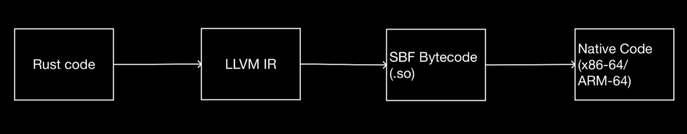
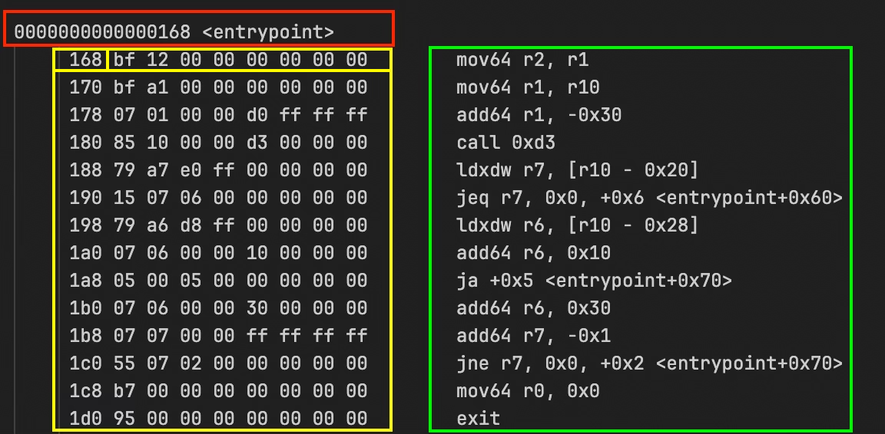
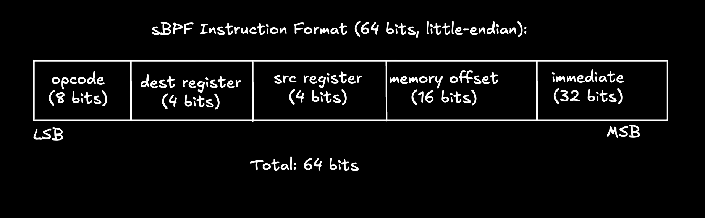
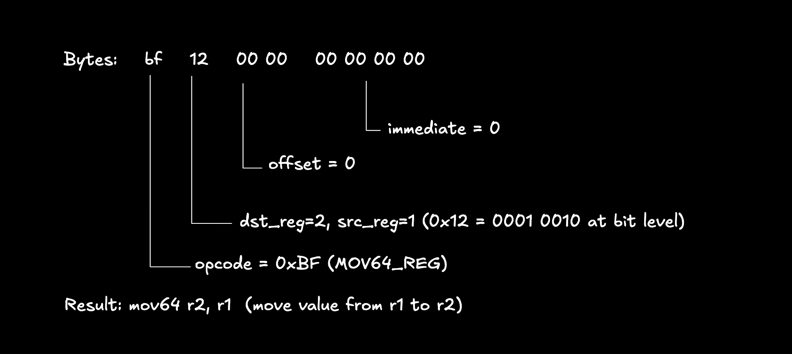

# Rust program to SBF compilation

Understanding how Rust compiles to SBF (Solana Bytecode Format) and how validators execute it is crucial for building complex Solana programs. This article explains the three-stage compilation process, helping you reason about program size, debug deployment issues, and optimize performance.

## **The Three-Stage Compilation Process for Solana Rust Programs**

When you run `cargo build-sbf`, your Rust program goes through three stages:

1. **Rust to LLVM IR**: The Rust compiler translates your code to [LLVM](https://llvm.org/) Intermediate Representation (LLVM IR)
2. **LLVM IR to SBF Bytecode (assembly)**: LLVM compiles the intermediate representation to SBF bytecode (the `.so` file we deploy)
3. **SBF to Native Code**: Solana validators have a built-in [Just-In-Time (JIT) compiler](https://en.wikipedia.org/wiki/Just-in-time_compilation) that compiles SBF bytecode to native machine code at runtime, achieving near-native execution speed

The image below summarizes this process.



The three-stage compilation process for a Solana Rust program

Now consider this simple Rust function that adds two `u64` integers:

```rust
pub fn add(a: u64, b: u64) -> u64 {
    a + b
}
```

This function will go through all three compilation stages before execution on a Solana validator. We'll use it as a running example to illustrate each stage.

## **Stage 1: Rust to LLVM IR**

The Rust compiler (`rustc`) uses [LLVM](https://llvm.org/) as its backend. LLVM is a compiler infrastructure that provides a common intermediate representation (IR)—[a platform-independent format for representing code](https://en.wikipedia.org/wiki/Intermediate_representation)—and applies optimizations like inlining and dead code elimination. `rustc` translates Rust source code to LLVM IR.

Languages that use LLVM compile their code to LLVM IR. LLVM can then translate that IR to machine code for different targets like x86, ARM, WebAssembly, BPF, and others. This design allows a single compiler frontend to support multiple hardware architectures without maintaining a separate backend for each.

To see the actual LLVM IR for your Rust code, set the environment variable `RUSTFLAGS` as follows:

```bash
RUSTFLAGS="-C debuginfo=0 --emit=llvm-ir" cargo build
```

This generates an LLVM IR in the `target/debug/deps/` folder with a name like `llvm-<hash>.ll`.

Here is the LLVM IR generated for the Rust `add` function shown above. We discuss it after the code block.

```llvm
; llvm::add
; Function Attrs: uwtable
define i64 @_ZN4llvm3add17h48743c4abf0c9b05E(i64 %a, i64 %b) unnamed_addr #0 {
start:
  %0 = call { i64, i1 } @llvm.uadd.with.overflow.i64(i64 %a, i64 %b)
  %_3.0 = extractvalue { i64, i1 } %0, 0
  %_3.1 = extractvalue { i64, i1 } %0, 1
  br i1 %_3.1, label %panic, label %bb1

bb1:                                              ; preds = %start
  ret i64 %_3.0

panic:                                            ; preds = %start
; call core::panicking::panic_const::panic_const_add_overflow
  call void @_ZN4core9panicking11panic_const24panic_const_add_overflow17h0235fd41b8202631E(ptr align 8 @alloc_d358b5fc6deae9ccd21c0c027d9d651f) #3
  unreachable
}
```

The above code block is stripped down to only show the LLVM IR for the `add` function. 

The above code block is stripped down to only show the LLVM IR for the `add` function. Here's how this maps to our original Rust code:

- The function `@_ZN4llvm3add17h48743c4abf0c9b05E` is the compiler-mangled name for our `add` function
- `i64 %a` and `i64 %b` are the two 64-bit integer parameters
- `@llvm.uadd.with.overflow.i64` performs the addition and checks for overflow
- If overflow occurs (`%_3.1` is true), execution branches to `panic`; otherwise it returns the result (`%_3.0`)

LLVM IR uses assembly-like syntax: `define` declares a function, `i64` specifies 64-bit integers, and `%a`/`%b` are [virtual registers](https://llvm.org/docs/CodeGenerator.html#register-allocator) (temporary storage for values).

## **Stage 2: LLVM IR to SBF Bytecode**

LLVM has different backends for different hardware targets (x86-64, ARM64, eBPF, etc.). Solana uses the eBPF backend but maintains a [fork of LLVM](https://github.com/anza-xyz/llvm-project) with custom modifications to generate SBF bytecode.

The [`cargo build-sbf`](https://github.com/anza-xyz/agave/blob/master/cargo-build-sbf) command downloads [Solana's platform tools](https://github.com/anza-xyz/platform-tools) (which includes this custom LLVM fork), then uses this custom LLVM to compile your program to SBF bytecode with a `.so` file extension:

```bash
cargo build-sbf
# Output: target/deploy/program_name.so
```

The `.so` file extension comes from [Linux shared libraries](https://tldp.org/HOWTO/Program-Library-HOWTO/shared-libraries.html) (compiled code that multiple programs can load and share at runtime). However, in Solana's case, instead of native machine code, this file contains SBF bytecode. The Solana runtime reads this bytecode as a sequence of 64-bit instructions (8 bytes), as defined in the [eBPF instruction encoding](https://www.kernel.org/doc/html/v6.3/bpf/instruction-set.html#instruction-encoding) specification.

When a program is executed on a blockchain, it's expected to produce the same output across all validators in the network. If Solana validators ran native machine code (x86-64, ARM64), differences in hardware or operating systems could lead to nondeterministic results, breaking consensus.

**SBF solves this problem. It's a restricted, deterministic version of eBPF that runs in a sandboxed virtual machine.** The restrictions include preventing infinite loops, [verifying instructions before execution](https://github.com/anza-xyz/sbpf/blob/main/src/verifier.rs), blocking unauthorized memory access, and handling program crashes gracefully. Every validator executes the same bytecode and gets the same result, no matter what CPU it's running on.

As we know, SBF is based on eBPF, and eBPF uses a register-based architecture (which we’ll discuss later in the series) and supports Just-In-Time compilation. **Solana modified eBPF by removing kernel-specific instructions, adding Solana blockchain syscalls (`sol_log_`, `sol_invoke_`, `sol_create_program_address`), and implementing compute unit metering to limit execution cost.**

## **Stage 3: SBF to Native Code (Runtime)**

Solana validators don't interpret SBF bytecode instruction by instruction. They use a Just-In-Time (JIT) compiler to translate bytecode to native machine code. JIT compilation happens at runtime—bytecode compiles to native instructions (specific to the hardware it’s running on) immediately before execution.

The LLVM fork we mentioned in Stage 2 compiles your Rust program to SBF bytecode. That bytecode is then executed by Solana's [sbpf](https://github.com/anza-xyz/sbpf) virtual machine.

Its [JIT compiler](https://github.com/anza-xyz/sbpf/blob/main/src/jit.rs) translates each SBF instruction into native machine code; for example, an SBF `add64` (64-bit integer addition) becomes an `add` on x86-64 or ARM64 depending on the validator’s CPU.

After the JIT compiler translates SBF bytecode to native machine code, validators store the compiled native code in memory. The next time the same program executes, the validator's [program cache](https://github.com/anza-xyz/agave/blob/3fd94dec67414d1ab0fd54e88d2c0e4e60936172/program-runtime/src/loaded_programs.rs#L662-L688) returns the already-compiled version instead of re-JIT-compiling.

Because of this JIT compilation process, SBF bytecode runs at native speed regardless of validator hardware. The same bytecode produces identical results on all validators, even across different CPU architectures.

## Viewing SBF Bytecode

When building a Solana program, you can use the `--dump` flag to output the disassembled bytecode for inspection.

Say we have this simple native Rust program:

```rust
// lib.rs
use solana_program::{
    account_info::AccountInfo,
    entrypoint,
    entrypoint::ProgramResult,
    pubkey::Pubkey,
};

entrypoint!(process_instruction);

pub fn process_instruction(
    _program_id: &Pubkey,
    _accounts: &[AccountInfo],
    _instruction_data: &[u8],
) -> ProgramResult {
    Ok(())
}
```

Before we can build and dump the bytecode, we need to install `rustfilt`, a tool that converts compiler-generated function names to readable names. Install it with:

```bash
cargo install rustfilt
```

Then build and dump the bytecode:

```bash
cargo build-sbf --dump
```

This generates a `.txt` file in `target/deploy/minimal_sbpf-dump.txt`. The file contains program metadata (file structure info, memory layout, function names) and the disassembled bytecode. What we care about is the disassembled `entrypoint` function we defined in our Rust program (at least, some part of it). This will help us visualize SBF instruction format. 

You can search for `<entrypoint>` in the file to find it and it looks like this:



The first line in red: `0000000000000168 <entrypoint>` marks the start of the entrypoint function.

The yellow box is the instruction address (in memory) and raw bytecode. `168 bf 12 00 00 00 00 00 00` means the instruction at address `0x168` has the bytecode `bf 12 00 00 00 00 00 00`. Each instruction is 8 bytes, so the next one is at `0x170`, then `0x178`, and so on.

The green box is the decoded instruction. `mov64 r2, r1` is what the bytecode means in readable form: "move the 64-bit value from register one into register two".

Each sBPF instruction follows this format from the [eBPF instruction set](https://www.kernel.org/doc/html/v6.3/bpf/instruction-set.html#instruction-encoding):



From the diagram:

- `opcode` represents the instruction to execute
- `dest register` represents the destination register (where the result goes)
- `src register` represents the source register (where the input comes from)
- `offset` represents the memory address for load/store operations
- `immediate` represents a constant value baked into the instruction

Taking the first instruction from the dump screenshot earlier (highlighted in yellow) as an example: `bf 12 00 00 00 00 00 00` (hex format):



You can find the complete opcode list is in the [sbpf ebpf module](https://github.com/anza-xyz/sbpf/blob/main/src/ebpf.rs).

*This article is part of a [tutorial series on Solana](http://rareskills.io/solana-tutorial).*