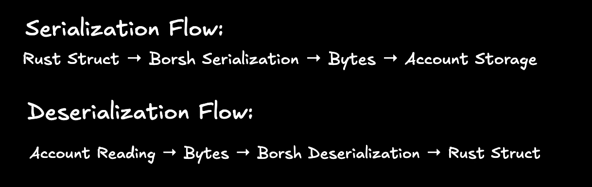
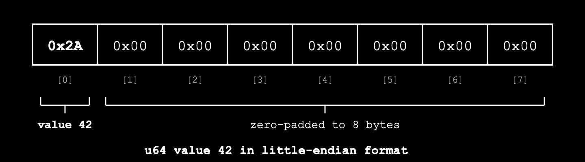
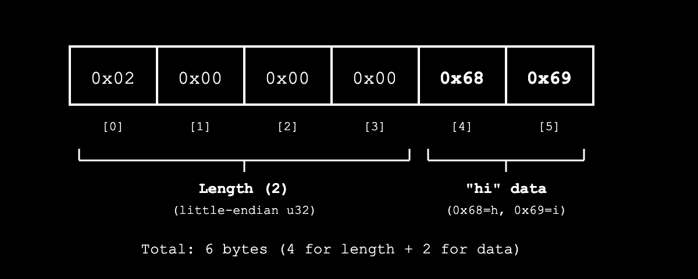
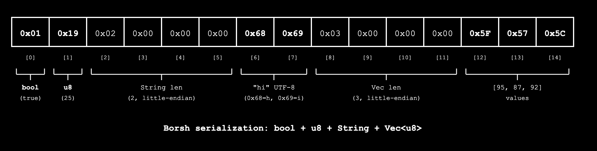
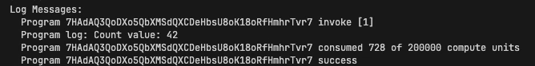
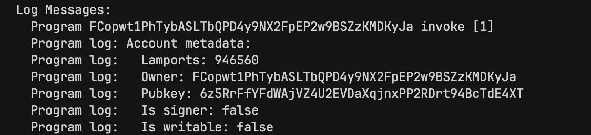

# Native Solana: Borsh Serialization

In the previous tutorial, we learned how to read accounts passed to a program. We saw that calling `account.try_borrow_data()` gives a reference to the account’s data field as a raw byte slice, for example `[0x01, 0x00, 0x00, 0x00]`. 

Solana stores all account data as bytes. To work with higher-level data structures like Rust structs, we use serialization to convert structs into bytes for storage on-chain, and deserialization to convert those bytes back into structs when reading them. Solana uses Borsh as its standard serialization format.

This article explains how Borsh serialization works and how to interpret these raw bytes.

In this tutorial, we'll show the following:

- What serialization is and how Borsh serialization works in Solana
- How to read and interpret serialized account data
- What an account with no data looks like when you try to read it

## **What is Serialization and Deserialization?**

Serialization is the process of converting data structures (like a Rust struct or a string) into a sequence of bytes that can be stored or transmitted. Deserialization is the reverse process - converting those bytes back into the original data structure.

For example, if you have a struct with a counter value of 42 (stored as a `u64`), serialization converts it into 8 bytes: `[0x2A, 0x00, 0x00, 0x00, 0x00, 0x00, 0x00, 0x00]`. The first byte `0x2A` holds the least significant byte of the value in little-endian order, and the remaining 7 bytes are zeros because `u64` is stored as 8 bytes in memory. Later, when you need to read that data, deserialization converts those bytes back into your struct.

## **What is Borsh Serialization?**

**Borsh** (Binary Object Representation Serializer for Hashing) is a serialization format that defines the rules for converting Rust structs into bytes and back. Solana uses Borsh as its standard serialization format because it is:

- **Deterministic**: The same data always produces the same bytes (and the same bytes always produce the same data)
- **Compact**: It stores data efficiently with no extra metadata or padding between fields (fixed-size types use their standard byte size, variable-length types use only what they need plus a 4-byte length prefix)

The [`borsh`](https://docs.rs/borsh/1.6.0/borsh/) Rust crate implements the serialization format Solana programs use.

Solana programs use Borsh to serialize both instruction data and on-chain account data. For accounts, Borsh converts Rust structs and their fields (strings, integers, booleans, vectors, etc.) into raw bytes stored in the [account's data](https://rareskills.io/post/solana-initialize-account) field.

### **How Borsh Serialization Works**

In native Rust programs, we define structs to represent the account data we want to store (similar to how you [define account structs in Anchor](https://rareskills.io/post/solana-counter-program)). Borsh then serializes these structs into bytes that populate the account's `data` field. When serialized, struct fields are laid out contiguously in the account's data field, in the same order they're declared.

The basic flow is shown in the diagram below:



This diagram shows:

1. **Serialization**: Your Rust struct (e.g., `CounterData { count: 42 }`) is converted into raw bytes using Borsh
2. **Storage**: Those bytes are stored in the account's data field on-chain
3. **Deserialization**: When reading the account, Borsh converts those bytes back into your struct

## **What Does Solana Account Data Look Like After Borsh Serialization?**

In Anchor, serialization is abstracted away, but in native Rust programs we add the `#[derive(BorshSerialize, BorshDeserialize)]` attribute to our structs. This tells the Borsh library to automatically generate the serialization and deserialization code at compile time. 

For example, here's a `CounterData` struct that stores a counter value as `u64`:

```rust
#[derive(BorshSerialize, BorshDeserialize)]
pub struct CounterData {
    pub count: u64,
}
```

If the `count` value is 42, the `BorshSerialize` attribute will serialize this struct to:



Here's what happens:

- Borsh takes our count value (42) and converts it to hexadecimal: 42 in decimal = `0x2A` in hex
- Since count is defined as a `u64`, Borsh uses 8 bytes in little-endian format to represent it
- The remaining 7 bytes after `0x2A` are zeros because a `u64` occupies 8 bytes

## **How Borsh Serializes Variable-Length Data**

Before we look at more complex examples, let's understand how Borsh handles data types that don't have fixed lengths, like strings and vectors.

Unlike fixed data types like `u64`, `bool`, and `u8` which use the same number of bytes regardless of their value, variable-length data types like `String` and `Vec<T>` have different sizes depending on their content.

For variable-length types, Borsh uses **length prefixing**: it first writes the size of the data, then the actual data. This tells Borsh how many bytes to read when deserializing (without it, Borsh wouldn't know where one field ends and another begins).

Here's how it works:

1. First, Borsh serializes the length of the data as a `u32` (4 bytes) in little-endian format
2. Then, it serializes the actual data bytes

For example, if we have a string "hi":

- First, Borsh serializes the length as a `u32` in little-endian: `[0x02, 0x00, 0x00, 0x00]` (2 bytes). Because the length is stored as a `u32`, the maximum string size is theoretically `2^32 - 1` bytes
- Finally, Borsh serializes the actual [UTF-8](https://en.wikipedia.org/wiki/UTF-8) bytes for "hi": `[0x68, 0x69]`

This gives us the final result:



This length prefix helps Borsh know exactly how many bytes to read for a variable-length type during deserialization. 

## **How Does Borsh Serialize a Solana Account Struct with Multiple Fields?**

Say we have a `UserData` struct with multiple fields to represent user information for a storage account:

```rust
#[derive(BorshSerialize, BorshDeserialize)]
struct UserData {
    active: bool,       // 1 byte: 0x01 for true, 0x00 for false
    age: u8,            // 1 byte
    name: String,       // 4 bytes (length) + UTF-8 bytes
    scores: Vec<u8>,    // 4 bytes (length) + individual u8 values
}

let user = UserData {
    active: true,
    age: 25,
    name: "hi".to_string(),
    scores: vec![95, 87, 92],
};

```

Borsh serializes struct fields strictly in the order they're defined in the struct, regardless of whether they're fixed-size or variable-length (dynamically-sized). The placement of fixed-size and variable-length fields doesn't affect how Borsh handles them - each field is serialized according to its type's rules (fixed-size types use their standard byte size, variable-length types use length-prefixing), and all fields are laid out sequentially in declaration order. Here's what happens:

- First, Borsh serializes the `active` field (true) to 1 byte: `0x01`.
- Then it serializes `age` (25) to 1 byte: `0x19`.
- Next, it serializes the `name` field ("hi"). Since strings are dynamically-sized, Borsh uses a length-prefixed approach:
    - It first writes the length as a `u32` in little-endian: `[0x02, 0x00, 0x00, 0x00]` (2 bytes)
    - Then writes the actual UTF-8 bytes for "hi" (`[0x68, 0x69]`)
- Finally, it serializes the `scores` vector `[95, 87, 92]` using the same length-prefixed approach:
    - It writes the vector length as `u32` in little-endian (3 items = `[0x03, 0x00, 0x00, 0x00]`)
    - Then writes each `u8` value: `[0x5F, 0x57, 0x5C]`.

All these bytes are appended together in the order the fields are declared, giving us the final result:



This shows how Borsh handles account with multiple fields, including `String` and `Vec`. 

## How Do We Read Back Serialized Account Data?

To get our data back from a Solana account, we deserialize it. The Borsh library provides a [`try_from_slice`](https://docs.rs/borsh/latest/borsh/de/trait.BorshDeserialize.html#method.try_from_slice) function that handles deserialization by reading the bytes in the order they were serialized and reconstructing the original struct.

So for a Solana account passed to a native program, the flow is:

- Read the raw bytes from the account
- Call `try_from_slice` from the Borsh crate to deserialize those bytes into the original struct

The code below shows this in practice. The `read_user_account` function below is a conceptual representation demonstrating how to use `try_from_slice` for deserialization. The `account` parameter represents a general Solana account containing the `UserData` struct from the "How Does Borsh Serialize a Solana Account Struct with Multiple Fields?" section above (with the `active`, `age`, `name`, and `scores` fields).

```rust
use borsh::BorshDeserialize;
use solana_program::account_info::AccountInfo;

pub fn read_user_account(account: &AccountInfo) -> ProgramResult {
    // First, we get the raw bytes from the account
    let data = account.try_borrow_data()?;
    // The raw bytes in the account's data field:
    // [0x01, 0x19, 0x02, 0x00, 0x00, 0x00, 0x68, 0x69, 0x03, 0x00, 0x00, 0x00, 0x5F, 0x57, 0x5C]

    // Then we use Borsh to deserialize these bytes back into our struct
    let _user = UserData::try_from_slice(&data)?;
    // We get back our original data:
    // UserData { active: true, age: 25, name: "hi", scores: [95, 87, 92] }

    Ok(())
}
```

## **Borsh Serialization Rules for Other Common Types**

For other common field types used in Solana accounts like booleans, numbers (`u32`, `i32`, `u64`), and Pubkeys, Borsh follows these rules:

| **Type** | **Size** | **Format** | **Example** |
| --- | --- | --- | --- |
| `bool` | 1 byte | `0x01` for true, `0x00` for false | `true` → `[0x01]` |
| `u8` | 1 byte | Raw value | `42` → `[0x2A]` |
| `u16` | 2 bytes | Little-endian | `42` → `[0x2A, 0x00]` |
| `u32` | 4 bytes | Little-endian | `42` → `[0x2A, 0x00, 0x00, 0x00]` |
| `u64` | 8 bytes | Little-endian | `42` → `[0x2A, 0x00, 0x00, 0x00, 0x00, 0x00, 0x00, 0x00]` |
| `u128` | 16 bytes | Little-endian | Similar pattern with 16 bytes |
| `i8`, `i16`, `i32`, `i64`, `i128` | Same as unsigned | Little-endian, [two's complement](https://en.wikipedia.org/wiki/Two%27s_complement) | `-1` as `i8` → `[0xFF]`, positive values are serialized the same as unsigned |
| `Pubkey` | 32 bytes | Raw bytes | The 32 bytes of the public key |

The same appending principle we saw earlier applies here too. When you have a struct with these types, Borsh goes through each field in order and appends all the bytes together, with no padding or extra metadata (this keeps the serialized data as small as possible).

## **Reading Raw Bytes Without Deserialization**

You can manually read specific fields from account data without deserializing if you know the memory layout. This isn't recommended for production code (it’s error-prone), but it helps understand how Borsh works.

Let's say we have our `CounterData` account from earlier with just the `count: 42` field, serialized as `[0x2A, 0x00, 0x00, 0x00, 0x00, 0x00, 0x00, 0x00]`. We can read just the count value manually by extracting the first 8 bytes and converting them to a `u64`:

```rust
pub fn read_count_manually(account: &AccountInfo) -> ProgramResult {
    let data = account.try_borrow_data()?;
		
    // count is a u64, so it occupies the first 8 bytes
    if data.len() >= 8 {
        let count_bytes = &data[0..8];
        let count = u64::from_le_bytes(count_bytes.try_into().unwrap());
        msg!("Count value: {}", count); // This will print: Count value: 42
    }

    Ok(())
}
```

Note: Since count is the only field in `CounterData`, attempting to read beyond its 8-byte length would panic as there's no additional data in the struct.

Running the code above will log a count value of 42.



This works because we know the struct layout. The `count` field occupies the first 8 bytes (byte positions 0–7), so we can read them directly and convert back to a `u64`. In a real program, we'd use `CounterData::try_from_slice(&data)?` instead, which automatically deserializes the entire struct from the raw bytes.

## **Accessing Account Metadata (Lamports, Owner, etc.)**

So far we've been talking about the account's data field, but as we learned in previous tutorials, Solana accounts have other important fields like lamports, owner, pubkey, etc.

`account.try_borrow_data()?` only gives us the **data field** (where our Borsh-serialized structs live), but the `AccountInfo` struct passed to our `process_instruction` function gives us access to all the other account metadata that Solana maintains automatically.

We show how to access these fields in the code below:

```rust
pub fn process_instruction(
    _program_id: &Pubkey,
    accounts: &[AccountInfo],
    _instruction_data: &[u8],
) -> ProgramResult {
    // Get the account's lamports (balance)
    let lamports = account.lamports();
    msg!("Account lamports: {}", lamports);
    
    // Get the account's owner (program that controls it)
    let owner = account.owner;
    msg!("Account owner: {}", owner);
    
    // Get the account's public key
    let pubkey = account.key;
    msg!("Account pubkey: {}", pubkey);
    
    // Check if the account is a signer
    let is_signer = account.is_signer;
    msg!("Is signer: {}", is_signer);
    
    // Check if the account is writable
    let is_writable = account.is_writable;
    msg!("Is writable: {}", is_writable);
    Ok(())
}
```

When we run the above code, we get something like this:



`AccountInfo` is the struct type that represents a Solana account in your program. It contains all the account's metadata (lamports, owner, etc.) and provides methods to access the data field. When we call `account.try_borrow_data()?`, we're accessing just the data field where our Borsh-serialized structs are stored.

## Summary

In this tutorial, we covered how Borsh serialization works in Solana:

- **Serialization** converts Rust structs into bytes for storage, while **deserialization** converts bytes back into structs
- **Borsh** is Solana's standard serialization format - it's deterministic and compact
- The `#[derive(BorshSerialize, BorshDeserialize)]` attribute enables Borsh serialization for your structs
- Borsh serializes the **data field** of Solana accounts, not the other metadata fields
- **Fixed-length types** (like `u64`, `bool`) use a consistent number of bytes
- **Variable-length types** (like `String`, `Vec<T>`) use **length prefixing**: 4 bytes for length + actual data
- Struct fields are serialized sequentially in the order they're declared, with no padding
- `AccountInfo` provides access to all account metadata, while `account.try_borrow_data()?` gives us just the serialized data field

In the next tutorial, we'll put this knowledge into practice by creating storage accounts and reading their data in native Rust Solana programs.