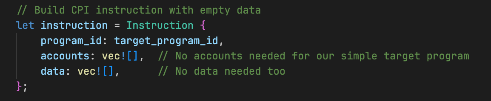
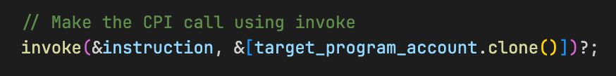
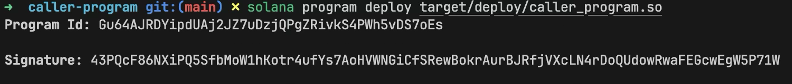
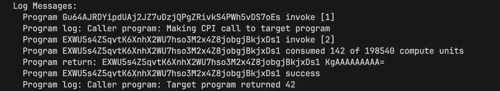

# Native Solana: Cross-Program Invocation with invoke and invoke_signed

[Cross-Program Invocation (CPI)](https://rareskills.io/post/cross-program-invocation) is how programs call other programs on the Solana blockchain. In this tutorial, we'll learn how to make CPI calls in native Rust.

We've already used CPI in our previous Anchor tutorials when transferring SOL or minting tokens through the SPL Token program. In Anchor, a CPI call looks like this:

```rust
let cpi_ctx = CpiContext::new(
    ctx.accounts.system_program.to_account_info(),
    system_program::Transfer {
        from: ctx.accounts.from.to_account_info(),
        to: ctx.accounts.to.to_account_info(),
    }
);
system_program::transfer(cpi_ctx, amount)?;
```

The code above creates a CPI context with the System Program and the accounts needed for a transfer, then calls `system_program::transfer` to execute the CPI.

This tutorial explains what happens behind the scenes when you make CPI calls in Anchor, then shows how to use Solana's native CPI functions directly.

We'll cover:

- The two core CPI functions in Solana: `invoke` and `invoke_signed`
- How Anchor abstracts these core functions
- How to build CPI instructions manually in native Rust by showing a practical example where we'll build two programs: a target program that returns 42 and a caller program that invokes it via CPI

Let’s start by understanding the `invoke` and `invoke_signed` CPI functions. 

## **Understanding Solana's Core CPI Functions**

Solana has two core functions for making Cross-Program Invocations:

1. `invoke`: Used for CPI calls that don't require [PDA signing](https://rareskills.io/post/solana-pda) (uses the original transaction signers)
2. `invoke_signed`: Used for CPI calls that require PDA signing (when a program needs to sign on behalf of a PDA it controls)

Let's look at these functions in detail:

### **1. The `invoke` Function**

The `invoke` function calls another program with accounts and instruction data. You use it when your program needs to invoke another program using the original transaction signers for authorization.

```rust
pub fn invoke(
    instruction: &Instruction,
    account_infos: &[AccountInfo<'_>],
) -> ProgramResult

```

The parameters are:

- `instruction`: An [`Instruction` struct](https://docs.rs/solana-program/latest/solana_program/instruction/struct.Instruction.html) that contains:
    - `program_id`: The target program's public key
    - `accounts`: A vector of `AccountMeta` structs. Each struct contains three fields: `pubkey` (the account's public key), `is_signer` (whether this account must sign the transaction), and `is_writable` (whether the program can modify this account)
    - `data`: A byte array containing the instruction data. Typically includes a discriminator (to identify which instruction to execute) followed by any parameters the instruction expects. The exact layout is defined by the target program
- `account_infos`: A slice of [`AccountInfo`](https://docs.rs/solana-account-info/latest/solana_account_info/struct.AccountInfo.html) structs. This must include all accounts referenced in the instruction's `accounts` field, plus the target program's account. The runtime uses these to access actual account data during execution

`AccountMeta` in the instruction tells Solana which accounts you need and how they'll be used. `AccountInfo` provides the actual account data and state your program reads or writes to.

### **2. The `invoke_signed` Function**

The `invoke_signed` function calls another program with accounts and instruction data, just like `invoke`, but is used when your program must sign on behalf of a PDA. Here's how it works:

1. When using `invoke_signed`, you must provide the seeds used to derive the PDA
2. The runtime uses these seeds to verify that your program derived the PDA (i.e., the PDA belongs to your program)
3. This allows your program to sign on behalf of a PDA, since PDAs don't have private keys and can't sign directly

```rust
pub fn invoke_signed(
    instruction: &Instruction,
    account_infos: &[AccountInfo<'_>],
    signers_seeds: &[&[&[u8]]],
) -> ProgramResult

```

This function has the same parameters as `invoke`, with one additional parameter:

- `signers_seeds`: The derivation seeds for PDAs that need to sign the CPI instruction. The runtime uses these seeds to re-derive the PDA and verify it belongs to your program.

Now that we understand the native CPI functions that Solana provides, let's see how Anchor uses them.

## How Anchor Abstracts Solana's CPI Functions

Anchor reduces the complexity of constructing CPI calls by providing two approaches that wrap around the `invoke` and `invoke_signed` functions:

**1. Regular CPI calls** (using the original transaction signers):

Anchor uses `CpiContext::new()` to wrap the native `invoke` function when the accounts required by the invoked program are already signers in the original transaction. Here's an example transferring SOL via the System Program:

```rust
let cpi_ctx = CpiContext::new(
    ctx.accounts.system_program.to_account_info(),
    system_program::Transfer {
        from: ctx.accounts.from.to_account_info(),
        to: ctx.accounts.to.to_account_info(),
    }
);
system_program::transfer(cpi_ctx, amount)?;
```

**2. PDA-signed CPI calls** (when your program needs to sign on behalf of a PDA):

Anchor uses `CpiContext::new_with_signer()` to wrap the native `invoke_signed` function when a PDA controlled by your program must sign the invoked instruction. The third parameter (`&[&seeds]`) provides the seeds to derive and sign with the PDA:

```rust
let seeds = &[
    b"seed-prefix",
    payer.key.as_ref(),
    &[bump],
];

let cpi_ctx = CpiContext::new_with_signer(
    ctx.accounts.token_program.to_account_info(),
    token::Transfer {
        from: ctx.accounts.from.to_account_info(),
        to: ctx.accounts.to.to_account_info(),
        authority: ctx.accounts.authority.to_account_info(),
    },
    &[&seeds],
);
token::transfer(cpi_ctx, amount)?;
```

After building the instruction context with either approach, you call the appropriate Anchor CPI helper function (like `system_program::transfer` or `token::transfer`) with the context.

**Behind the scenes, Anchor uses `invoke_signed` for all CPI calls. This is because:**

- **With no signer seeds, it works exactly like `invoke`**
- **With signer seeds, it enables PDA signing**

**This unified approach means Anchor only needs one code path for all CPI operations.**

The `invoke` function works this way because its implementation uses the `invoke_signed` function but passes an empty byte slice for the PDA signer seeds.

```rust
pub fn invoke(instruction: &Instruction, account_infos: &[AccountInfo]) -> ProgramResult {
    invoke_signed(instruction, account_infos, &[])
}
```

Inside Solana's BPF runtime, both `invoke` and `invoke_signed` call the [`sol_invoke_signed_rust` syscall](https://github.com/anza-xyz/agave/blob/60ba168d54d7ac6683f8f2e41a0e325f29d9ab2b/syscalls/src/cpi.rs). This syscall performs the actual cross-program invocation by suspending the caller's execution, invoking the target program, managing the call stack, and verifying PDA-derived signatures when signer seeds are provided. There's also a C language ABI variant, `sol_invoke_signed_c`, that exposes the same behavior for programs written in the C programming language.

To see how Anchor uses `invoke_signed`, let's inspect the `system_program::transfer` function in the Anchor [source code](https://github.com/solana-foundation/anchor/blob/18d0ca0ce9b78c03ef370406c6ba86e28e4591ab/lang/src/system_program.rs#L298). Notice that it builds an instruction using `system_instruction::transfer`, then calls `invoke_signed` with `ctx.signer_seeds`:

```rust
pub fn transfer<'info>(
    ctx: CpiContext<'_, '_, '_, 'info, Transfer<'info>>,
    lamports: u64,
) -> Result<()> {
    let ix = crate::solana_program::system_instruction::transfer(
        ctx.accounts.from.key,
        ctx.accounts.to.key,
        lamports,
    );
    crate::solana_program::program::invoke_signed(
        &ix,
        &[ctx.accounts.from, ctx.accounts.to],
        ctx.signer_seeds,
    )
    .map_err(Into::into)
}
```

The same pattern is visible in the SPL token `transfer` function from the [Anchor SPL token crate](https://github.com/solana-foundation/anchor/blob/18d0ca0ce9b78c03ef370406c6ba86e28e4591ab/spl/src/token.rs#L11):

```rust
pub fn transfer<'info>(
    ctx: CpiContext<'_, '_, '_, 'info, Transfer<'info>>,
    amount: u64,
) -> Result<()> {
    let ix = spl_token::instruction::transfer(
        &spl_token::ID,
        ctx.accounts.from.key,
        ctx.accounts.to.key,
        ctx.accounts.authority.key,
        &[],
        amount,
    )?;
    anchor_lang::solana_program::program::invoke_signed(
        &ix,
        &[ctx.accounts.from, ctx.accounts.to, ctx.accounts.authority],
        ctx.signer_seeds,
    )
    .map_err(Into::into)
}
```

Notice in both examples, the code consistently uses `invoke_signed` with `ctx.signer_seeds`. As mentioned earlier, when no seeds are provided (regular CPI), the empty `signer_seeds` makes `invoke_signed` behave exactly like `invoke`. When seeds are provided (PDA signing), it enables the program to sign on behalf of its PDAs.

We now understand how Anchor abstracts cross-program invocations. Next, we’ll learn how to build CPI instructions manually.

## Building CPI Instructions Manually in Native Rust

To construct and make a CPI call in a native Rust Solana program, we need to build an instruction and then call the appropriate CPI function.

To do this, we’ll have to:

1. Create an instruction with the `program_id` of the program we want to call, a list of accounts the program will need to read or write to during the CPI, and the instruction data to send.
2. Then we call the appropriate CPI function (`invoke` or `invoke_signed`) with the instruction and accounts

As mentioned at the start of this tutorial, we'll create two separate Solana programs that work together:

1. **A target program**: that returns the number 42 when called (we’ll see how later)
2. **A caller program**: that makes CPI calls to the target program using the `invoke` function.

By implementing both programs, we can observe the complete CPI process from both perspectives and see how data flows between programs.

Before we create our programs, let's set up our project structure:

```bash
mkdir solana-cpi-example
cd solana-cpi-example
```

## Creating the Target Program

We'll keep the target program simple, it’ll simply return a value for the caller program. 

First, we create the target program directory and initialize it (inside `solana-cpi-example`):

```bash
mkdir target-program
cd target-program
cargo init --lib
```

Update `target-program/Cargo.toml`:

```toml
[package]
name = "target-program"
version = "0.1.0"
edition = "2021"

[lib]
crate-type = ["cdylib", "lib"]

[dependencies]
solana-program = "1.18"
```

Replace the code in `target-program/src/lib.rs` with this code. In this program, we:

1. Import the necessary Solana dependencies including `set_return_data` from the `solana_program` crate (we explain this after the code below)
2. Define a `process_instruction` function that:
    - Creates a variable with the value 42, and
    - Uses `set_return_data` to return this value back to the caller

```rust
// target-program/src/lib.rs
use solana_program::{
    account_info::AccountInfo,
    entrypoint,
    entrypoint::ProgramResult,
    program::set_return_data,
    pubkey::Pubkey,
};

entrypoint!(process_instruction);

pub fn process_instruction(
    _program_id: &Pubkey,
    _accounts: &[AccountInfo],
    _instruction_data: &[u8],
) -> ProgramResult {
    // Create the data we want to return
    let return_value: u64 = 42;
    let return_bytes = return_value.to_le_bytes();
    
    // Set the return data that the calling program can access
    set_return_data(&return_bytes);
    
    Ok(())
}
```

### **The `set_return_data` function**

The `set_return_data` function (from the `solana_program` crate) stores data in a buffer that the calling program can read after the CPI returns. The maximum return data size is 1024 bytes.

We convert our `u64` value to bytes and set it as return data. We need this because the `ProgramResult` return type only indicates success or failure to the runtime, not actual data. Solana introduced `set_return_data` to enable direct data passing between programs without requiring additional accounts. In Anchor, this is handled automatically through return types in your instruction functions.

We'll see how to retrieve this data when we build the caller program next.

Now build the target program:

```bash
cargo build-sbf
```

## Creating the Caller Program

Next, we'll implement the program that makes the CPI calls to the target program. This will demonstrate how one program can call another.

The caller program will handle the CPI calls and data retrieval from the target program. 

Let's go back to the project root and create our caller program:

```bash
cd ..
mkdir caller-program
cd caller-program
cargo init --lib
```

Update `caller-program/Cargo.toml`:

```toml
[package]
name = "caller-program"
version = "0.1.0"
edition = "2021"

[lib]
crate-type = ["cdylib", "lib"]

[dependencies]
solana-program = "1.18"
```

Replace the code in `caller-program/src/lib.rs` with this code below. In this program, we:

1. Import the necessary Solana dependencies including `get_return_data` from the `solana_program` crate
2. Define a `process_instruction` function for our program that:
    - Extracts the target program ID from the first account in the accounts array
    - Builds a CPI instruction without instruction data
    - Makes the CPI call using `invoke()`
    - Retrieves the returned data using `get_return_data()`
    - Logs the actual value received from the target program

We’ll explore the CPI construction in detail after the code block.

```rust
// caller-program/src/lib.rs
use solana_program::{
    account_info::AccountInfo,
    entrypoint,
    entrypoint::ProgramResult,
    instruction::{AccountMeta, Instruction},
    msg,
    program::{invoke, get_return_data},
    pubkey::Pubkey,
};

entrypoint!(process_instruction);

pub fn process_instruction(
    _program_id: &Pubkey,
    accounts: &[AccountInfo],
    _instruction_data: &[u8],
) -> ProgramResult {
    msg!("Caller program: Making CPI call to target program");

    // Extract the target program's program_id from the accounts array
    let target_program_account = &accounts[0];
    let target_program_id = *target_program_account.key;

    // In production, verify the program ID matches expected value and is executable:
    // assert!(target_program_id == EXPECTED_PROGRAM_ID);
    // assert!(target_program_account.executable);

    // Build CPI instruction with empty data
    let instruction = Instruction {
        program_id: target_program_id,
        accounts: vec![],  // No additional accounts needed for our simple target program
        data: vec![],      // No instruction data needed
    };

    // Make the CPI call using invoke
    // We pass target_program_account (an AccountInfo from our accounts parameter)
    // because invoke needs the AccountInfo of the program we're calling
    invoke(&instruction, &[target_program_account.clone()])?;

    // Get the return data from the called program
    let (_, return_data) = get_return_data().unwrap();
    let value = u64::from_le_bytes(return_data[0..8].try_into().unwrap());
    msg!("Caller program: Target program returned {}", value);

    Ok(())
}// caller-program/src/lib.rs
use solana_program::{
    account_info::AccountInfo,
    entrypoint,
    entrypoint::ProgramResult,
    instruction::{AccountMeta, Instruction},
    msg,
    program::{invoke, get_return_data},
    pubkey::Pubkey,
};

entrypoint!(process_instruction);

pub fn process_instruction(
    _program_id: &Pubkey,
    accounts: &[AccountInfo],
    _instruction_data: &[u8],
) -> ProgramResult {
    msg!("Caller program: Making CPI call to target program");

    // Extract the target program's program_id from the accounts array
    let target_program_account = &accounts[0];
    let target_program_id = *target_program_account.key;

    // In production, verify the program ID matches expected value and is executable:
    // assert!(target_program_id == EXPECTED_PROGRAM_ID);
    // assert!(target_program_account.executable);

    // Build CPI instruction with empty data
    let instruction = Instruction {
        program_id: target_program_id,
        accounts: vec![],  // No additional accounts needed for our simple target program
        data: vec![],      // No instruction data needed
    };

    // Make the CPI call using invoke
    // We pass target_program_account (an AccountInfo from our accounts parameter)
    // because invoke needs the AccountInfo of the program we're calling
    invoke(&instruction, &[target_program_account.clone()])?;

    // Get the return data from the called program
    let (_, return_data) = get_return_data().unwrap();
    let value = u64::from_le_bytes(return_data[0..8].try_into().unwrap());
    msg!("Caller program: Target program returned {}", value);

    Ok(())
}
```

### **The `get_return_data` function**

The `get_return_data` function allows our caller program to retrieve data from the program we just called.

This function returns `Option<(Pubkey, Vec<u8>)>`—a tuple containing the program ID that set the data and the data itself. We only care about the return data (the second item), so we destructure it as `let (_, return_data) = get_return_data().unwrap()`. We then convert those bytes back to our expected data type (u64 in this case).

```bash
cargo build-sbf
```

## **Breaking Down the CPI Construction in the Caller Program**

First, we extracted the target program ID from the accounts array:


Then we built the instruction that defines our CPI call:



This `Instruction` struct has three components:

- `program_id`: The address of the program we're calling (the target program’s ID in this case)
- `accounts`: The list of accounts our instruction needs (empty in this case)
- `data`: Any instruction data to pass (also empty)

Finally, we executed the CPI using the `invoke` function:



The `invoke` function takes:

- The instruction we built
- A list of all account infos needed for the instruction

**If the called program returns a `ProgramError`, the error propagates to the runtime, execution stops immediately, and the entire transaction fails. Control does not return to the caller program.**

But when the `invoke` function executes successfully, here's what happens:

1. The caller program calls `invoke()` with the instruction and account infos
2. 
3. The Solana runtime suspends the caller program and transfers execution to the target program
4. The target program executes, calls `set_return_data(&return_bytes)` to store value 42, and returns `Ok(())`
5. The runtime resumes the caller program from where it left off (right after the `invoke()` call)
6. The caller program calls `get_return_data()` to retrieve the bytes from the buffer
7. It converts those bytes back to a u64 value (42) and logs it

## Deploying and Testing Both Programs

### Deploying both programs

Now that we’ve written both programs — the target program and the caller that performs a CPI — we can deploy them to test that our implementation works.

Run the following commands in separate terminal tabs to start a local test validator and view logs:

```bash
solana-test-validator # in a separate terminal
solana logs # in another terminal
```

Deploy the target program first:

```bash
cd target-program
solana program deploy target/deploy/target_program.so
```

You'll see output showing the program ID. Copy this program ID—you'll need it when setting up the client test.



Deploy the caller program:

```bash
cd ../caller-program
solana program deploy target/deploy/caller_program.so
```

Copy this program ID as well.

### Testing both programs

With both programs deployed, we need to trigger our caller program and observe the results. We’ll do this with a TypeScript client. 

We'll create a TypeScript client that sends a transaction to our caller program. This client initiates the process: the client calls the caller program, which then makes CPI calls to the target program.

Now, let’s go back to the project root and set up our TypeScript client:

```bash
cd ..
mkdir client && cd client
npm init -y
npm install @solana/web3.js typescript ts-node @types/node
```

Update `client/package.json`:

```json
{
  "scripts": {
    "test": "ts-node client.ts"
  }
}
```

Create `client/tsconfig.json`:

```json
{
  "compilerOptions": {
    "target": "ES2020",
    "module": "commonjs",
    "moduleResolution": "node",
    "strict": true,
    "esModuleInterop": true,
    "skipLibCheck": true,
    "types": ["node"]
  },
  "include": ["*.ts"]
}
```

Next, create `client/client.ts` and add the code below. In this client code, we:

1. Set up the connection to the local Solana cluster
2. Define constants for the target and caller program IDs (`TARGET_PROGRAM_ID` and `CALLER_PROGRAM_ID`)
3. Create and fund a signer account with SOL for testing
4. Create an instruction that calls our caller program
5. Pass the target program ID as an account so the caller program knows which program to call via CPI
6. Execute the transaction and display the transaction signature

```tsx
import {
  Connection,
  Keypair,
  LAMPORTS_PER_SOL,
  PublicKey,
  Transaction,
  TransactionInstruction,
  sendAndConfirmTransaction,
} from "@solana/web3.js";

// Replace these with your actual program IDs
const TARGET_PROGRAM_ID = new PublicKey("YOUR_TARGET_PROGRAM_ID_HERE");
const CALLER_PROGRAM_ID = new PublicKey("YOUR_CALLER_PROGRAM_ID_HERE");

const connection = new Connection("http://localhost:8899", "confirmed");

async function testCPI() {
  console.log("Testing Cross-Program Invocation\n");

  // Create and fund a signer account
  const signer = Keypair.generate();
  console.log("Funding signer account...");
  await connection.requestAirdrop(signer.publicKey, LAMPORTS_PER_SOL);
  await new Promise((resolve) => setTimeout(resolve, 2000));

  console.log(`Signer: ${signer.publicKey.toString()}`);
  console.log(`Target Program: ${TARGET_PROGRAM_ID.toString()}`);
  console.log(`Caller Program: ${CALLER_PROGRAM_ID.toString()}\n`);

  // Create instruction to call our caller program
  // The caller program expects the target program ID as the first account
  const instruction = new TransactionInstruction({
    keys: [{ pubkey: TARGET_PROGRAM_ID, isSigner: false, isWritable: false }],
    programId: CALLER_PROGRAM_ID,
    data: Buffer.alloc(0), // No instruction data needed
  });

  const transaction = new Transaction().add(instruction);

  console.log("Executing CPI test...");
  const signature = await sendAndConfirmTransaction(
    connection,
    transaction,
    [signer],
    {
      commitment: "confirmed",
      preflightCommitment: "confirmed",
    },
  );
}

testCPI().catch(console.error);
```

Ensure you replace `TARGET_PROGRAM_ID` and `CALLER_PROGRAM_ID` with the actual program IDs from your deployments.

Now run the test:

```bash
npm run test # inside the client/ directory
```

If we look at the logs, we can see that the CPI call from the Caller program to the Target program was successful, and the Caller program received the value 42 from the Target program, which it logged.



### Overview of the program execution

When we run our program test, a sequence of events occurs. Here's an overview of what happens:

1. The TypeScript client calls the caller program
2. The caller program prepares CPI instruction and calls `invoke()`
3. The Solana runtime switches execution to target program
4. The target Program Executes, stores return value 42, returns `Ok(())`
5. Finally, the runtime switches execution back to the caller program, which retrieves and logs the value 42

## **Next Steps**

We didn't use `invoke_signed` in this tutorial because it requires creating accounts and PDAs in native Rust, which we haven't covered yet. We'll see an example of `invoke_signed` in another tutorial when we learn about creating PDAs in native Rust programs.

Now, build the caller program:

This function returns `Option<(Pubkey, Vec<u8>)>`—a tuple containing the program ID that set the data and the data itself. We only care about the return data (the second element), so we destructure it as `let (_, return_data) = get_return_data().unwrap()`. We then convert those bytes back to our expected data type (u64 in this case).

**The `get_return_data` function allows our caller program to retrieve data from the program we just called.**

This mechanism allows programs to not only call each other but also pass data back to the caller.

1. It converts those bytes back to a u64 value (42) and logs it
2. The caller program calls `get_return_data()` to retrieve the bytes from the buffer
3. The runtime resumes the caller program from where it left off (right after the `invoke()` call)
4. The target program executes, calls `set_return_data(&return_bytes)` to store value 42, and returns `Ok(())`
5. The Solana runtime suspends the caller program and transfers execution to the target program

*This article is part of a tutorial series on [Solana development](https://rareskills.io/solana-tutorial).*