# Native Solana: Creating Accounts For Storage I

In this two-part tutorial, we'll learn how to create accounts for storing data in native Solana programs using two approaches: keypairs (this part) and Program Derived Addresses or PDAs (Part 2). Our goal is to understand account allocation, initialization, and data serialization at the low level — the logic that [Anchor's `#[account(init)]` macro](https://rareskills.io/post/solana-initialize-account) abstracts away from you.

For both approaches, we'll build a program that creates an account and writes data to it, then test with a TypeScript client to verify the data was written correctly.

## Setting up the keypair storage program

Run the following commands to create a directory and initialize a Rust project with Cargo:

```bash
mkdir solana-storage-write
cd solana-storage-write
cargo init --lib

```

Update your `Cargo.toml` to the configuration below, which sets the crate type and adds Solana program dependencies:

```toml
[package]
name = "solana-storage-write"
version = "0.1.0"
edition = "2021"

[lib]
crate-type = ["cdylib", "lib"]

[dependencies]
solana-program = "1.18"
borsh = "0.10"
```

Note that we've added `borsh = "0.10"` for serialization, which we'll need when creating our account. We covered Borsh serialization in detail in a previous tutorial.

Now let's create our program.

## **Creating accounts with keypairs in native Solana programs**

### **Account structure for data storage**

Before we dive into the code, let's understand what a Solana account that stores data looks like:

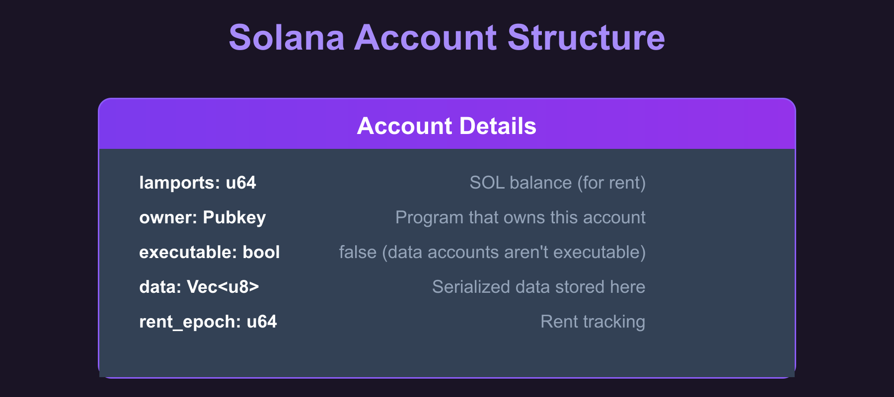

The `data` field is where we store our serialized struct (we get to this later). When we create an account, we specify how many bytes this field should hold, and the System Program allocates that space.

### Steps to create a keypair-based storage account

The steps below show how to create a keypair-based account for data storage:

1. Receive the storage account's public key from the client (who generated the keypair and will sign the transaction)
2. Create the data structure we want to store (a `CounterData` struct with a `u64` count field) and serialize it with Borsh
3. Determine the space needed (the byte length of the serialized data that sets the account’s data field size).
4. Calculate the [rent-exempt lamports](https://rareskills.io/post/solana-account-rent) required for that space (the minimum SOL balance required to keep the account alive without being garbage collected).
5. Use the System Program to create the account with the calculated space and lamports.
6. Write the serialized data directly into the account's data field.

Now let's see this in code. Replace the code in `src/lib.rs` file with the following. We've added code comments to show where we implement each of the steps listed above:

```rust
use borsh::{BorshDeserialize, BorshSerialize};
use solana_program::{
    account_info::{next_account_info, AccountInfo},
    entrypoint,
    entrypoint::ProgramResult,
    msg,
    program::invoke,
    program_error::ProgramError,
    pubkey::Pubkey,
    rent::Rent,
    system_instruction, system_program,
};

entrypoint!(process_instruction);

// This represents the data we'll store in our account
// We've added Borsh derive macros for serialization and deserialization
#[derive(BorshSerialize, BorshDeserialize, Debug)]
pub struct CounterData {
    pub count: u64,
}

pub fn process_instruction(
    program_id: &Pubkey,
    accounts: &[AccountInfo],
    _instruction_data: &[u8],
) -> ProgramResult {
    msg!("Storage Write Program: Creating storage account and writing data");

    let accounts_iter = &mut accounts.iter();

    // STEP 1: Get the accounts we need
		// next_account_info() extracts the next AccountInfo from the iterator
    let storage_account = next_account_info(accounts_iter)?;
    let signer = next_account_info(accounts_iter)?;
    let system_program = next_account_info(accounts_iter)?;

    // Verify the system program
    if system_program.key != &system_program::ID {
        msg!("Invalid system program");
        return Err(ProgramError::IncorrectProgramId);
    }

    // Verify the signer account is actually a signer
    if !signer.is_signer {
        msg!("Signer must be a signer");
        return Err(ProgramError::MissingRequiredSignature);
    }

    // STEP 2: Create our counter data
    let counter_data = CounterData { count: 42 };

    // STEP 2: Serialize the data with Borsh (u64 becomes 8 bytes in little-endian format)
    let serialized_data = counter_data.try_to_vec()?; // [42, 0, 0, 0, 0, 0, 0, 0]

    // STEP 3: Determine the space needed for our data
    let space = serialized_data.len();

    msg!("Creating storage account with {} bytes", space);
    msg!("Serialized data: {:?}", serialized_data);

    // STEP 4: Calculate lamports needed for rent exemption
    let lamports = Rent::default().minimum_balance(space);

    // STEP 5: Create the account using system program
    let create_account_ix = system_instruction::create_account(
        signer.key,
        storage_account.key,
        lamports,
        space as u64,
        program_id,
    );

    // STEP 5 (continued): Execute the create_account instruction
    invoke(
        &create_account_ix,
        &[
            signer.clone(),
            storage_account.clone(),
            system_program.clone(),
        ],
    )?;

    msg!("Storage account created successfully");

    // STEP 6: Write our serialized data to the account
    let mut account_data = storage_account.try_borrow_mut_data()?;
    account_data.copy_from_slice(&serialized_data);

    msg!("Data written to storage account");

    Ok(())
}
```

We will now look at the steps behind the account creation.

### **How the keypair account creation works in our Rust program**

The account creation in our program happens in two steps. First, we build the instruction with `system_instruction::create_account()` — a helper function that constructs the `Instruction` struct with the correct accounts and data for account creation (in the CPI tutorial, we built this struct manually).

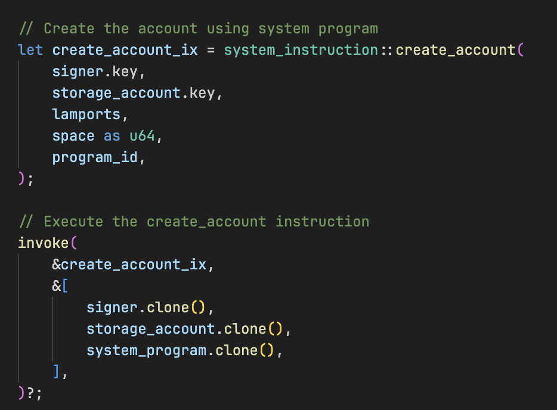

Second, we execute this instruction using `invoke()`, which performs a Cross-Program Invocation (CPI) to the System Program. The System Program then actually creates the account on-chain with the parameters we specified.

### **The `create_account` Instruction**

The System Program's `create_account` instruction creates a new on-chain account by transferring lamports, allocating data space, and assigning an owner. It takes five parameters:

1. **Payer**: The account funding the new account's rent
2. **New account address**: The address to create the account at (the account being initialized)
3. **Lamports**: The amount of SOL to transfer to the new account (must cover rent-exemption)
4. **Space**: The number of bytes to allocate for the account's data
5. **Owner**: The program ID (public key) that will own the new account

Because the System Program requires the new account address to be a signer in the `create_account` instruction, a keypair account works as expected: the transaction includes a signature from the keypair's private key. A PDA has no private key, so the program that creates it must supply the seeds via `invoke_signed()`, which the runtime uses to re-derive and verify the PDA, granting it signing authority (we'll see this in Part 2).

**How does Solana know the keypair address is available for account creation?**

The client generates a new keypair and passes its public key in the transaction. Our program receives this address via `let storage_account = next_account_info(accounts_iter)?;`. When the System Program processes the `create_account` instruction, it checks if an account already exists at that address. If no account exists there, the System Program creates it. If an account already exists, the instruction fails with an error.

## **How data gets stored in a Solana account**

Now that we've seen the code, let's walk through exactly what happens when we store data in our Solana account.

First, we start with our struct:

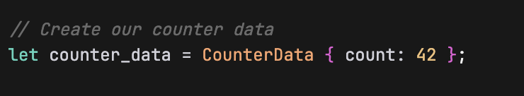

This is just a regular Rust struct living in memory. But Solana accounts can't store Rust structs directly, they only understand raw bytes. So we need to convert our struct into bytes using Borsh:

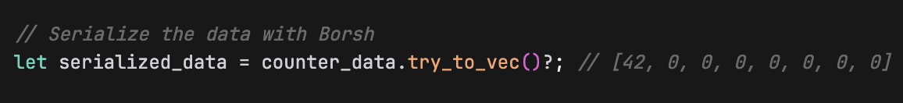

This `try_to_vec()` method is available because we added the `#[derive(BorshSerialize, BorshDeserialize)]` attribute to our `CounterData` struct earlier. 

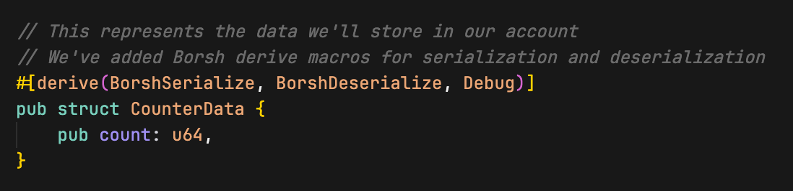

Those derive macros generates the code to convert our struct to and from bytes. Borsh takes our `count: 42` (a u64) and turns it into 8 bytes in little-endian format. The value 42 becomes `[42, 0, 0, 0, 0, 0, 0, 0]`, the first byte is 42, and the rest are zeros because u64 always takes exactly 8 bytes (just as we discussed in the Borsh serialization tutorial). This is necessary because Solana accounts can only store raw bytes, not Rust structs directly.

Next, we create the account with the system program’s `create_account` instruction. 

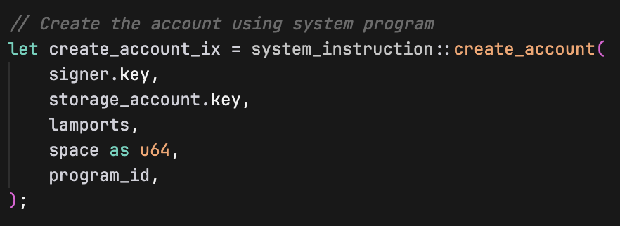

The `create_account` instruction takes these parameters:

- `signer.key`: The address of the account paying for the new account creation
- `storage_account.key`: The address where the new account will be created
- `lamports`: Amount of SOL to fund the new account (for rent exemption)
- `space as u64`: Size of the new account's data field in bytes
- `program_id`: Which program will own the newly created account (our program in this case)

Then we create the account with `invoke` (imported from the `solana_program` crate):

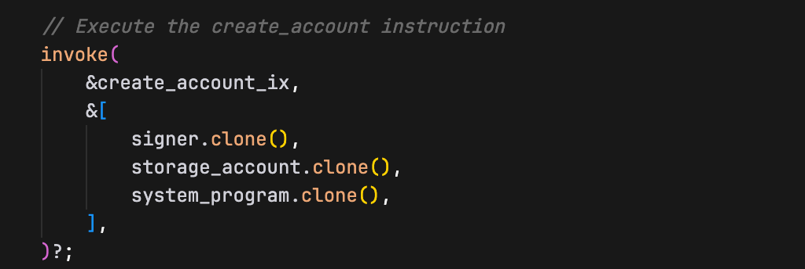

After we create this account, we write the Borsh serialized bytes directly into its data field:

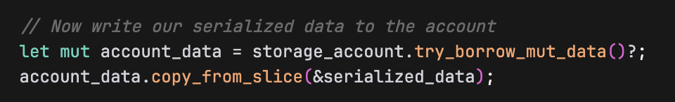

**How does this persist to storage?**

`storage_account.try_borrow_mut_data()?` doesn't just give us a copy. It gives us a **mutable reference to the actual account's data field that lives on the Solana blockchain**. So when we write to `account_data`, we are writing directly to the account's persistent storage.

Think of it like this:

- `storage_account` is a handle to an actual account that exists on Solana
- `try_borrow_mut_data()` gives you direct access to that account's data bytes
- When you modify `account_data`, you're modifying the actual on-chain account data using `copy_from_slice` (copies the bytes from `serialized_data` into `account_data`)
- The Solana runtime automatically persists these changes when your program finishes successfully

At this point, our account's data field contains exactly the Borsh serialized 8 bytes: `[42, 0, 0, 0, 0, 0, 0, 0]`. That's it, our struct is now "stored" in the account, and it’ll persist on the blockchain even after our program finishes executing.

Now build and deploy the program:

```bash
cargo build-sbf
solana-test-validator # in another terminal
solana program deploy target/deploy/solana_storage_write.so
```

Copy the program ID from the deploy output, we'll use it when we test the program.

## **Testing the program with a client**

Now let's create a TypeScript client to test our storage program.

Just as in the previous tutorials, we set up the client environment from the project root directory:

```bash
mkdir client && cd client
npm init -y
npm install @solana/web3.js typescript ts-node @types/node
```

Update `client/package.json` to add a test script:

```json
{
  "scripts": {
    "test": "ts-node client.ts"
  }
}
```

Create `client/tsconfig.json` to configure TypeScript compilation settings:

```json
{
  "compilerOptions": {
    "target": "ES2020",
    "module": "commonjs",
    "moduleResolution": "node",
    "strict": true,
    "esModuleInterop": true,
    "skipLibCheck": true,
    "types": ["node"]
  },
  "include": ["*.ts"]
}
```

Now create `client/client.ts` and add the following code. In this client, we:

1. Create a signer keypair and a **storage keypair account** for our `CounterData` struct
2. Fund the signer account with SOL
3. Pass the required accounts to our program for storage creation (storage account, signer account, system program)
4. Execute the transaction to create the account and write data
5. Read the account data back and verify it was written correctly (that the count value is exactly 42)

```tsx
import {
  Connection,
  Keypair,
  LAMPORTS_PER_SOL,
  PublicKey,
  SystemProgram,
  Transaction,
  TransactionInstruction,
  sendAndConfirmTransaction,
} from '@solana/web3.js';

const PROGRAM_ID = new PublicKey('YOUR_PROGRAM_ID_HERE'); // Replace with your actual program ID
const connection = new Connection('http://localhost:8899', 'confirmed');

async function testStorageWrite() {
  console.log('Testing Storage Creation and Writing\n');

	// Create a signer keypair and a storage keypair account
  const signer = Keypair.generate();
  const storageAccount = Keypair.generate();

  // Fund the signer keypair account
  console.log('Funding signer account...');
  await connection.requestAirdrop(signer.publicKey, LAMPORTS_PER_SOL);
  await new Promise(resolve => setTimeout(resolve, 2000));

  console.log(`Signer: ${signer.publicKey.toString()}`);
  console.log(`Storage Account: ${storageAccount.publicKey.toString()}\n`);

  // Create instruction with required accounts (storage, signer & system program account)
  const instruction = new TransactionInstruction({
    keys: [
      { pubkey: storageAccount.publicKey, isSigner: true, isWritable: true },
      { pubkey: signer.publicKey, isSigner: true, isWritable: true },
      { pubkey: SystemProgram.programId, isSigner: false, isWritable: false },
    ],
    programId: PROGRAM_ID,
    data: Buffer.alloc(0), // No instruction data needed
  });

  const transaction = new Transaction().add(instruction);

  console.log('Creating storage account and writing data...');
  const signature = await sendAndConfirmTransaction(connection, transaction, [signer, storageAccount]);

  console.log(`Transaction confirmed: ${signature}`);
  
  // Verify the data was written correctly by reading it back
  console.log('\nVerifying data was written correctly...');
  const accountInfo = await connection.getAccountInfo(storageAccount.publicKey);
  if (accountInfo && accountInfo.data.length > 0) {
    console.log('Account data length:', accountInfo.data.length, 'bytes');
    console.log('Raw account data:', Array.from(accountInfo.data));
    
    // Deserialize the data back to verify
    const deserializedData = new Uint8Array(accountInfo.data);
    
    // DataView lets us read binary data as specific types (u64 in this case)
    // getBigUint64(0, true) reads 8 bytes starting at offset 0, little-endian
    const count = new DataView(deserializedData.buffer).getBigUint64(0, true);
    console.log('Deserialized count value:', count.toString());
    
    // the `n` makes 42 a BigInt literal. This is required because getBigUint64 returns a BigInt
    if (count === 42n) {
      console.log('Data was written correctly to the storage account.');
    } else {
      console.log('Error: Expected count 42, got', count.toString());
    }
  } else {
    console.log('Error: Could not read account data');
  }
}

testStorageWrite().catch(console.error);
```

Ensure that the `PROGRAM_ID` variable is set to your program ID.

### **Understanding the keypair account creation in our client**

First we generate a keypair that will become our new account:

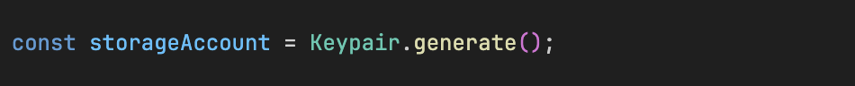

The next important step is setting the account as a signer when we construct the instruction:

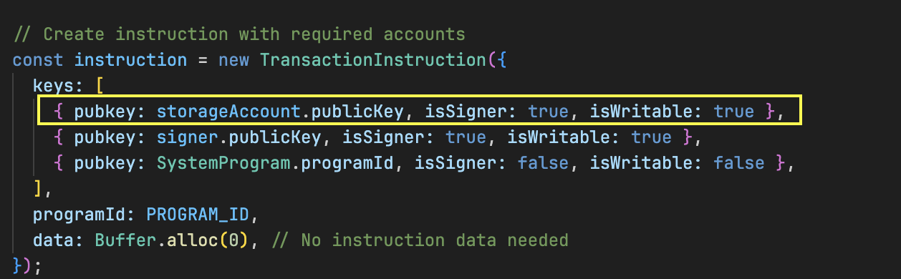

The `isSigner: true` is crucial because the System Program needs a signature from the exact address where the account will be created.

Then we provide the keypairs when sending the transaction:

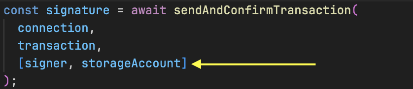

**The keypair objects contain the private keys needed to generate the required signatures, authorizing the account creation at that specific address.**

Before we run the test, ensure your local Solana validator is still running and the program has been deployed to it.

Now run the test:

```bash
cd client
npm run test
```

You should see the transaction execute successfully.

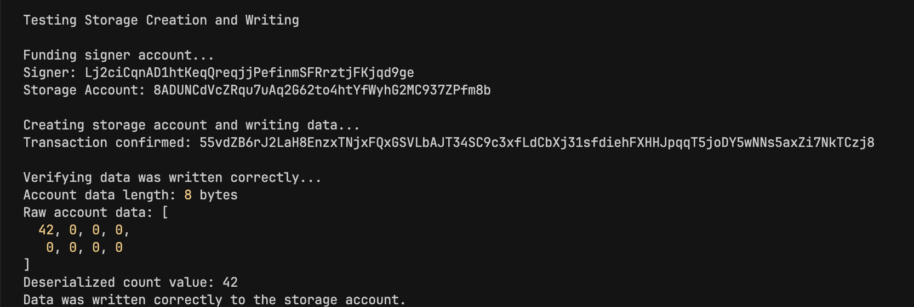

Our program executed successfully and created an account with counter value 42. We also see the serialized `CounterData` of `[42, 0, 0, 0, 0, 0, 0, 0]` (8 bytes).

In the next part of this tutorial, we'll create a storage account using a PDA instead of a keypair. The fundamentals remain the same—only the signing mechanism differs.