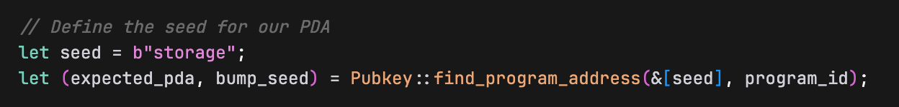
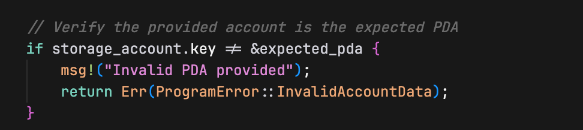
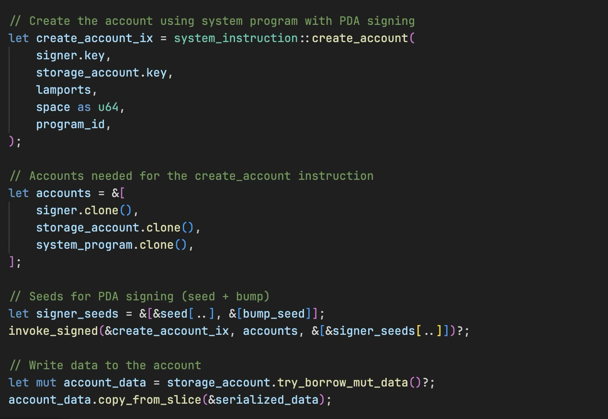

# Native Solana: Creating Accounts For Storage II

In the first part of this tutorial, we created storage accounts in native Rust using keypairs, where the account required a private key to sign for its initialization. Now we'll explore a different approach using Program Derived Addresses (PDAs), which don't have private keys yet can still be used as storage accounts through a special signing mechanism.

## **Creating Storage Accounts with PDAs**

Before diving into code, let's understand what makes PDA account creation different from keypair-based accounts:

**Keypair Accounts:**

- Have a private key that can sign transactions
- The keypair must sign for its own initialization
- Require `isSigner: true` when creating the account

**PDA Accounts:**

- Deterministically derived from seeds and a program ID
- Have no private key, so they can't directly sign transactions or instructions
- Our program acts as a signer on the PDA's behalf using `invoke_signed()`
- Require the seeds used to derive the address as proof of ownership

This fundamental difference means we'll use `invoke_signed()` instead of `invoke()` when creating PDA accounts, as the System Program needs a signature to initialize any account.

### **Building the PDA storage program**

Replace the code in `src/lib.rs` (from Part 1) with this version. In the code below, we:

1. Import additional dependencies for PDA creation (`invoke_signed`, `Rent`, `Sysvar`)
2. Get the required accounts (storage account, signer, system program, rent)
3. Verify we received the correct system program and that the signer account is valid
4. Create `CounterData` with a value of 100 and serialize it with Borsh
5. Create a PDA storage account using `invoke_signed` with a seed and bump to derive the PDA address
6. Write the serialized data directly to the account

```rust
use borsh::{BorshDeserialize, BorshSerialize};
use solana_program::{
    account_info::{next_account_info, AccountInfo},
    entrypoint,
    entrypoint::ProgramResult,
    msg,
    program::invoke_signed,
    program_error::ProgramError,
    pubkey::Pubkey,
    system_instruction, system_program,
    sysvar::{rent::Rent, Sysvar},
};

entrypoint!(process_instruction);

// This represents the data we'll store in our account
// We've added Borsh derive macros for serialization and deserialization
#[derive(BorshSerialize, BorshDeserialize, Debug)]
pub struct CounterData {
    pub count: u64,
}

pub fn process_instruction(
    program_id: &Pubkey,
    accounts: &[AccountInfo],
    _instruction_data: &[u8],
) -> ProgramResult {
    msg!("Storage Write Program: Creating PDA storage account and writing data");

    let accounts_iter = &mut accounts.iter();

    // Get the accounts we need
		// next_account_info() extracts the next AccountInfo from the iterator
    let storage_account = next_account_info(accounts_iter)?;
    let signer = next_account_info(accounts_iter)?;
    let system_program = next_account_info(accounts_iter)?;
    let rent = next_account_info(accounts_iter)?;

    // Verify the system program
    if system_program.key != &system_program::ID {
        msg!("Invalid system program");
        return Err(ProgramError::IncorrectProgramId);
    }

    // Verify the signer is a signer
    if !signer.is_signer {
        msg!("Signer must be a signer");
        return Err(ProgramError::MissingRequiredSignature);
    }

    // Create our counter data
    let counter_data = CounterData { count: 100 };
    let serialized_data = counter_data.try_to_vec()?;
    let space = serialized_data.len();

    msg!("Creating PDA storage account with {} bytes", space);
    msg!("Serialized data: {:?}", serialized_data);

    // Get rent info
    let rent_sysvar = Rent::from_account_info(rent)?;
    let lamports = rent_sysvar.minimum_balance(space);

    // Define the seed for our PDA
    let seed = b"storage";
    let (expected_pda, bump_seed) = Pubkey::find_program_address(&[seed], program_id);

    // Verify the provided account is the expected PDA
    if storage_account.key != &expected_pda {
        msg!("Invalid PDA provided");
        return Err(ProgramError::InvalidAccountData);
    }

    // Create the account using system program with PDA signing
    let create_account_ix = system_instruction::create_account(
        signer.key,
        storage_account.key,
        lamports,
        space as u64,
        program_id,
    );

    // Accounts needed for the create_account instruction
    let accounts = &[
        signer.clone(),
        storage_account.clone(),
        system_program.clone(),
    ];

    // Seeds for PDA signing (seed + bump)
    let signer_seeds = &[&seed[..], &[bump_seed]];
    invoke_signed(&create_account_ix, accounts, &[&signer_seeds[..]])?;

    // Write data to the account
    let mut account_data = storage_account.try_borrow_mut_data()?;
    account_data.copy_from_slice(&serialized_data);

    msg!("Data written to PDA storage account");

    Ok(())
}

```

Now that we’ve seen the complete implementation, let’s examine the mechanism that makes PDA account creation possible.

### **Using `invoke_signed()` for PDA Creation**

`invoke_signed()` allows our program to act as a signer for a PDA by providing the seeds used to derive that address. The Solana runtime verifies that the seeds actually derive the PDA, and if they do, it treats the PDA as having signed the transaction.

Without this mechanism, the System Program would reject the `create_account` instruction because the PDA address wouldn't have a valid signature.

### **Understanding the `signers_seeds` Parameter**

`invoke_signed()` can handle multiple PDAs signing in a single CPI call. This is why `signers_seeds` has a nested structure — it's an array of PDA seed arrays.

Here's our seeds structure for one PDA:

```rust
let seed = b"storage";
let bump_seed = bump_seed;

// Seeds that derive our PDA: ["storage" + bump]
let signer_seeds: &[&[&[u8]]] = &[
    &[seed, &[bump_seed]]  // ← seeds for our one PDA
];

invoke_signed(&create_account_ix, accounts, signer_seeds)?;
```

Breaking down the three levels of nesting (outside-in):

```rust
&[                          // Outer: array of PDA seed sets (we have 1 PDA signing)
    &[                      // Middle: this PDA's seed components (we have 2)
        seed,               // Component 1: "storage"
        &[bump_seed]        // Component 2: bump byte
    ]
]
```

- **Outer `&[...]`**: One seed set per PDA signer (in our case, just 1)
- **Middle `&[...]`**: Multiple seed components for each PDA (we use 2: the string and the bump)
- **Inner `&[u8]`**: The individual bytes of each seed component

If we had two PDAs signing, it would look like:

```rust
let signer_seeds: &[&[&[u8]]] = &[
    &[seed1, &[bump1]],     // First PDA's seeds
    &[seed2, &[bump2]],     // Second PDA's seeds
];
```

## **Explaining the PDA Storage Account Creation Process**

Now that we understand how `invoke_signed()` works, let's see exactly how we used it to create our PDA storage account.

In the code above, you can see we start by deriving the PDA address:



This derives a deterministic address based on our program ID and the "storage" seed. The `bump_seed` is a single byte that ensures the address is valid.

Next, we verify the account passed from the client matches our expected PDA:



This ensures the client is passing the correct PDA address that we derived.

Finally, we create the storage account and write the serialized struct to it using `invoke_signed`:



The System Program creates the account at the deterministic PDA address, and our program becomes the owner.

## Testing PDA Storage Creation

Now let's test the PDA approach. Replace your `client/client.ts` to test PDA storage. In this client, we:

1. Create a signer keypair and derive a PDA storage address with a "storage" seed and a bump seed, using `PublicKey.findProgramAddressSync`
2. Airdrop the signer account with SOL
3. Pass the required accounts to our program for PDA storage creation (PDA account, signer account, system program, rent)
4. Execute the transaction to create the PDA account and write data
5. Read the account data back and verify it was written correctly (that the count value is exactly 100)

```tsx
import {
    Connection,
    Keypair,
    LAMPORTS_PER_SOL,
    PublicKey,
    SystemProgram,
    SYSVAR_RENT_PUBKEY,
    Transaction,
    TransactionInstruction,
    sendAndConfirmTransaction,
  } from '@solana/web3.js';

  const PROGRAM_ID = new PublicKey('YOUR_PROGRAM_ID_HERE'); // Replace with your actual program ID
  const connection = new Connection('<http://localhost:8899>', 'confirmed');

  async function testPDAStorage() {
    console.log('Testing PDA Storage Creation\\n');

    // Create accounts
    const signer = Keypair.generate();

    // Create PDA for storage
    const [pdaStorage, _bump] = PublicKey.findProgramAddressSync(
      [Buffer.from("storage")],
      PROGRAM_ID
    );

    // Fund the signer account
    console.log('Funding signer account...');
    await connection.requestAirdrop(signer.publicKey, LAMPORTS_PER_SOL);
    await new Promise(resolve => setTimeout(resolve, 2000));

    console.log(`Signer: ${signer.publicKey.toString()}`);
    console.log(`PDA Storage: ${pdaStorage.toString()}\\n`);

    // Test PDA storage account
    console.log('=== Testing PDA Storage ===');
    const pdaIx = new TransactionInstruction({
      keys: [
        { pubkey: pdaStorage, isSigner: false, isWritable: true },
        { pubkey: signer.publicKey, isSigner: true, isWritable: true },
        { pubkey: SystemProgram.programId, isSigner: false, isWritable: false },
        { pubkey: SYSVAR_RENT_PUBKEY, isSigner: false, isWritable: false },
      ],
      programId: PROGRAM_ID,
      data: Buffer.alloc(0),
    });

    const pdaTx = new Transaction().add(pdaIx);
    const pdaSig = await sendAndConfirmTransaction(connection, pdaTx, [signer]);
    console.log(`PDA transaction: ${pdaSig}\\n`);

    // Verify PDA data was written correctly
    console.log('=== Verifying PDA Data ===');
    const pdaAccountInfo = await connection.getAccountInfo(pdaStorage);
    if (pdaAccountInfo && pdaAccountInfo.data.length > 0) {
      console.log('PDA account data length:', pdaAccountInfo.data.length, 'bytes');
      console.log('Raw PDA data:', Array.from(pdaAccountInfo.data));

      // Deserialize the PDA data back to verify
      const pdaData = new Uint8Array(pdaAccountInfo.data);

      // DataView lets us read binary data as specific types (u64 in this case)
      // getBigUint64(0, true) reads 8 bytes starting at offset 0, little-endian
      const pdaCount = new DataView(pdaData.buffer).getBigUint64(0, true);
      console.log('Deserialized PDA count value:', pdaCount.toString());

      if (pdaCount === 100n) {
        console.log('Success! PDA data was written correctly.');
      } else {
        console.log('Error: Expected PDA count 100, got', pdaCount.toString());
      }
    } else {
      console.log('Error: Could not read PDA account data');
    }
  }

  testPDAStorage().catch(console.error);

```

Again, ensure that the `PROGRAM_ID` variable is set to your program ID.

Also, ensure your local Solana validator is running and the program has been deployed to it.

Now run test:

```bash
cd client
npm run test

```

You'll see the PDA storage account being created with counter value 100.

This demonstrates how to create storage accounts and write data in pure Rust Solana programs using the PDAs.

*This article is part of a tutorial series on [Solana development](https://rareskills.io/solana-tutorial).*