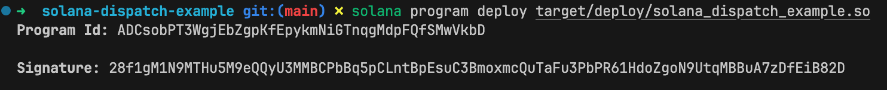
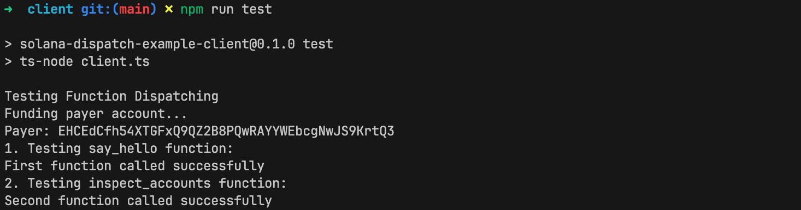
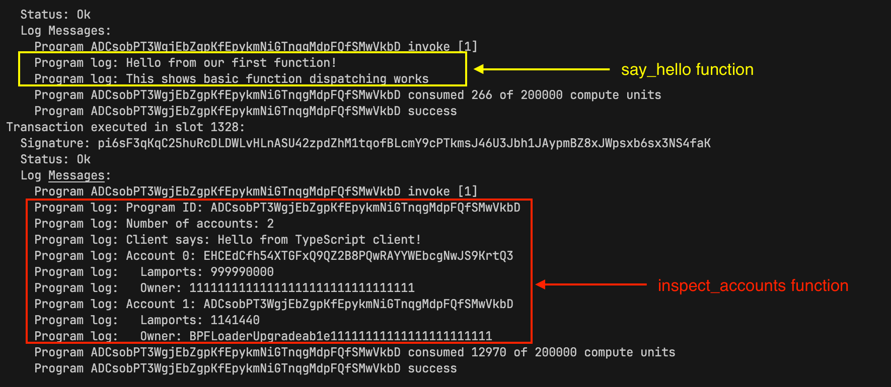

# Native Solana: Function Dispatching

Function dispatching in Solana is the process of routing incoming instructions to the appropriate handler function based on specific identifiers encoded in the instruction data.

In our previous native Rust Solana tutorials, we put all program logic inside the `process_instruction` function. This works for simple programs with a single instruction. However, when a program supports multiple instructions, the entrypoint fills up with parsing logic, condition checks, and handler code. A cleaner approach is to move logic into separate functions and route each instruction to the correct handler.

Unlike Ethereum, where the EVM routes calls to the correct function with built-in selectors, Solana programs must route instructions themselves. Anchor solves this by generating 8-byte discriminators and prepends them to the instruction data. The program reads this value and dispatches to the correct handler. We explain this in detail in the next section.

In this tutorial, we'll demonstrate how to handle function dispatching in native Rust Solana programs.

## **How Anchor handles function dispatching**

When you write functions in Anchor like this:

```rust
#[program]
pub mod my_program {
    pub fn initialize(ctx: Context<Initialize>) -> Result<()> {
        // Initialize logic
        Ok(())
    }
    
    pub fn update_counter(ctx: Context<UpdateCounter>, new_value: u64) -> Result<()> {
        // Update logic
        Ok(())
    }
    
    pub fn close_account(ctx: Context<CloseAccount>) -> Result<()> {
        // Close logic
        Ok(())
    }
}
```

Anchor generates the necessary code to route instructions to the appropriate function based on the instruction data. Under the hood, it performs three main steps:

1. **Step 1 — Anchor prepends an 8-byte discriminator to every instruction.** This discriminator is created by taking the first 8 bytes of the SHA-256 hash of "global:" plus the function name (`sha256("global:" + function_name)`). This unique identifier helps route each instruction to the correct handler function, this is similar to Ethereum where the function selector is the first 4 bytes of the Keccak-256 hash of the function signature.
    
    ```rust
    let mutdiscriminator = [0u8; 8];
    let preimage = format!("global:{}", ix_name);   // ix_name = function name
    let hash = sha2::Sha256::digest(preimage.as_bytes());
    discriminator.copy_from_slice(&hash[..8]);
    ```
    
2. **Step 2 — Anchor generates a dispatcher at compile time.** It splits the instruction data at the 8-byte mark and uses the discriminator to route to the appropriate handler with a Rust match statement, right inside the instruction processor.
    
    ```rust
    // Conceptual representation of what Anchor generates
    pub fn process_instruction(
        program_id: &Pubkey,
        accounts: &[AccountInfo],
        instruction_data: &[u8],
    ) -> ProgramResult {
        // Split off the 8-byte discriminator
        let (discriminator, remaining_data) = instruction_data.split_at(8);
    
        // Match against known instruction discriminators
        match discriminator {
            // Each instruction's discriminator is computed at compile time
            INITIALIZE_DISCRIMINATOR => initialize(program_id, accounts, remaining_data),
            UPDATE_COUNTER_DISCRIMINATOR => update_counter(program_id, accounts, remaining_data),
            _ => return Err(ProgramError::InvalidInstructionData),
        }
    }
    ```
    
3. **Step 3 — Anchor deserializes instruction parameters.** For instructions with parameters, Anchor deserializes the remaining instruction data into the expected Rust types. This means your functions receives the parameters it expects, instead of raw bytes.

With these three steps in place, we write Rust functions and Anchor handles instruction routing and all the instruction data parsing for us. But because we're using native Rust, we have to do these steps ourselves.

## Implementing Function Dispatching in Native Rust Programs

We'll build a native Solana program in Rust with three functions: the `process_instruction` function and two instruction handlers. In `process_instruction`, we'll examine the first byte of the instruction data and use a match statement to dispatch to the appropriate handler. The first function will simply log a message to demonstrate that the routing mechanism correctly identifies and calls the intended handler. The second function will iterate through accounts and parse the instruction data bytes.

Once we cover how routing works, all the other concepts we've covered in our previous tutorials on native Rust Solana can be applied, i.e., account creation, Borsh serialization, cross-program invocation. They all work the same way inside your handler functions.

We can implement function dispatching in multiple ways. While there's no single enforced convention (programs are free to choose their own approach), the simple byte approach and Borsh-serialized enums are most common in native Rust programs, while Anchor uses its hashing approach. Here are the main approaches:

1. **Simple byte approach:** We assign a unique constant to represent each function in our program, e.g., `const INITIALIZE: u8 = 0` and `const UPDATE: u8 = 1`. When a client calls our program, it places one of these values at the start of the instruction data (byte position 0). Our program then reads the first byte and compares it against its defined constants to determine which function the client intended to call, and routes execution accordingly.
2. **Borsh-serialized enum:** This approach uses Borsh for serialization. We define a Rust enum with variants for each instruction, derive Borsh serialization traits, and let the client send the serialized enum. On the program side, we deserialize the instruction data back into our enum and match on the variants.
3. **Anchor-style hashing:** This approach mirrors how Anchor works internally. We can create unique identifiers by taking the first 8 bytes of the SHA-256 hash of "global:" plus each instruction name. The client computes this hash the same way and prepends it to the instruction data, and our program matches against these pre-computed hash constants.

We'll use the simple byte approach for our example.

Our program will have three main functions:

1. `process_instruction`: The instruction processor that receives all instructions and routes them to the appropriate handler based on the instruction data.
2. `say_hello`: A simple handler function that logs greeting messages
3. `inspect_accounts`: This function will receive a string message from the client we will build, and it will log the message along with the program ID and the account information provided by that client.

## **Project Setup**

Let's set up our project structure first to demonstrate function dispatching:

```bash
mkdir solana-dispatch-example
cd solana-dispatch-example
cargo init --lib
```

Now update your `Cargo.toml` to include the necessary dependencies:

```toml
[package]
name = "solana-dispatch-example"
version = "0.1.0"
edition = "2021"

[lib]
crate-type = ["cdylib", "lib"]

[dependencies]
solana-program = "2.2.0"
```

Open `src/lib.rs` and replace its contents with the code below. This program:

- Defines constants for each instruction type (`SAY_HELLO` = 0 and `INSPECT_ACCOUNTS` = 1)
- Implements`process_instruction` and passes it to the `entrypoint!` macro
- Reads the first byte of the instruction data to determine which function to call
- Matches on the instruction type and routes execution to the correct handler function

```rust
use solana_program::{
    account_info::AccountInfo,
    entrypoint,
    entrypoint::ProgramResult,
    msg,
    pubkey::Pubkey,
};

// Define instruction type constants
pub const SAY_HELLO: u8 = 0;
pub const INSPECT_ACCOUNTS: u8 = 1;

entrypoint!(process_instruction);

pub fn process_instruction(
    program_id: &Pubkey,
    accounts: &[AccountInfo],
    instruction_data: &[u8],
) -> ProgramResult {
    // Read first byte to determine which function to call
    match instruction_data[0] {
        SAY_HELLO => say_hello(),
        INSPECT_ACCOUNTS => inspect_accounts(program_id, accounts, &instruction_data[1..]),
        _ => {
            msg!("Unknown instruction: {}", instruction_data[0]);
        }
    }
    
    Ok(())
}
```

The match statement is where the actual dispatching happens. We match the first byte of the instruction data against our defined constants (`SAY_HELLO` and `INSPECT_ACCOUNTS`). Since our constants are single-byte values, we only need to check `instruction_data[0]`. For the `INSPECT_ACCOUNTS` function, we pass the remaining bytes (`&instruction_data[1..]`) to the handler function

Now add the `say_hello` function. We simply log some messages:

```rust
fn say_hello() {
    msg!("Hello from our first function!");
}
```

Finally, let's add the `inspect_accounts` function. This function will receive a text message from the client (sent as instruction data), deserialize it, and log it along with the program ID and account information passed:

```rust
fn inspect_accounts(program_id: &Pubkey, accounts: &[AccountInfo], data: &[u8]) {
    msg!("Hello from our second function!");
    msg!("Program ID: {}", program_id);
    msg!("Number of accounts: {}", accounts.len());
    msg!("Instruction data length: {}", data.len());
    
    // Show account details
    for (i, account) in accounts.iter().enumerate() {
        msg!("Account {}: {}", i, account.key);
        msg!("  Lamports: {}", account.lamports());
        msg!("  Owner: {}", account.owner);
    }
}
```

Notice that the `inspect_accounts` functions uses the same parameters as the `process_instruction` function. This is not a requirement, but it is a common pattern.

Now we build and deploy the program:

```bash
# Build the program
cargo build-sbf

# Start a local validator (in a separate terminal)
solana-test-validator

# Monitor logs (in another terminal)
solana logs

# Deploy the program
solana program deploy target/deploy/solana_dispatch_example.so
```

You should get a similar output to this:



Copy your program ID from the output, you'll need it for the client.

## Testing our program

We have successfully built and deployed our program. Now, let’s create a TypeScript client to test function dispatch. This client will call both functions in our program.

First, set up the client environment in our project directory:

```bash
mkdir client && cd client
npm init -y
npm install @solana/web3.js typescript ts-node @types/node
```

Update `client/package.json` to add a test script so we can run our client with `npm run test`:

```json
{
  "scripts": {
    "test": "ts-node client.ts"
  }
}
```

Create a `client/tsconfig.json` file with the following TypeScript compiler configuration, which allows our client TypeScript code to compile and run with `ts-node`.

```json
{
  "compilerOptions": {
    "target": "ES2020",
    "module": "commonjs",
    "moduleResolution": "node",
    "strict": true,
    "esModuleInterop": true,
    "skipLibCheck": true,
    "types": ["node"]
  },
  "include": ["*.ts"]
}
```

Finally, create a `client/client.ts` file for our client code and add the code below. In this code we:

1. Define the same instruction constants that match our program functions (`SAY_HELLO` = 0, `INSPECT_ACCOUNTS` = 1)
2. Set up connection to the local Solana test validator
3. Create and fund a payer account (used as the transaction signer to pay for transaction fees)
4. Call the `say_hello` function (sends only the discriminator byte 0, with no accounts passed)
5. Call the `inspect_accounts` function (sends discriminator + greeting string message, passes payer and program ID as accounts for inspection)

```tsx
import {
  Connection,
  Keypair,
  LAMPORTS_PER_SOL,
  PublicKey,
  Transaction,
  TransactionInstruction,
  sendAndConfirmTransaction,
} from '@solana/web3.js';

// Constants that match our program
const SAY_HELLO = 0;
const INSPECT_ACCOUNTS = 1;

// Replace with your actual program ID after deployment
const PROGRAM_ID = new PublicKey('YOUR_PROGRAM_ID_HERE');
const connection = new Connection('http://localhost:8899', 'confirmed');

async function testFunctionDispatching() {
  console.log('Testing Function Dispatching');

  // Create a funded payer account
  const payer = Keypair.generate();
  console.log('Funding payer account...');
  await connection.requestAirdrop(payer.publicKey, LAMPORTS_PER_SOL);

  // Wait for airdrop confirmation
  await new Promise((resolve) => setTimeout(resolve, 2000));

  console.log(`Payer: ${payer.publicKey.toString()}`);

  // Test the say_hello function
  console.log('1. Testing say_hello function:');
  const sayHelloIx = new TransactionInstruction({
    keys: [],
    programId: PROGRAM_ID,
    data: Buffer.from([SAY_HELLO]),
  });

  await sendAndConfirmTransaction(
    connection,
    new Transaction().add(sayHelloIx),
    [payer]
  );
  console.log('First function called successfully');

  // Test the inspect_accounts function
  console.log('2. Testing inspect_accounts function:');
  
  // Create message to send to the program
  const message = "Hello from TypeScript client!";
  const messageBytes = Buffer.from(message, 'utf-8');
  const instructionData = Buffer.concat([
    Buffer.from([INSPECT_ACCOUNTS]), // Discriminator byte
    messageBytes                    // Message payload
  ]);
  
  const inspectAccountsIx = new TransactionInstruction({
    keys: [
      { pubkey: payer.publicKey, isSigner: false, isWritable: false },
      { pubkey: PROGRAM_ID, isSigner: false, isWritable: false },
    ],
    programId: PROGRAM_ID,
    data: instructionData,
  });

  await sendAndConfirmTransaction(
    connection,
    new Transaction().add(inspectAccountsIx),
    [payer]
  );
  console.log('Second function called successfully');
  console.log('Check the logs to see detailed function output!');
}

testFunctionDispatching().catch(console.error);
```

Ensure that the test validator and logs are still running before we run the test. 

Now run the test:

```bash
cd client
npm run test
```

It runs successfully!



Looking at the logs, we can see that both of our program functions executed.

