# Tracing SBF Instruction Execution and Compute Costs

In the previous article, we covered the sBPF VM architecture, register conventions, and the instruction set. Now we'll analyze actual bytecode execution using the `agave-ledger-tool` (a CLI tool that ships with the Solana toolchain) to generate execution traces and manually calculate compute units consumed by a program.

Although manually tracing opcodes is challenging, we can automatically generate a visual trace of how every register updated with each opcode execution. This lets us see exactly which instructions run and how compute units accumulate.

## **Analyzing a Simple Program**

Let's analyze the bytecode of a simple Anchor program to see how each part turns into SBF instructions and how they use the registers. This will also let us manually calculate the compute unit cost.

### Project Setup

First, initialize a new project with:

```bash
anchor init compute_unit
cd compute_unit
```

Replace the code in `programs/compute_unit/src/lib.rs` with the minimal program below. We use an empty `initialize` function so we can focus on measuring baseline compute costs without any business logic:

```rust
use anchor_lang::prelude::*;

declare_id!("CR33kP6d39mBZv1ryjufVXoRm6djnWW8uKoQXwU5kgDV");

#[program]
pub mod compute_unit {
    use super::*;

    pub fn initialize(ctx: Context<Initialize>) -> Result<()> {
        Ok(())
    }
}

#[derive(Accounts)]
pub struct Initialize {}

```

We'll run the `initialize` function on a local validator (we’ll see how as we proceed) and use `solana logs` to see the compute units it consumes. Then we'll disassemble the program and generate an execution trace to observe which SBF opcodes ran. In doing so, we can manually calculate how each instruction adds up to the total compute unit cost.

Build and start a local validator:

```bash
anchor keys sync
anchor build
```

Then in a new terminal:

```bash
solana-test-validator
```

This spins up a local validator and creates a `test-ledger/` directory—`agave-ledger-tool` uses this directory to load the ledger state when generating program traces.

Run `solana logs` in another terminal, then run `anchor test --skip-local-validator` in a separate terminal to see exactly how many compute units the `initialize` function uses. If we do this, we get 272 compute units. We'll get back to this later.

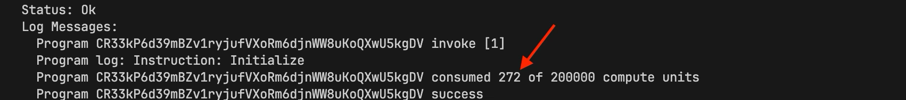

## Disassembling the Program

The first step in Solana bytecode analysis is turning the executable Solana program binary (usually stored in a `target/deploy/<project_name>.so` file) into bytecode mnemonics that we can understand a bit better. Mnemonics are simply a human-readable representation of binary/hexadecimal opcodes, E.g, from the EVM, `0x60` = PUSH1, `0x52` = MSTORE and so on.

We need a `test-ledger` folder in the project root containing a `genesis.bin` file. The `solana-test-validator` we ran earlier generates these automatically. The `agave-ledger-tool` (part of the Solana toolchain) uses this file to load the ledger state when disassembling programs.

We can now disassemble our program with:

```bash
agave-ledger-tool program --ledger test-ledger disassemble target/deploy/compute_unit.so --output json > output.txt
```

This dumps assembly mnemonics to `output.txt`. You'll see something like this:

```bash
function_0:
    mov64 r0, r2
    and64 r0, 1
    jeq r0, 0, lbb_32
    mov64 r0, 0
    jslt r5, 0, lbb_34
    stxdw [r10-0x8], r3
    jeq r5, 0, lbb_41
    ...
    ...
```

Labels like `function_0:` are jump destinations in the bytecode that other instructions can jump to using the `call` instruction. Rust functions compile into sequences of instructions, and the compiler generates these labels to mark function entries or internal code blocks. So when you see something like `call function_11561`, execution jumps to that offset in the bytecode and runs the instructions there.

This is the mnemonics of our Solana program. However, we cannot do much with this, it’s very large and extremely challenging to analyze manually. 

## Generating an Execution Trace

To generate a trace, we need to tell the `agave-ledger-tool` which function to call in our program. We do this by creating an `instructions.json` file, which we will pass to the tool as you will see shortly. 

Now, create an `instructions.json` file in our project root folder and paste the code below:

```bash
{
  "accounts": [],
  "program_id": <program_id>,
  "instruction_data": [175, 175, 109, 31, 13, 152, 155, 237]
}
```

The parameters above denote: the `accounts` list (empty here since our `initialize` function takes no accounts), the `program_id` to invoke (replace `<program_id>` with your real program id), and the instruction data.

The `instruction_data` field contains only the 8-byte discriminator for the `initialize` function (no additional arguments since our function takes none). Anchor [generates these discriminators](https://github.com/solana-foundation/anchor/blob/292b095f91eb2888a0dd034d408395a9379ed5c4/lang/syn/src/codegen/program/common.rs#L13) by taking the first 8 bytes of `sha256("<namespace>:<function_name>")`. In our case, that's `sha256("global:initialize")`. Namespace is global because our program is contained in the outermost scope of our codebase.

Now let's generate the trace:

```bash
agave-ledger-tool program run target/deploy/compute_unit.so --limit 200000 --trace trace.txt --ledger test-ledger --input instructions.json
```

This runs the program with our instruction data (the `initialize` function) and outputs the execution trace to `trace.txt.0`. The `--limit` flag sets a compute unit limit. It’s not required, but it’s useful for testing.

**Note: If you get an error saying `Err(JitNotCompiled)` (for example, when using an ARM MacBook), add `--mode interpreter` to your command to use interpreter mode instead of the default JIT compilation mode.**

## Reading the Execution Trace

The `trace.txt.0` file looks like this. We've labeled each section for clarity and show only the first 6 instructions:

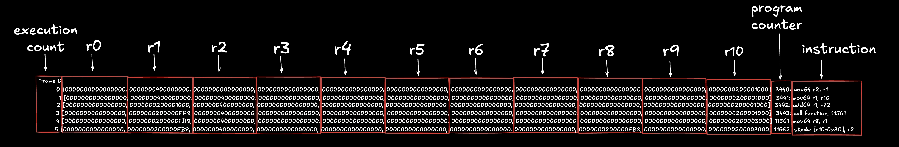

This gives us enough information to analyze and understand the program and compute units it consumed. 

Let’s go through what each column shows:

- Execution count column (first column): The execution counter.
- r-prefixed columns (column 2-12): Shows the state/value of each of Solana VM’s 11 Registers (r0 - r10) after the instruction above it was executed.
- Program counter column (column 13): The Program counter (PC) or index of the given instruction/opcode in the program’s binary.
- Instruction column (column 14): The instruction/opcode and it’s operands to be executed next.

Now let's go through the first 6 instruction of the trace output to get familiar with how the values change in registers during execution. Let's split the image to make the register's values more visible:

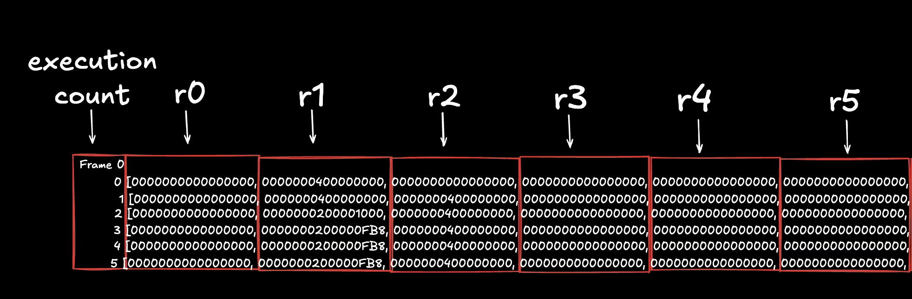

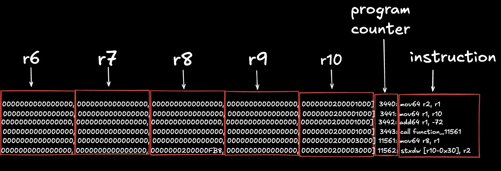

- The first instruction (`mov64 r2, r1`) copies the 64-bit value from register 1 to register 2. In the next row, both r1 and r2 hold the same value.
- The second instruction (`mov64 r1, r10`) copies the value from register 10 to register 1.
- The third instruction (`add64 r1, -72`) subtracts 72 from the value in r1 and stores the result back in r1.
- The fourth instruction (`call function_11561`) jumps to another function; execution resumes after the call when the function returns.
- The fifth instruction (`mov64 r8, r1`) copies the value from register 1 to register 8 (inside the called function, as shown by the PC change. PC went from 3443 to 11561 because of this function call).
- The sixth instruction (`stxdw [r10-0x30], r2`) stores 64 bits from register 2 to memory at the address in r10 minus the memory offset 0x30. Given that, in this 6th execution, register 2 holds the value `0x0000000400000000` and register 10 holds the value `0x0000000200003000`, this means that the instruction will store the 64-bit value `0x0000000400000000` at the memory address `0x0000000200002FF0` (which is `r10 - 0x30`, where r10 calculates a new address from the address stored in r10 minus that specified offset)

## Computing Compute Units

Now that we've seen how the execution trace is displayed and what each column shows, the next question is, where does compute unit come into play here?

**Each sBPF instruction costs 1 compute unit. However, syscall instruction incur additional charges that vary by type. Total compute units = instruction count + syscall instruction charges.**

Let’s see this in action. In the same program, if we scroll down to the end of the execution trace (in the `trace.txt.0` file) we can see that the last execution count/index is 171 which means this program executed 172 instructions (index 0-171). Validator logs for the same call (shown below) report 272 compute units consumed. 


The difference (100) comes from the logging syscall that prints the instruction name ("Program log: Instruction: Initialize"). 

That syscall is `sol_log_`, which charges a `syscall_base_cost` [compute units of 100](https://github.com/anza-xyz/agave/blob/eb0cc0b668da178f075e65fb53cf6296ea185260/program-runtime/src/execution_budget.rs#L236) (at the time of writing). Now, if we add this to the 172 instruction count, we get 172 + 100 = 272 total compute units.

We can verify this by searching for the `syscall` opcode in our `trace.txt.0` file. It appears once — `syscall sol_log_` at execution count 157.

## Why doesn’t the PC start at 0?

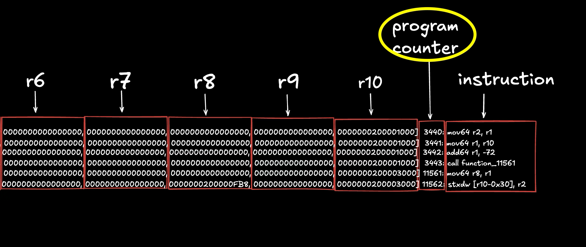

Unlike EVM bytecode where execution starts at the first PC, in Solana bytecode, execution starts wherever the `entrypoint` jump label is (we discuss this in the next tutorial, but you can search for `<entrypoint>` in the `output.txt` file we generated earlier to see it). The Solana runtime jumps directly to this label when invoking your program. If you look at the image above showing our execution trace, you'll see the first instruction `mov64 r2, r1` is at a non‑zero PC (3440 in this trace) instead of PC 0. This means the bytecode from PC 0 to PC 3439 exists in the compiled program but isn't executed unless explicitly jumped to.

What's in that skipped section? It contains other labeled code blocks (like helper functions, error handling routines, or Anchor-generated code) that only execute when jumped to from the main execution path. If you search for the `<entrypoint>` label in `output.txt` (the full bytecode dump), you'll see it's defined at offset 3440, with other labels like `function_0`, `function_11561`, etc. defined before it at earlier offsets. The runtime starts execution at `<entrypoint>`, then jumps to these other labels as needed (you can see `call function_11561` in the trace above). Again, we’ll discuss the entrypoint in the next tutorial. 

## Where is the log coming from if the program d**oes not log anything from its code?**

We've seen that our program consumes compute units from both instruction execution and syscall costs. To understand this better, we'll first identify where the log in our trace comes from, then add explicit logging to see how different syscalls affect the total compute unit count. This will let us verify our formula (instructions + syscall costs = total CU) with concrete numbers.

What is the program trying to log out with the `sol_log_` syscall? To find out, let's run a test against our test validator with Solana logs running. (If you already have this running you can skip this step):

```bash
# start up a test validator
solana-test-validator

# get solana logs running in a separate terminal
solana logs
```

Run `anchor test --skip-local-validator` in a separate terminal. We should see some things logged out in the Solana logs terminal and the last log gives us the answer. Logs from a program can be identified as having a key of `Program log:` under that Transaction's `Log Messages:`.

In the example above, the output of the transaction that strictly involves the call to initialize is this:

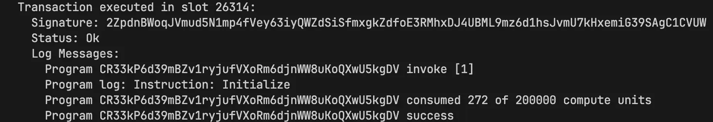

Looking at it, it has three properties:

- Signature: which is the signature of the signer
- Status: if the transaction was successful
- Log Messages: logs from that particular call

What we are interested in is the `Log Messages` section of the log output above. It has some properties also:

- **First** line tells us the program ID being invoked and its invoke depth starting from 1.
- **Second to last** line tells us the amount of compute units our program consumed and the max compute unit set for that transaction
- **Last** line tells us if the call was successful
- **Everything in between** (in this case, just one line) is the actual program logs. These can be identified easily as they always start with `Program xxx:` where `xxx` can vary depending on the syscall that is used to log out.

In our case above, we have one log which simply tells us the name of the instruction from our program or in other words, the function we called. This log is automatically inserted by Anchor. Our program code doesn't explicitly call any logging function, but Anchor's macro expansion adds a `sol_log_` syscall that prints "Instruction: Initialize" when the function runs. If you wrote the same program in native Rust without Anchor, you wouldn't see this log unless you explicitly added it.

Given that Anchor automatically logs the instruction name for every function call, every Anchor program invocation will have at least one log line (the instruction name).

### **Adding explicit logging to see syscall costs**

Now let's add our own logging call to see how multiple syscalls affect the count. Add `solana-program = "1.18.17"` to `programs/compute_unit/Cargo.toml` as a dependency and update our program code to this:

```rust
use anchor_lang::prelude::*;
use solana_program::log::sol_log_compute_units;

declare_id!("CR33kP6d39mBZv1ryjufVXoRm6djnWW8uKoQXwU5kgDV"); // Run anchor sync to update your program ID

#[program]
pub mod compute_unit {
    use super::*;

    pub fn initialize(ctx: Context<Initialize>) -> Result<()> {
        sol_log_compute_units();
        Ok(())
    }
}

#[derive(Accounts)]
pub struct Initialize {}
```

Running the tests for this, we can see the `solana log` for our transaction will come out as:

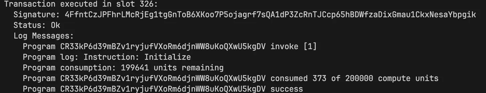

We can see that we now have 2 `Program xxx:` logs. The first is our usual `Instruction: Initialize` log, and the second shows how many compute units remain at the point `sol_log_compute_units()` was called.

From the log, we also see that 199,641 compute units are remaining when `sol_log_compute_units()` executes. When we subtract this value from the compute unit limit (200,000), we get 359 compute units consumed to reach that point. We'll break this down and verify where these 359 units went.

Note: When logging compute units remaining, the format is always `Program consumption: X units remaining`.

### **Breaking down the compute unit calculation**

After adding `sol_log_compute_units()` to our program and generating a new trace (you can do this as we did earlier). From`trace.txt.0`:

- Execution count is 0-172 (173 total instructions executed, up from 172 in our earlier trace without logging)
- Execution count 157 has `syscall sol_log_` (this logs "Instruction: Initialize")
- Execution count 158 has `syscall sol_log_compute_units_` (this logs the remaining CUs)

You can search for these yourself in `trace.txt.0` (`sol_log_` and `sol_log_compute_units_`) to confirm where they show up in the trace output.

Now here's where it gets interesting. Each syscall has a runtime charge. Syscalls must have these charges to prevent programs from running forever (if syscalls were free, a program could make infinite syscall loops and clog up the network):

- `sol_log_` costs 100 CU (defined by `syscall_base_cost` [here](https://github.com/anza-xyz/agave/blob/master/program-runtime/src/execution_budget.rs))
- `sol_log_compute_units_` also costs 100 CU (defined by `get_remaining_compute_units_cost` [here](https://github.com/anza-xyz/agave/blob/master/program-runtime/src/execution_budget.rs))

So the total compute units consumed:

```
Instructions executed:    173
Runtime syscall charges:  200  (100 + 100)
                          ---
Total compute units:      373
```

This matches what the validator logs show: "consumed 373 of 200000 compute units" 

### **Verifying compute units at the logging point**

Remember the log showed "199641 units remaining" when `sol_log_compute_units()` executed. That means 359 units were consumed by that point (200,000 - 199,641 = 359).

Let's verify this makes sense. Looking at the trace, `sol_log_compute_units_` appears at execution count 158, which means:

- 159 instructions executed so far (execution count 0-158)
- 100 CU charge from the first `sol_log_` syscall (at execution count 157)
- 100 CU charge from `sol_log_compute_units_` itself (applied when it executes)
- Total: 159 + 100 + 100 = **359 CU**

Perfect! This confirms our trace is showing us exactly when each syscall happens and how compute units accumulate throughout execution.

### **Observing parameter handling in the trace**

Let’s replace `solana_program::log::sol_log_compute_units();` from our current program and replace it with `solana_program::log::sol_log_64(1, 2, 3, 4, 5);`. Here, we are instead logging five 64-bit numbers with a syscall.

Running our test now, we can see our relevant logs as:

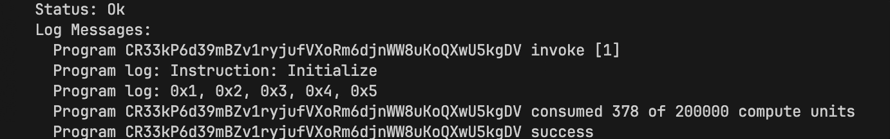

Indeed we have 2 logs. Our usual Instruction name log and as expected our 5 numbers logged out. 

If we run our execution trace command and search for syscall in `trace.txt.0`, we find two entries. The second is a syscall to `sol_log_64_`, which matches what we just did.

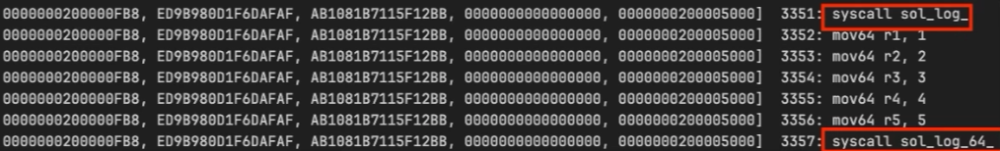

The Solana compute unit [codebase](https://github.com/anza-xyz/agave/blob/master/program-runtime/src/execution_budget.rs) shows that `log_64_units` costs 100 units, the same as `get_remaining_compute_units_cost`. But notice that this costs additional 5 compute unit (no longer 373 like before, but 378). That's easily explained by the fact that just before the syscall to `sol_log_64_`, we have 5 new instructions. We show this below.

Once again, the images are split to make the register’s values more visible:

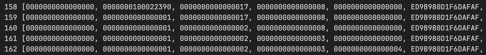

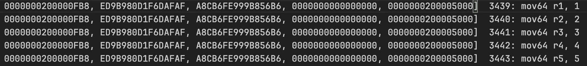

This is self-explanatory. From the image, we see five `mov` instructions that store five numbers in register `r1-r5`. Those numbers are exactly what we logged.