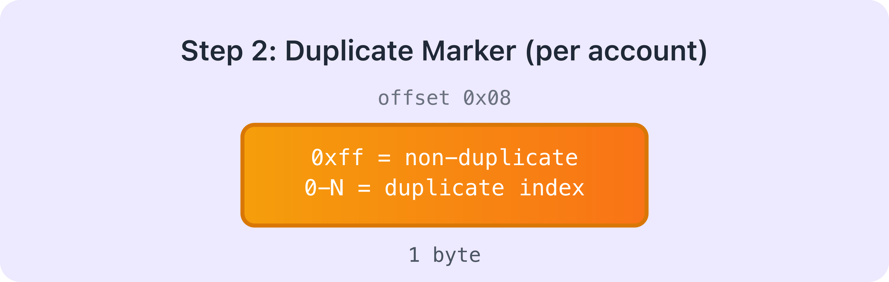
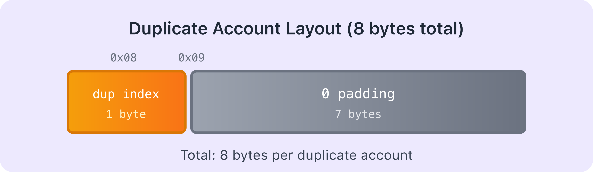
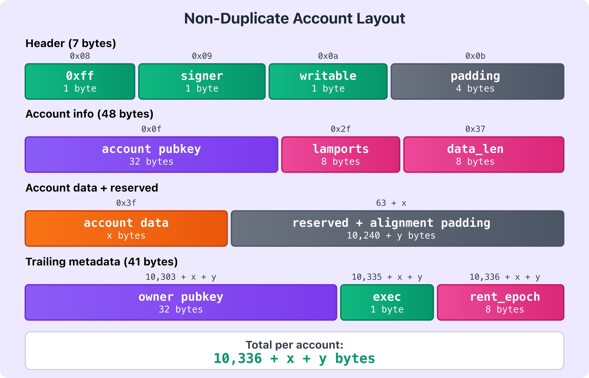
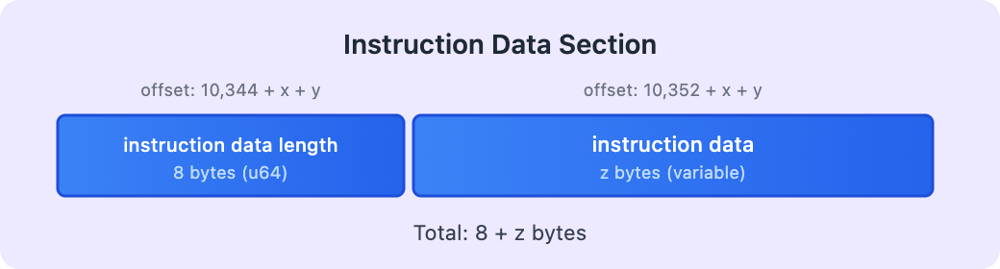
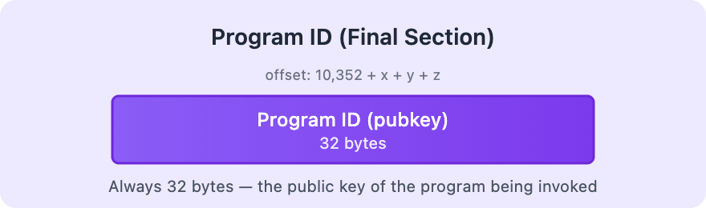
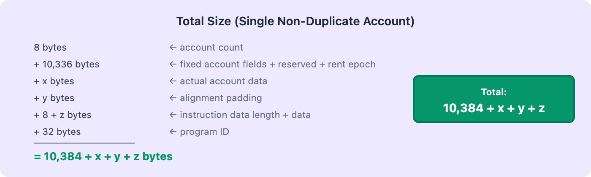
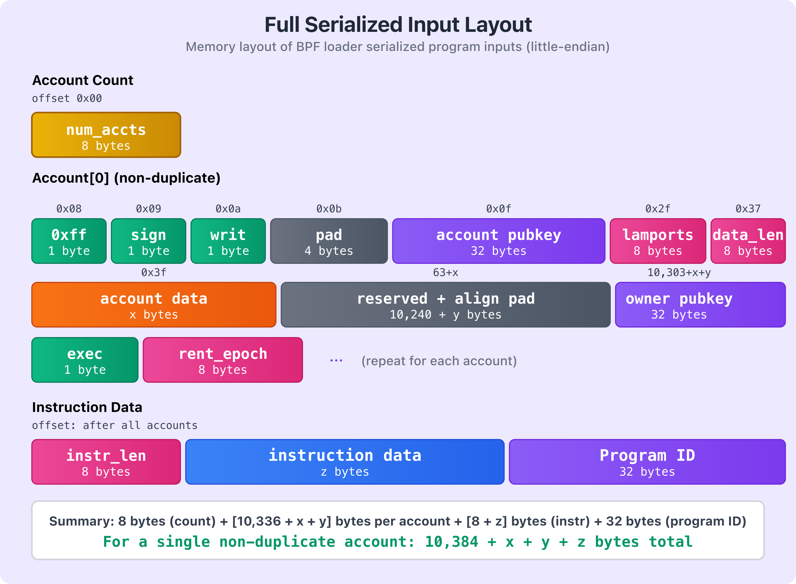

# Solana Program Execution and Input Serialization

This article explains how the BPF loader serializes program instruction inputs, how the entrypoint receives them, and how programs deserialize that input to read the program ID, accounts, and instruction data. In part two of this article, we'll cover how programs routes incoming instructions to the appropriate handlers and the supporting code the entrypoint sets up to make that possible.

## **The Solana BPF Loader**

The BPF Loader is one of Solana's native programs, with its implementation [here](https://github.com/anza-xyz/agave/blob/master/programs/bpf_loader/src/lib.rs). It's responsible for deployment, upgrades, loading, and executing BPF programs on chain.

Native programs are programs that are part of the validator implementation and can be upgraded as part of cluster upgrades (for example to fix bugs or add features).

Solana has multiple BPF Loaders, but the older ones (V1 & V2) are deprecated and no longer used for new deployments. The [**BPF Loader Upgradeable**](https://solscan.io/account/BPFLoaderUpgradeab1e11111111111111111111111) is the current standard, and unless stated otherwise, "the BPF Loader" in this article refers to it — including the serialization format described here.

The BPF Loader sets up the execution environment and starts the Solana virtual machine. The virtual machine then calls the program entrypoint and the program execution begins.

## **The Program Entrypoint**

Recall that in the previous article, when we analyzed the execution trace, bytecode execution started at an `<entrypoint>` label, the symbol marking the program's entrypoint function. This is where execution begins.

In Anchor programs, the `#[program]` macro automatically generates this entrypoint for you. The macro creates the entrypoint function, sets up instruction dispatching (routing to your instruction handlers based on the first 8 bytes of instruction data), and handles input deserialization and output serialization. You never see or write the entrypoint yourself.

In native Rust programs, you must define the entrypoint yourself using the [`entrypoint!`](https://github.com/anza-xyz/solana-sdk/blob/master/program-entrypoint/src/lib.rs#L125-L139) macro from the `solana_program` crate, then handle instruction dispatch yourself.

The `entrypoint!` macro generates code that sets up the program's entry point. To understand what this code looks like, let's take a look at the generated function signature:

```rust
#[no_mangle]
pub unsafe extern "C" fn entrypoint(input: *mut u8) -> u64;
```

The function takes a single parameter (`input`), a pointer to serialized instruction inputs stored in the VM's memory. The instruction input consists of three parameters:

- `program_id`: The public key of the program being called
- `accounts`: An array of accounts the program can access
- `instruction_data`: The instruction-specific data (similar to calldata in Solidity)

You might recognize these instruction input parameters as exactly the same data we provided in our `instructions.json` file in the previous article when generating execution traces:

```json
{
  "accounts": [],
  "program_id": "HTpqQdG7f44su3QsV3HHurraR1ZNjHAdArCy3qHKyKBC",
  "instruction_data": [175, 175, 109, 31, 13, 152, 155, 237]
}

```

## **How the BPF Loader Serializes Program Instruction Inputs**

When you invoke a Solana program, the Solana runtime (through the BPF loader) serializes the instruction inputs (the `program_id`, the account list, and the `instruction_data`) along with each account's on-chain state (its lamports balance, owner, data bytes, and other metadata) into a byte array and stores it in the VM's memory. A pointer to the start of this array is passed to the program’s entrypoint as the `input` parameter. The invoked program then deserializes this byte array to recover the `program_id`, accounts, and instruction data it needs to execute.

The BPF loader uses a known serialization format, and Solana programs must follow the exact same format when deserializing instruction inputs (we discuss this later).

In Anchor programs, the `#[program]` macro automatically generates the deserialization code that follows this format. In native Rust programs, the `entrypoint!` macro from `solana_program` crate provides a `deserialize` internal function that implements this format. Either way, the deserialization logic is provided for you, so you don't have to implement it from scratch.

Now we walk through how the BPF loader serializes program input data in memory. All values are encoded in little-endian, so keep that in mind as we examine the layout. The sections below break down how the instruction input is structured.

**Account count**

The very first thing serialized is how many accounts this program call needs. This takes up 8 bytes.


**Then, each account in the accounts array is serialized**

After the account count, the loader serializes each account one by one. Each account starts with a 1-byte duplicate marker that indicates whether this is the first occurrence of this account within the accounts array or a duplicate (meaning the same account appears multiple times in the accounts array).



**Duplicate accounts**

If the account is a duplicate (i.e. this exact account was already serialized earlier in the accounts array), the loader doesn't serialize all its data again. Instead, the 1-byte marker contains the index of where this account first appeared, followed by 7 bytes of padding. Hence, the total size for a duplicate is 8 bytes (1-byte index + 7 bytes padding).



**Non-duplicate accounts**

If this is the first occurrence of this account in the array, the loader serializes all its information. This is where the size of the whole serialized data becomes variable because different accounts hold different amounts of data.

The loader writes each account in sequence. It starts with a 1-byte non-duplicate marker (`0xff`), followed by two 1-byte flags for whether the account is a signer and writable, then 4 bytes of padding — 7 bytes total for this opening section. After that, it writes the account's public key (32 bytes), the lamports field (8 bytes), and the data length (8 bytes). Those fields add up to 55 bytes before any account data.

Next it writes the account's data bytes (`x` bytes). Once that's written, the loader appends 10,240 bytes of reserved space (so the account can grow during execution without reallocation) plus `y` alignment padding bytes — where `y` is whatever is needed to align the next field to a 16-byte boundary (defined as `BPF_ALIGN_OF_U128` in the [serialization source code](https://github.com/anza-xyz/agave/blob/master/programs/bpf_loader/src/serialization.rs)). After the padding, it writes the account owner's public key (32 bytes), the 1-byte executable flag, and the 8-byte rent epoch.

Hence, the total size for a non-duplicate account: 7 (header) + 32 (pubkey) + 8 (lamports) + 8 (data_len) + `x` (data) + 10,240 + `y` (reserved + alignment) + 32 (owner) + 1 (executable) + 8 (rent epoch) = **10,336 + `x` + `y` bytes**.



This pattern repeats for every non-duplicate account in the accounts array.

**After all accounts are serialized (non-duplicate or duplicate), the instruction data is serialized**

Once all accounts are serialized, the loader serializes the instruction data. First, it writes the length of the instruction data as an 8-byte unsigned integer (u64), then the actual instruction data itself (`z` bytes, which varies per instruction). Total: 8 + `z` bytes.



**Finally, the program ID is placed**

The last thing serialized is the program ID (public key of the program being called). This is always 32 bytes. 



**If we consider a serialized input with a single non-duplicate account, the total size for the entire serialized input will be:** 8 bytes (account count) + 10,336 bytes (fixed account fields + reserved space + rent epoch) + `x` bytes (actual account data) + `y` bytes (alignment padding) + 8 bytes (instruction data length) + `z` bytes (actual instruction data) + 32 bytes (program ID) = 10,384 + `x` + `y` + `z` bytes total. If you have multiple accounts, you add the size of each account's serialized data together.



The diagram below shows the complete serialized input structure (non-duplicate account):



The diagram shows how the different components are laid out in memory. Yellow shows the account count, green shows the header flags, purple shows public keys (including the program ID), pink indicates numeric fields like lamports and data lengths, orange shows account data, blue shows instruction data, and gray represents padding and reserved sections.

As mentioned earlier, if there are multiple accounts in the accounts array, the pattern repeats. After the first account's data, we'd have another 1-byte duplicate flag for the second account. If it's not a duplicate (`0xff`), the full account structure follows. If it's a duplicate, the 1-byte value contains the index of its first occurrence in the accounts array, followed by 7 bytes of padding.

Note that the total size of the serialized data isn't fixed; it depends on how many accounts you're passing, how much data each account holds, and the size of your instruction data.

## How Programs Deserialize Instruction Inputs

Now that we've seen how the BPF loader serializes the instruction inputs into a byte array, let's look at how your program deserializes this byte array.

When the runtime invokes the program entrypoint, it calls a deserialize function that converts the raw input byte array into the program ID, accounts, and instruction data needed for execution.

This deserialization function lives in the [Solana SDK](https://github.com/anza-xyz/solana-sdk/blob/master/program-entrypoint/src/lib.rs#L464-L501), and is invoked by the `entrypoint!` macro from the Solana crate. In native Rust Solana programs, this macro defines the program's entrypoint and calls the SDK deserializer before handing control to the instruction processor (we discuss this in the next section).

The deserialization function reads through the BPF loader serialized byte array and extracts the program ID (as a `Pubkey`), the accounts (as a vector of `AccountInfo`), and the instruction data (as a byte slice). 

```rust
pub unsafe fn deserialize<'a>(input: *mut u8) -> (&'a Pubkey, Vec<AccountInfo<'a>>, &'a [u8]) {
    let mut offset: usize = 0;

    // Number of accounts present

    #[allow(clippy::cast_ptr_alignment)]
    let num_accounts = *(input.add(offset) as *const u64) as usize;
    offset += size_of::<u64>();

    // Account Infos
    
    let mut accounts = Vec::with_capacity(num_accounts);
    for _ in 0..num_accounts {
        let dup_info = *(input.add(offset) as *const u8);
        offset += size_of::<u8>();
        if dup_info == NON_DUP_MARKER {
            let (account_info, new_offset) = deserialize_account_info(input, offset);
            offset = new_offset;
            accounts.push(account_info);
        } else {
            offset += 7; // padding

            // Duplicate account, clone the original
            accounts.push(accounts[dup_info as usize].clone());
        }
    }

    // Instruction data

    let (instruction_data, new_offset) = deserialize_instruction_data(input, offset);
    offset = new_offset;

    // Program Id

    let program_id: &Pubkey = &*(input.add(offset) as *const Pubkey);

    (program_id, accounts, instruction_data)
}
```

Now let’s break down this code block step by step.

### **Understanding the Deserialization Process**

**Function Signature**

```rust
pub unsafe fn deserialize<'a>(input: *mut u8) -> (&'a Pubkey, Vec<AccountInfo<'a>>, &'a [u8]) {
```

The `deserialize` function is marked `unsafe` because it involves raw pointer manipulation. It takes `input`, a pointer to the serialized bytes in memory, and returns three values:

- A reference to the program's `Pubkey`
- A vector of `AccountInfo` structs (the accounts used in the transaction)
- A byte slice containing the instruction data

**Tracking the Current Position**

First, the `deserialization` function creates an `offset` variable to track its current position in the `input` byte array. As we know from how the BPF loader serializes this data, the first 8 bytes (a `u64`) specify the number of accounts. The function reads this value into `num_accounts` and then advances the offset by 8 bytes.

```rust
let mut offset: usize = 0;

// Number of accounts present
#[allow(clippy::cast_ptr_alignment)]
let num_accounts = *(input.add(offset) as *const u64) as usize;
offset += size_of::<u64>();
```

**Initializing the Accounts Vector**

Next, the deserialize function creates a vector with capacity for `num_accounts` elements. This is more efficient than letting the vector grow dynamically because Rust won't need to reallocate and copy the entire vector as it fills up.

```rust
let mut accounts = Vec::with_capacity(num_accounts);
```

**Deserializing Each Account**

After creating a vector to hold the accounts to be deserialized, the function loops through each account and checks the duplicate flag. If it's `NON_DUP_MARKER` (0xff), that means this is a unique account, so it calls `deserialize_account_info` to read the full account structure (we explain this next) into the `accounts` vector variable. If it's a duplicate (the flag contains an index instead), it just skips the 7 padding bytes and copies the account that was already deserialized at that index.

```rust
for _ in 0..num_accounts {
    // 1 byte indicating if this is a duplicate account
    // If not a duplicate, the value is 0xff (NON_DUP_MARKER)
    // Otherwise, the value is the index of the account it duplicates
    let dup_info = *(input.add(offset) as *const u8);
    offset += size_of::<u8>();
    
    if dup_info == NON_DUP_MARKER {
        // Not a duplicate: deserialize the full account
        let (account_info, new_offset) = deserialize_account_info(input, offset);
        offset = new_offset;
        accounts.push(account_info);
    } else {
        // Duplicate account: skip 7 bytes of padding and copy the original
        offset += 7; // padding
        accounts.push(accounts[dup_info as usize].clone());
    }
}
```

The `deserialize_account_info` helper function is defined as follows:

This helper function walks through the serialized bytes in the exact order the BPF loader wrote them. It reads the three boolean flags (`is_signer`, `is_writable`, `executable`), skips the 4-byte padding, reads the two public keys (account key and owner), reads the lamports and data length, then creates a slice pointing to the account data. After that, it advances the offset past the account data itself, the 10,240 bytes of reserved space, and the 8-byte rent epoch (which isn't actually stored in the `AccountInfo` struct—it is just skipped). Finally, it adds alignment padding to make sure the next account starts at an 8-byte aligned address.

```rust
unsafe fn deserialize_account_info<'a>(input: *mut u8, mut offset: usize) -> (AccountInfo<'a>, usize) {
    // 1 byte boolean, true if account is a signer
    let is_signer = *(input.add(offset) as *const u8) != 0;
    offset += size_of::<u8>();
    
    // 1 byte boolean, true if account is writable
    let is_writable = *(input.add(offset) as *const u8) != 0;
    offset += size_of::<u8>();
    
    // 1 byte boolean, true if account is executable
    let executable = *(input.add(offset) as *const u8) != 0;
    offset += size_of::<u8>();
    
    // 4 bytes of padding
    offset += size_of::<u32>();
    
    // 32 bytes of the account's public key
    let key: &Pubkey = &*(input.add(offset) as *const Pubkey);
    offset += size_of::<Pubkey>();
    
    // 32 bytes of the account owner's public key
    let owner: &Pubkey = &*(input.add(offset) as *const Pubkey);
    offset += size_of::<Pubkey>();
    
    // 8 bytes unsigned number of lamports owned by the account
    let lamports = &mut *(input.add(offset) as *mut u64);
    offset += size_of::<u64>();
    
    // 8 bytes unsigned number of bytes of account data
    let data_len = *(input.add(offset) as *const u64) as usize;
    offset += size_of::<u64>();
    
    // x bytes of account data (variable length)
    let data = from_raw_parts_mut(input.add(offset), data_len);
    offset += data_len;
    
    // 10,240 bytes of reserved space (for account data growth)
    offset += MAX_PERMITTED_DATA_INCREASE;
    
    // 8 bytes rent epoch (skipped, not deserialized into AccountInfo)
    offset += size_of::<u64>();
    
    // Alignment padding to ensure next account starts at 8-byte boundary
    offset += (offset as *const u8).align_offset(BPF_ALIGN_OF_U128);
    
    (AccountInfo::new(key, is_signer, is_writable, lamports, data, owner, executable), offset)
}
```

**Deserializing the Instruction Data and Program ID**

After deserializing all the accounts, the `deserialize` function moves on to the instruction data. It calls the `deserialize_instruction_data` helper function. This helper function is defined as follows:

```rust
// Instruction data
let (instruction_data, new_offset) = deserialize_instruction_data(input, offset);
offset = new_offset;
```

This helper function reads the 8-byte instruction data length, creates a slice pointing to the instruction data bytes, and returns both the slice and the updated offset. 

```rust
unsafe fn deserialize_instruction_data<'a>(input: *mut u8, mut offset: usize) -> (&'a [u8], usize) {
    // Read the length of the instruction data (first 8 bytes at the current offset)
    let instruction_data_len = *(input.add(offset) as *const u64) as usize;
    
    // Move the offset past the u64 length field, so it now points to the start of the instruction data
    offset += size_of::<u64>();
    
    // Create a slice pointing to the instruction data bytes
    let instruction_data = from_raw_parts(input.add(offset), instruction_data_len);
    
    // Move the offset past the instruction data itself
    offset += instruction_data_len;
    
    // Return the instruction data slice and the updated offset
    (instruction_data, offset)
}

```

Finally, the main deserialization function (`deserialize`) extracts the program ID (the last 32 bytes) and returns all three components your program needs: the program ID, the accounts vector, and the instruction data.

```rust
// Program Id
let program_id: &Pubkey = &*(input.add(offset) as *const Pubkey);
```

We’ve explored how the Solana BPF loader serializes program instruction inputs into a byte array and how programs deserialize them into the program ID, accounts, and instruction data. In the next part of this article, we’ll see what happens to these inputs once they reach the program.

*This article is part of a [tutorial series on Solana](http://rareskills.io/solana-tutorial).*