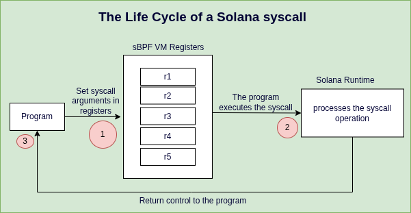
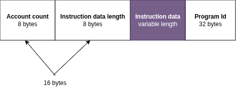
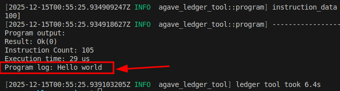
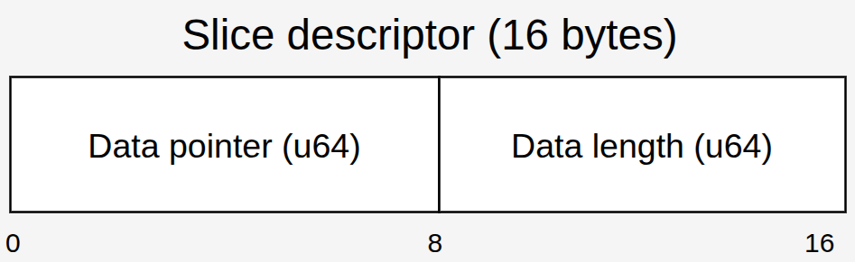
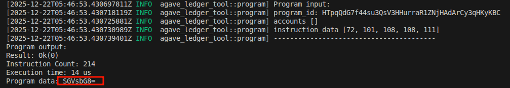
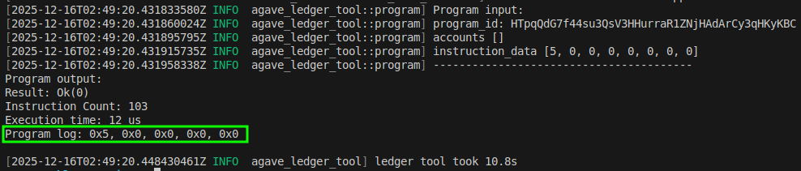
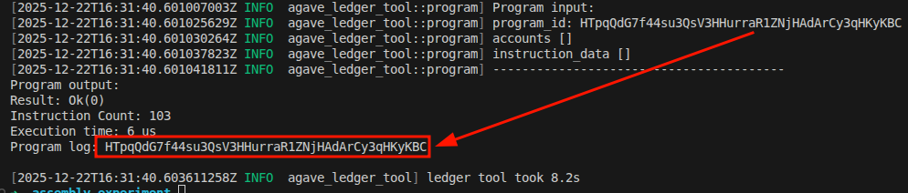
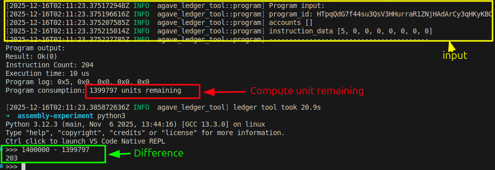

# Solana Syscalls: Logging in sBPF Assembly

In the previous tutorial, we learned how a program reads from memory into the sBPF VM registers. Now, we’ll build on that model by showing how programs invoke Solana runtime functionality through syscalls, with syscall arguments supplied via registers.

A syscall is an API exposed and executed by the Solana runtime that programs call to perform operations they can't perform on their own, such as logging and [cross-program invocation](https://rareskills.io/post/cross-program-invocation).

Here is how it works:

- The program loads values into argument registers (`r1` through `r5`) if the syscall expects arguments.
- Your program executes the `syscall` instruction and transfers control to the Solana runtime. The `syscall` handler reads from the registers you loaded values into.
- The runtime performs the requested operation and then hands control back to then program.



Solana [provides syscalls for different purposes](https://github.com/anza-xyz/solana-sdk/blob/master/define-syscall/src/definitions.rs#L4) like logging, cryptographic operations, cross-program invocation, sysvar access, and memory operations. For this tutorial, we’ll focus on the logging syscalls.

## syscalls for logging

Programs invoke logging syscalls to print values during execution. There are five logging syscalls, all of which are listed below. We’ll discuss each of them in detail in a later section.

1. `fn sol_log_(message: *const u8, len: u64)`: This `syscall` prints UTF-8 text to the program log.
2. `fn sol_log_data(data: *const u8, data_len: u64)`: Logs arbitrary byte data to the program log.
3. `fn sol_log_64_(arg1: u64, arg2: u64, arg3: u64, arg4: u64, arg5: u64)`: This `syscall` logs five 64-bit integer values. 
4. `fn sol_log_pubkey(pubkey_addr: *const u8)`: Logs a public key to the program log.
5. `fn sol_log_compute_units_()`: This `syscall` logs the number of remaining compute units at the point where it is executed. It takes no arguments.

Four of these syscalls expect arguments. The program loads those arguments into registers before invoking the syscall and handing control to the runtime. `sol_log_compute_units_` takes no arguments since it only queries the runtime's internal state.

Just like opcodes in the EVM, every `syscall` has a compute cost documented in the [client source code](https://github.com/anza-xyz/agave/blob/d240fe57dd5c7388cc4ffa2805c08a7bd58f2745/program-runtime/src/execution_budget.rs#L181). While syscalls like `sol_log_64_` have fixed compute unit costs, syscalls like `sol_log_` that process variable-length data have costs that depend on the size of their inputs. Developers can use the `sol_log_compute_units_` syscall to measure the amount of compute unit consumed.

Next, we'll set up our environment to experiment with loading data from memory into registers and logging it with syscalls.

### **Setup**

Ensure `solana-test-validator` is running. Complete these setup steps:

- Create a folder named `syscalls`
- Create a file `syscalls/syscalls.asm` for assembly code
- Create a file `syscalls/instructions.json` for transaction data and add the JSON below. In our demonstrations, we won't need accounts. Our focus will be on the `instruction_data`. We’ll update the `instruction_data` content along the way:

```json
{
  "accounts": [],
  "program_id": "HTpqQdG7f44su3QsV3HHurraR1ZNjHAdArCy3qHKyKBC",
  "instruction_data": []
}
```

We'll use the same command from previous tutorials and modify only the file paths for our syscalls directory.

```bash
agave-ledger-tool program run syscalls/syscalls.asm --limit 200000 --trace syscalls/trace.txt --ledger test-ledger --input syscalls/instructions.json
```

Now that our setup is complete, let’s show how to execute syscalls in sBPF assembly.

### How to execute syscalls in sBPF assembly

A syscall in sBPF assembly follows the template below. You must load argument values into registers before invoking a syscall.

```nasm
... ; instructions that copy arguments into registers 
syscall <syscall_name>
```

We'll use this template in our assembly code throughout this article. 

In the next section, we call the `sol_log_` syscall using sBPF assembly.

## **Logging strings with sol_log_ 1/5**

The `sol_log_` syscall takes a pointer to a message string in memory as the first argument and the length of the message as the second argument and then logs the message as a UTF-8 text to the program log. The Rust definition of the `sol_log_` syscall is the code below:

```rust
fn sol_log_(message: *const u8, len: u64)
```

Let's demonstrate logging the message “Hello world” in sBPF assembly using `sol_log_` in 3 steps:

1. We’ll pass the ASCII decimal byte representation of “Hello world” as instruction data to the program.
2. The runtime will copy the instruction data into the input memory region, and our assembly code will read it using `r1` as the base pointer since inputs get loaded into `r1` at program start.
3. Then, we’ll log the “Hello world” message.

First, update the `instruction_data` in the `instructions.json` with the ASCII decimal byte representation of “Hello world”:

```json
 {
  "accounts": [],
  "program_id": "HTpqQdG7f44su3QsV3HHurraR1ZNjHAdArCy3qHKyKBC",
  "instruction_data": [72, 101, 108, 108, 111, 32, 119, 111, 114, 108, 100]
}
```

Note that the `sol_log_` syscall expects `r1` to hold a pointer to the message string in memory and `r2` to hold its length (the string "Hello world" is 11 bytes long).

Below is a program that will print a “Hello world” message using the `sol_log_` syscall. Copy it into the `syscalls/syscalls.asm` file.

```assembly
mov64 r3, r1        ; Copy r1 (0x400000000) to r3 to preserve base pointer
add64 r1, 16        ; r1 now points to first byte of "Hello world" (0x400000010)
ldxdw r2, [r3+8]    ; Load instruction data length (11) from memory into r2
syscall sol_log_    ; Invoke syscall: r1=message pointer, r2=length
exit
```

Let's explain each instruction in detail:

### **Line 1/4, first instruction: `mov64 r3, r1`**

This instruction copies the starting address of the input memory region (`0x400000000`) from `r1` into `r3` to preserve it. We preserve this value in `r3` because we need it to read the instruction data length later.

### **Line 2/4, second instruction: `add64 r1, 16`**

The purpose of this instruction is to store the pointer to the instruction data in `r1` which is what the `sol_log_` syscall expects.

This instruction advances `r1` past the account count and instruction data length in memory so that it points to the first byte of the instruction data, which in this example is the start of the “Hello world” string.

The account count field is always present in memory, even when there are no accounts in the instruction:

- When accounts exist, the account count is followed by account metadata, public keys, and account data.
- When no accounts exist, the account count is immediately followed by the instruction data length.

In our case with no accounts, the first 16 bytes contain just the account count (8 bytes) and instruction data length (8 bytes).



So `r1` points to the first byte of the instruction data in memory and becomes `0x400000000 + 16` (`16` is`0x10` in hex) = `0x400000010`. Since we already know the target memory location, it’s also possible to load the “Hello world” message pointer into `r1` using this instruction  `lddw r1, 0x400000010`. We used the `add64` instruction because it’s more idiomatic to navigate dynamic memory structures relatively.

### **Line 3/4, third instruction: `ldxdw r2, [r3+8]`**

The purpose of this instruction is to load the instruction data length into `r2`, which is what the `sol_log_` syscall expects as its second argument.

Remember, we preserved the base pointer in `r3` back in the first instruction specifically for this purpose.

The `ldxdw` instruction loads an 8-byte value from memory. The instruction data length field is located 8 bytes after the base pointer, so its address is `0x400000000 + 8 = 0x400000008`. Therefore, `ldxdw r2, [r3+8]` loads the 8-byte value stored at `0x400000008` into `r2`.

In our example, this loads the value `11` (the length of "Hello world") into `r2`.

### Line 4/4, fourth instruction:`syscall sol_log_`

This invokes the `sol_log_` syscall passing `r1` and `r2` to it as first and second arguments respectively.

Now that we understand how the program works, run the program with the `agave-ledger-tool`. The result should log the “Hello world” message.



**If you're writing Solana programs in native Rust or Anchor, you'll typically use the `msg!` macro rather than calling `sol_log_` directly. Solana’s [`msg!` macro](https://docs.rs/solana-msg/latest/src/solana_msg/lib.rs.html#33-38) is a wrapper around the `sol_log_` syscall.**

```rust
macro_rules! msg {
    ($msg:expr) => {
        $crate::sol_log($msg)
    };
    ($($arg:tt)*) => ($crate::sol_log(&format!($($arg)*)));
}
```

**Also, you can directly call the `sol_log` syscall in your Anchor Rust program by importing it directly from the `solana_program` crate as shown below:**

```rust
use anchor_lang::solana_program::log::sol_log;

sol_log("Hello world");
```

## Logging binary data with sol_log_data 2/5

This syscall is similar to the `sol_log_` syscall. The distinction is that it logs base64-encoded binary data to the program log instead of the UTF-8 text.

Here is what happens when the `sol_log_data` syscall is invoked:

- The runtime reads an array of slice descriptors from memory. A slice descriptor is a record in memory that tells the runtime where a byte buffer starts and how many bytes it contains.
- The runtime uses the pointer stored in each descriptor to locate the byte buffer in memory,
- Then reads and logs the number of bytes specified by the descriptor's length field as base64-encoded output.

Each descriptor is stored as 16 bytes in memory: an 8-byte pointer to the data and an 8-byte length field.



### sol_log_data function definition and register requirements

Here's the `sol_log_data` signature:

```rust
fn sol_log_data(data: *const u8, data_len: u64)
```

The `data` parameter is a `*const u8` that the runtime treats as a pointer to an array of 16-byte slice descriptors (pointer, length). The `data_len` parameter specifies how many descriptors to read.

The `sol_log_data` syscall expects:

- `r1` to hold a memory address pointing to an array of slice descriptors
- `r2` to hold the number of slices in the array

### Logging "Hello" as binary data

Let's demonstrate logging the string "Hello" as binary data using `sol_log_data`.

First, update the `instruction_data` in the `instructions.json` with the ASCII decimal byte representation of "Hello":

```json
{
  "accounts": [],
  "program_id": "HTpqQdG7f44su3QsV3HHurraR1ZNjHAdArCy3qHKyKBC",
  "instruction_data": [72, 101, 108, 108, 111]
}
```

To log "Hello" with `sol_log_data`, we need a slice descriptor on the stack. We'll first extract the pointer to 'Hello' and its length from the input memory, store both values on the stack to form the descriptor, then load the descriptor's address into `r1` and the slice count into `r2` as shown in the code below. Copy the code into `syscalls/syscalls.asm` file, pay attention to the comments:

```nasm
ldxdw r2, [r1+8]   ; Load instruction data length from memory
add r1, 16         ; Advance r1 to instruction data start

stxdw [r10-16], r1 ; Store pointer on stack (descriptor field 1)
stxdw [r10-8], r2  ; Store length on stack (descriptor field 2)

mov r1, r10        ; Copy stack pointer to r1
add r1, -16        ; Adjust r1 to descriptor address
mov r2, 1          ; Load immediate value 1 (slice count)

syscall sol_log_data ; invoking the sol_log_data syscall
exit
```

Run the program with the `agave-ledger-tool`:



The output shows `SGVsbG8=`, which is the base64 encoding of "Hello". This shows that `sol_log_data` successfully logged our binary data.

Here is how you can use the `sol_log_data` syscall in Anchor.

```rust
use anchor_lang::solana_program::log::sol_log_data;

let a = b"hello";
let b = b"world";
sol_log_data(&[a, b]);
```

## Logging integers with sol_log_64_ 3/5

The `sol_log_64_` syscall logs five 64-bit values during program execution. You don't necessarily need to pass all five arguments to the `sol_log_64_` syscall. If you don't load a value into an argument register, the `sol_log_64_` syscall logs whatever value is already in that register (which could be 0 or leftover data). To be explicit, set unused registers to `0`. The `sol_log_64` function signature looks like this in Rust:

```rust
fn sol_log_64_(arg1: u64, arg2: u64, arg3: u64, arg4: u64, arg5: u64)
```

In sBPF assembly, we’ll load each of the arguments in the argument registers from `r1` to `r5`. Syscalls only get their arguments from argument registers. 

Note that `sol_log_64_` prints values in hex.

Here is an example of how we’ll pass 5 `u64` values to the `sol_log_64_` syscall:

```nasm
mov64 r1, 1
mov64 r2, 2
mov64 r3, 3
mov64 r4, 4
mov64 r5, 5
syscall sol_log_64_
exit
```

To log fewer values, explicitly set the unused registers to 0:

```nasm
mov64 r1, 1
mov64 r2, 0
mov64 r3, 0
mov64 r4, 0
mov64 r5, 0
syscall sol_log_64_
exit
```

To demonstrate how to load a single 64-bit value from memory into a register and log it, we'll update the `instruction_data` field of our running `instructions.json` file with an 8-byte representation of 5 as an example:

```json
{
  "accounts": [],
  "program_id": "HTpqQdG7f44su3QsV3HHurraR1ZNjHAdArCy3qHKyKBC",
  "instruction_data": [5, 0, 0, 0, 0, 0, 0, 0]
}
```

Then we can load the instruction data from memory by advancing `r1` past the account count (8 bytes) and instruction data length (8 bytes) like we did earlier with the `sol_log_` syscall.

```rust
ldxdw r1, [r1 + 16] 
syscall sol_log_64_
exit
```

When we run this code, we’ll get the result below:



Unlike `sol_log_`, Anchor doesn't re-export `sol_log_64_` from the `solana_program` crate.

## Logging public keys with sol_log_pubkey 4/5

The `sol_log_pubkey` syscall logs a Solana public key during program execution. It takes a single argument: a pointer to a 32-byte public key in memory.

Unlike the other logging syscalls, `sol_log_pubkey` does not take a length argument. The runtime reads exactly 32 bytes starting from the address provided in `r1` and interprets those bytes as a public key.

To demonstrate how this works in sBPF assembly, we’ll log the program id from our running JSON input file because it’s a public key. Update the `instructions.json` so we have only the `program_id` left. This instruction input will be loaded into memory when we run the program:

```json
{
  "accounts": [],
  "program_id": "HTpqQdG7f44su3QsV3HHurraR1ZNjHAdArCy3qHKyKBC",
  "instruction_data": []
}
```

Then copy the code below into the `syscalls/syscalls.asm`:

```nasm
add64 r1, 16
syscall sol_log_pubkey
exit
```

As we already know, at program entry, `r1` points to the start of the input memory region. In the above code, we add 16 to `r1` to skip:

- 8 bytes for the account count
- 8 bytes for the instruction data length (the instruction data length field is always present in the memory layout, regardless of whether the instruction contains any actual instruction data bytes, similar to the account count field)

Since there is no instruction data, the next item in the memory layout after the instruction data length is the program id. `r1` contains a pointer to the program id in memory.

Run the program. Your output should look like the screenshot below. The program id public key should match the program public key in our input.



## Tracking compute usage with sol_log_compute_units_ 5/5

The `sol_log_compute_units_` syscall logs the number of compute units remaining at the exact point where it is executed. It takes no arguments, unlike the other syscalls we discussed. When the `sol_log_compute_units_` syscall runs, the runtime queries the current compute budget and prints the remaining balance to the program log.

All compute costs are enforced by the runtime. Some syscalls cost a fixed amount of compute units (for example, the `sol_log_64` syscall costs 100 CU), while others cost an amount that depends on their inputs, an example is the `sol_log_` syscall since it accepts strings with variable lengths . 

The `sol_log_compute_units_` syscall is a measurement logging tool that helps you observe compute costs during development.

### Logging the compute unit used during program execution manually

To log the compute cost of a specific transaction, we’ll need to calculate the cost of each of the opcodes involved in the transaction. Let’s use the `sol_log_64_` syscall as an example:

```nasm
ldxdw r1, [r1 + 16]
syscall sol_log_64_
exit
```

First we need to determine the cost of each of the opcodes, even though compute unit of all the opcodes in assembly are not documented, we’ll be able to determine them shortly. `syscall`, `ldxdw`, `exit` opcodes cost 1 compute unit each, while the `sol_log_64` cost 100 CU ([defined in this struct](https://github.com/anza-xyz/agave/blob/d240fe57dd5c7388cc4ffa2805c08a7bd58f2745/program-runtime/src/execution_budget.rs#L179)). So, to calculate the compute unit cost of this transaction we’ll add up this cost which will become 1 + 1 + 1 + 100 = 103 compute unit.

In a real program with hundreds or thousands of opcodes, calculating the total compute cost manually would be impractical. That’s where the `sol_log_compute_units_` comes in. We can use `sol_log_compute_units_` to log how many compute units is left after an execution. 

### Logging the compute units used during program execution with `sol_log_compute_units_`

Since we know the [maximum compute unit limit is 1,400,000](https://github.com/anza-xyz/agave/blob/ba0331efe51cf6068ddc229034b4cef0ce723039/program-runtime/src/execution_budget.rs#L39) and the `sol_log_compute_units_` syscall returns the remaining compute units. When we run our program using the `sol_log_compute_units_` syscall, we subtract the remaining compute units from the maximum compute units (1,400,000). The difference equals the compute units consumed by our program.

Note that the `sol_log_compute_units_` syscall itself consumes 100 compute units, so we must account for this in our calculation.

Let’s demonstrate how we can do this using assembly. Copy the code below into your `syscalls/syscalls.asm` file.

```nasm
ldxdw r1, [r1 + 16]
syscall sol_log_64_

syscall sol_log_compute_units_
exit
```

When we run the above program with the agave-ledger tool, we’ll get the following result:



From the screenshot, we see 1,399,797 remaining compute units.

Total consumed: 1,400,000 - 1,399,797 = 203 CU

But this 203 includes the cost of `sol_log_compute_units_` itself (100 CU) and its `syscall` instruction (1 CU), which we need to exclude. It also doesn't include the exit instruction (1 CU) which runs after the log.

Actual program cost = 203 - 100 (log syscall) - 1 (syscall instruction) + 1 (exit) = 103 CU

This matches our manual calculation from earlier

You can also use this syscall in your Solana programs directly by importing it from the solana_program crate:

```nasm
solana_program::log::sol_log_compute_units()
```

To learn more about compute unit optimization, refer to our previous tutorial on [Compute Unit Optimization](https://rareskills.io/post/solana-compute-unit-price).

Here's a table that summarizes the five logging syscalls we’ve discussed:

| Syscall | Arguments | What It Logs | Compute Cost |
| --- | --- | --- | --- |
| `sol_log_` | `r1`: pointer to UTF-8 string in memory, 
`r2`: length in bytes | UTF-8 text as readable string | Variable (depends on string length) |
| `sol_log_data` | `r1`: pointer to array of slice descriptors, 
`r2`: number of slices | Binary data as base64 encoding | Variable (depends on data) |
| `sol_log_64_` | `r1` through `r5`: five 64-bit integers | Up to five integers in hexadecimal format | 100 CU (fixed) |
| `sol_log_pubkey` | `r1`: pointer to 32-byte public key in memory | Public key in standard Solana base58 format | 100 CU (fixed) |
| `sol_log_compute_units_` | None | Remaining compute units at execution point | 100 CU (fixed) |


*This article is part of a tutorial series on [Solana development](https://rareskills.io/solana-tutorial)*