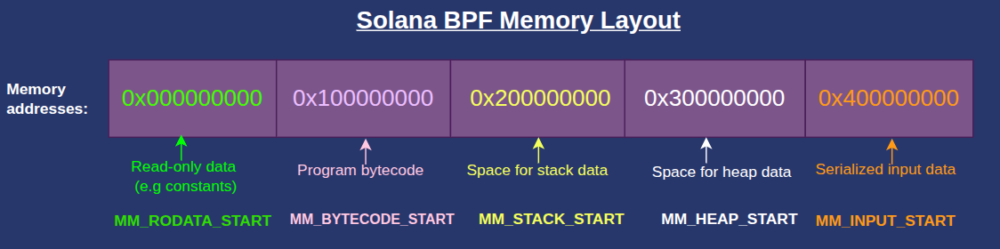
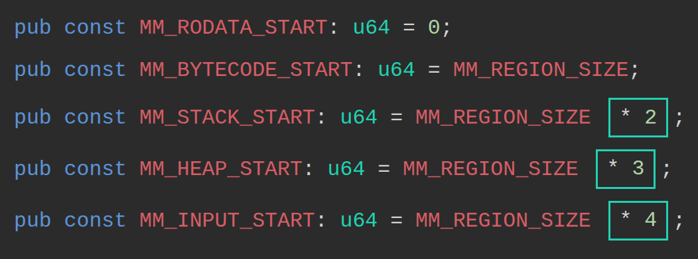
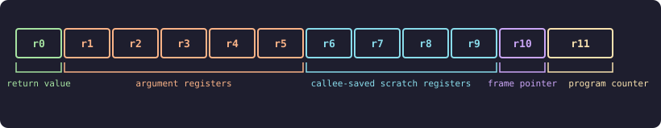
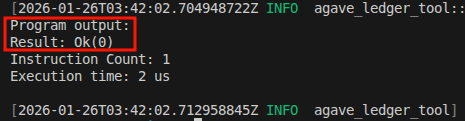
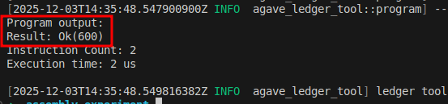
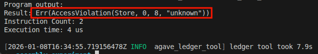
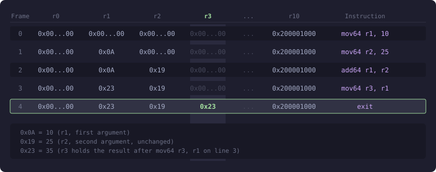
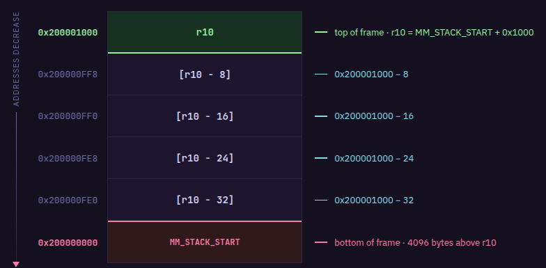
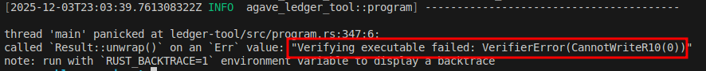
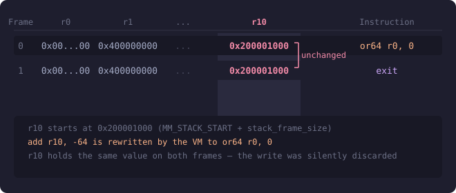

# sBPF Memory Layout and Register Conventions

This tutorial introduces the Solana BPF (sBPF) memory layout and the roles of its virtual machine registers. We'll demonstrate the conventions for how programs read and write data from memory into registers within the sBPF VM.

## Solana BPF memory layout

The sBPF VM’s memory is divided into 5 distinct regions. Each of the five regions serve a specific purpose. Any attempt to access memory outside these regions, or to violate a region’s permissions such as writing to read-only data, triggers an access-violation error. Will show this later.

 

**Before we describe each region, we want to emphasize that while the EVM reads it’s bytecode directly from the contract code, the SVM loads its bytecode into memory before running it.**

The addresses below are the start of each memory region and are defined in the [Solana source code](https://github.com/anza-xyz/sbpf/blob/71d8df05d1d3fe31a4057a29754bfd9d362da052/src/ebpf.rs#L43) as `u64` constants. The names such as `MM_BYTECODE_START`, `MM_RODATA_START`, etc., are the Rust constants definitions starting address of each region. `MM` here means “memory map” while `RO` means “read-only”. Solana reserves 4GiB for each of these memory regions to prevent address collisions between regions but allocates the size each region actually needs.

- **`0x000000000`**: `MM_RODATA_START` — 4 GiB for the read-only ELF data (constants, static data)
- **`0x100000000`**: `MM_BYTECODE_START` — 4 GiB for the program bytecode region
- **`0x200000000`**: `MM_STACK_START` — 4 GiB for the execution stack
- **`0x300000000`**: `MM_HEAP_START` — 4 GiB reserved for heap memory region
- **`0x400000000`**: `MM_INPUT_START` — 4 GiB for the serialized input data (program id, accounts, and instruction data) in the current transaction. This is populated by the runtime at the start of the program.

The Solana BPF memory layout can be visualized as shown below:



The Solana client defines the constants as shown in the snippet below:

```rust
pub const MM_RODATA_START: u64 = 0;
pub const MM_BYTECODE_START: u64 = MM_REGION_SIZE;  // = MM_REGION_SIZE * 1
pub const MM_STACK_START: u64 = MM_REGION_SIZE * 2;
pub const MM_HEAP_START: u64 = MM_REGION_SIZE * 3;
pub const MM_INPUT_START: u64 = MM_REGION_SIZE * 4;
```

`MM_REGION_SIZE` defines the size of one virtual memory block, calculated as `1 << VIRTUAL_ADDRESS_BITS`. The `VIRTUAL_ADDRESS_BITS` is defined as 32 in the sBPF [source code](https://github.com/anza-xyz/sbpf/blob/71d8df05d1d3fe31a4057a29754bfd9d362da052/src/ebpf.rs#L41), this means within each region, there are 2^32 different byte addresses, which gives each region 4GiB of addressable space.

The multipliers (`* 2`, `* 3`, `* 4`) advance each region’s starting address by multiples of `MM_REGION_SIZE`.



To use data in memory, we must first load it into a register. The VM assigns each register a specific role, which developers are expected to follow by convention. The next section describes these roles with minimal examples.

## How the Solana BPF VM assigns roles to registers

The sBPF VM has [12 registers](https://github.com/anza-xyz/sbpf/blob/main/doc/bytecode.md), named `r0` through `r11`. Registers `r0–r10` are exposed to programs, while `r11` holds the program counter and is both not readable and not writable by Solana programs.

`r0` holds return values, `r1–r5` are argument registers, `r6–r9` are general-purpose scratch registers also known as callee-saved registers (use for storing temporary values across calls), and `r10` is the frame pointer register for the current call stack.



Before we examine each register, let's set up an environment to observe how register values change during execution.

### **Register experiment setup**

Create a new folder named `register-experiment`. Open a terminal inside this folder and run the `solana-test-validator` command. This will start a local Solana cluster and create a `test-ledger` directory inside register-experiment

Once the local validator is running:

- Create a folder named `src` in the `register-experiment` directory. This folder will hold our assembly program and a trace file showing how register states change after each instruction executes.
- Create a `src/inputs.asm` file for our assembly code.

Your directory should look like this:

```
register-experiment
├── src
   └── inputs.asm
```

We'll use the `agave-ledger-tool` (which comes with your Solana installation) to run our assembly code and create register traces.

Use the command below to run the following examples. It runs against our local test ledger, executes the assembly program with a 200,000 compute-unit limit, and generates a trace file showing how register values change during execution.

```bash
agave-ledger-tool program run src/inputs.asm --limit 200000 --trace src/trace.txt --ledger test-ledger
```

Note: On some architectures, such as Apple Silicon, running this command may trigger a `JitNotCompiled` error. To resolve this, add the `--mode interpreter` flag to force interpretation instead of JIT compilation.

Now that our setup is complete, we’ll demonstrate how each register, from `r0` through `r11`, is used during execution. Our demonstrations hardcode values into registers to isolate their behavior. We’ll show how to read from memory and load values into registers in the next article.

### **Register `r0`**

Programs communicate success or failure to the runtime by writing to `r0`. The VM reads this value when execution completes. The possible outcomes are:

1. A successful execution returns `0`. 
2. A controlled error returns a non-zero error code (we write the custom error code). 
3. If panic happens, the program terminates before reaching the exit instruction, so the runtime ignores `r0`.

Let’s demonstrate how programs communicate success or failure using `r0` based on the three possible outcomes listed above.

**1/3 An example showing successful execution returns 0**

Write a simple `exit` instruction in `src/inputs.asm`:

```nasm
exit
```

Run it with the `agave-ledger-tool` command, you’ll get a successful exit returning `0`:



The following trace will be created in `trace.txt` showing that the `r0` is `0000000000000000` (the first column in the trace is `r0`, the second is `r1` …):

```nasm
Frame 0
    0 [0000000000000000, 0000000400000000, ...]     0: exit

```

The above demonstration shows that `r0` holds `0` if a function returns successfully.

**2/3 An example to show a controlled failure returns a nonzero value.**

We can write to `r0` in case of a controlled failure. If we for some reasons we want to return a custom error code like 600 `(0x0000000000000258)`, the program still exits cleanly, but `r0` holds the error code instead of zero:

```nasm
mov r0, 600  ; Set custom error code
exit
```

The comments in the assembly code examples may cause a parse error when copied directly, because the agave-ledger-tool throws errors if there are comments. Delete the comment `; Set custom error code` if this happens.

Run the above code using the `agave-ledger-tool`, you’ll get this output:



The trace shows that `r0` started at `0` and its current state is `0000000000000258` in hex which is 600 in decimal:

```nasm
Frame 0
    0 [0000000000000000, 0000000400000000, 0000000000000000, 0000000000000000, 0000000000000000, 0000000000000000, 0000000000000000, 0000000000000000, 0000000000000000, 0000000000000000, 0000000200001000]     0: lddw r0, 0x258
    1 [0000000000000258, 0000000400000000, 0000000000000000, 0000000000000000, 0000000000000000, 0000000000000000, 0000000000000000, 0000000000000000, 0000000000000000, 0000000000000000, 0000000200001000]     2: exit

```

**3/3 An example to show that a panic or trap terminates execution and doesn’t write to `r0`**

A panic or trap terminates execution and is treated as unrecoverable. It doesn’t store the result in `r0`, so any value previously stored there is ignored. 

The code below demonstrates an attempt to write `42` to the read-only memory region.

```nasm
lddw r1, 0x000000000 ;Load MM_RODATA_START address into r1
stdw [r1 + 0], 42    ;Attempt to store 42 into the MM_RODATA_START
exit
```

In the above code:

- `lddw` loads a 64-bit immediate value into a register. We use it to load the read-only region's start address (`0x000000000`) into `r1`.
- `stdw` stores a 64-bit immediate value directly to memory. We attempts to write 42 to the read-only memory region using this instruction, which triggers an access violation error when we run it.



In the trace, you’ll notice that the trace ends at line 1 (the `stxdw` line) because we are attempting an invalid memory operation, which caused it to trap. The program never reached the `exit` instruction.

```nasm
Frame 0
0 [0000000000000000, 0000000400000000, ...]     0: lddw r1, 0x100000000
1 [0000000000000000, 0000000100000000, ...]     2: stxdw [r1+0x0], r2

```

So far, we’ve covered how `r0` behaves in different scenarios and how the VM uses it. At the Rust layer, the return value appears as `Ok(u64)` or `Err(...)`, but in the VM it is just a single `u64` status code stored in and read from `r0`.

The table below shows what happens in each scenario and the value that `r0` holds in that scenario:

| Situation | What happens | Value in `r0` |
| --- | --- | --- |
| Normal return | Program finishes and returns to the loader | 0 |
| Controlled error (Anchor or manual error handling) | Program sets an error code, and returns | Non-zero error code (e.g; 2, 600, 1, 5, etc) |
| Assertion failure or abort | Program terminates  | `r0` is ignored because the program doesn't reach the `exit` instruction |

### Register `r1`

At program start, `r1` holds `MM_INPUT_START` (`0x400000000`), which points to the beginning of the serialized input parameters in memory.

Assume we have a function that takes two arguments, `a` and `b`:

```rust
fn add_constant(a: u64, b: u64)
```

When the program begins execution, the runtime stores the serialized values of `a` and `b` in the memory location `MM_INPUT_START`. At this stage, the register `r1` points to `MM_INPUT_START` (that is, `r1` contains the address of `MM_INPUT_START`).

During execution, the role of `r1` changes to an argument register and the content can be overwritten by the program.

### Registers `r1`-`r5`

If your program’s functions need arguments during execution, the runtime expects your program to store those arguments in `r1` through `r5`. If a function needs more than five arguments, you must store the extra values on the stack and pass a pointer to them using one of these registers.

When a function returns, the values in argument registers are considered dirty. The next function that executes may overwrite `r1`–`r5` freely.

Let's demonstrate argument passing by calling an `add_numbers` function that takes two arguments.

```rust
fn add_numbers(a: u64, b: u64) -> u64 {
    a + b
}
```

For simplicity, we manually translate the above code into sBPF assembly and bypass the compiler. The snippet is shown below. Let’s pass `10` as the first argument and `25` as the second, add them in the function body, and return the result in `r0`:

```nasm
mov r1, 10     ; Simulate passing a=10 as first argument        
mov r2, 25     ; Simulate passing b=25 as second argument
add64 r1, r2   ; Function body: add first and second argument
mov r3, r1     ; Copy the result to r3
exit           ; exit successfuly with 0 in r0
```

Run the agave-ledger-tool and check the trace.txt file. You’ll see that the result is 23 (35 in decimal):



The next registers are `r6`-`r9`, but they depend on `r10` (the stack pointer). Let’s explain `r10` first, then return to `r6`-`r9`.

### The Stack Pointer Register (`r10`)

`r10` is the stack frame pointer. It holds a virtual address pointing into the current stack region.

When your program starts, the runtime initializes `r10` to `MM_STACK_START + stack_frame_size`, where `MM_STACK_START` is**`0x200000000`**while `stack_frame_size` = 4096 (1000 in hex) bytes (4KiB) — in traces, you’ll see `r10` initialized as `0x200001000`. This puts `r10` at the top of your stack frame with a 4096 bytes of usable space below it.



The stack grows downward, meaning you allocate stack space at progressively lower memory addresses. Since `r10` = `MM_STACK_START` + `stack_frame_size`, reading from or writing to any stack location follows this formula:

```nasm
[r10 - offset] = MM_STACK_START + stack_frame_size - offset
```

where `offset` is the number of bytes of stack space consumed. That means `[r10 - 8]` resolves to `MM_STACK_START + stack_frame_size - 8`, you're referencing a location 8 bytes below where `r10` points.

So `r10` itself never changes value as your program executes. To use more stack space, you simply use larger offsets like `[r10 - 16]`, `[r10 - 24]`, and so on. Each function call is limited to 4KiB (4096 bytes) of usable space.

Let's say you need to pass data on the stack to a function. You choose a location in the stack frame at some negative offset from `r10`, write your data there, then put the address of that location (for example, `r10 - 8`) into one of the argument registers (`r1` through `r5`) before calling.

For example, if you need a 64-byte buffer as the first argument:

- You can store data in the memory region `[r10 - 64]` to `[r10 - 1]`
- You move the starting address `r10 - 64` into `r1`

![Stack frame diagram showing r10 as the frame pointer with a 64-byte buffer allocated below it at [r10 - 64], with r1 pointing to the buffer start](images/r10-stack-arg-buffer.png)

- Then you make your function call

We'll demonstrate how to use the `r10` stack pointer when we cover “Registers 6-9”.

### Write restrictions on `r10`

You can’t write to the `r10` register. Writing to `r10` with `mov` returns an error:

```nasm
mov r10, 999       # Error: cannot write to r10
exit
```



Attempting to write to `r10` with `add r10, -64` doesn't error, but the VM silently ignores it and rewrites the instruction to a 64-bit bitwise OR instruction (`or64 r0, 0`) that does nothing:

```nasm
add r10, -64      
exit
```

If we run the code above and look at the trace file, we’ll see that `r10` remains unchanged:



### Callee-saved Registers (`r6`-`r9`)

In Solana BPF, registers `r6`-`r9` are 'callee-saved' (also called 'preserved'). This means if a function (the callee) modifies these registers, it must restore them to their original values before returning to the caller.

For example, if function **A** stores a value in `r6` and calls function **B**, and function **B** wants to use `r6` for it’s own computation, function **B** must preserve whatever was in `r6` before using it. Function **B** does this by copying `r6` to the stack, using `r6` for its own computation, then copying the original value back from the stack into `r6` before returning. When function **B** exits, function **A** still holds its original value in `r6`.

The code below demonstrates the data preservation convention between two functions:

- Function **A** (CALLER) stores 999 in `r6`
- Function **A** calls function **B** (`function_b`), expecting `r6` to be preserved
- Function **B** copies `r6` (999) to the stack at `[r10 - 8]`
- Function **B** uses `r6` for its own computation: loads 42 and adds 10 (resulting in 52)
- Function **B** restores `r6` from the stack back to 999 before returning
- When function **B** exits, function **A** still holds 999 in `r6`
- Function **A** moves `r6` to `r2` to use the preserved value

```nasm
; === Function A: CALLER ===
mov r6, 999          ; Store value we want preserved across call
call function_b      ; function_b MUST preserve r6 per convention
mov r2, r6           ; r6 still contains 999 (preserved by callee)
exit

; === Function B: CALLEE ===
function_b:
    ; Save callee-saved registers we'll modify
    stxdw [r10 - 8], r6    ; copy caller's r6 value to stack
    
    ; FUNCTION BODY: We can freely use r6 now
    mov r6, 42             ; Temporary use of r6
    add64 r6, 10           ; r6 = 52 (will be discarded)
    
    ; Restore callee-saved registers
    ldxdw r6, [r10 - 8]    ; Restore original r6 value (999)
    exit
```

The animation below illustrates these steps:


<video src="animations/callee-saved-registers.mp4" style="width: 100%; height: 100%;" autoplay="" loop="" muted="" controls="" class=""></video>

Running the above code produces the trace below:

```nasm
Frame 0
    0 [..., 0000000400000000, 0000000000000000, ..., ..., ..., 0000000000000000, ..., ..., ..., 0000000200001000]     0: mov64 r6, 999
    1 [..., 0000000400000000, 0000000000000000, ..., ..., ..., 00000000000003E7, ..., ..., ..., 0000000200001000]     1: call function_b
    2 [..., 0000000400000000, 0000000000000000, ..., ..., ..., 00000000000003E7, ..., ..., ..., 0000000200003000]     4: stxdw [r10-0x8], r6
    3 [..., 0000000400000000, 0000000000000000, ..., ..., ..., 00000000000003E7, ..., ..., ..., 0000000200003000]     5: mov64 r6, 42
    4 [..., 0000000400000000, 0000000000000000, ..., ..., ..., 000000000000002A, ..., ..., ..., 0000000200003000]     6: add64 r6, 10
    5 [..., 0000000400000000, 0000000000000000, ..., ..., ..., 0000000000000034, ..., ..., ..., 0000000200003000]     7: ldxdw r6, [r10-0x8]
    6 [..., 0000000400000000, 0000000000000000, ..., ..., ..., 00000000000003E7, ..., ..., ..., 0000000200003000]     8: exit
    7 [..., 0000000400000000, 0000000000000000, ..., ..., ..., 00000000000003E7, ..., ..., ..., 0000000200001000]     2: mov64 r2, r6
    8 [..., 0000000400000000, 00000000000003E7, ..., ..., ..., 00000000000003E7, ..., ..., ..., 0000000200001000]     3: exit

```

**Key observations from the trace:**

- Line 1: `r6` contains `0x3E7` (999) before the call
- Line 2: The `call` instruction transitions to `function_b` and updates `r10` to
point to a new stack frame at `0x200003000`
- Line 4: After `mov64 r6, 42`, `r6` contains `0x2A` (42)
- Line 5: After `add64 r6, 10`, `r6` contains `0x34` (52)
- Line 6: After `ldxdw r6, [r10-0x8]`, `r6` is restored to `0x3E7` (999)
- Line 7: After returning to the caller, `r10` returns to `0x200001000` and `r6` still contains `0x3E7` (999)
- Line 8: After `mov64 r2, r6`, both `r2` and `r6` contain `0x3E7` (999)

The animation below explains the above steps:

<video src="animations/callee-saved-registers-trace.mp4" style="width: 100%; height: 100%;" autoplay="" loop="" muted="" controls="" class=""></video>

In the next part of this article, we’ll further demonstrate how to read and write the instruction inputs to memory by writing simple raw assembly programs that directly inspect memory contents.


*This article is part of a tutorial series on [Solana development](https://rareskills.io/solana-tutorial)*