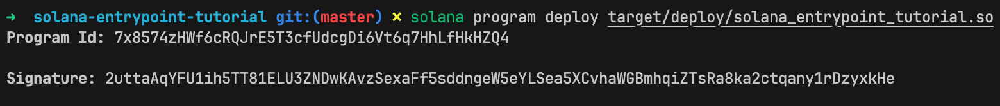
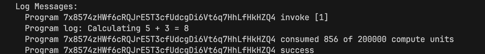

# Native Solana: Program Entry and Execution

All through this series, we've used the Anchor framework to build Solana programs. This tutorial teaches you how to write them in native Rust without Anchor.

There are several reasons you might want to do this, such as:

- **Low-level control**: You have control over how you serialize and deserialize data, validate accounts, and structure your program logic
- **Performance**: In native Rust, you can skip Anchor’s serialization, deserialization, and account validation steps for simple operations when not needed, whch will result in less compute unit usage
- **Smaller binary size**: No Anchor overhead (additional Rust macros and dependencies) means smaller deployed programs
- **Learning**: Understanding the underlying mechanics makes you a better Solana developer

So far, we've been using Anchor to create our programs and have written our functions like this:

```rust
#[program]
pub mod my_program {
    pub fn initialize(ctx: Context<Initialize>) -> Result<()> {
        // function logic
        Ok(())
    }

    pub fn update(ctx: Context<Update>, value: u64) -> Result<()> {
        // function logic
        Ok(())
    }
}
```

The `#[program]` attribute macro automatically generates a program entrypoint behind the scenes. This entrypoint receives all incoming instructions and dispatches them to your individual functions (`initialize`, `update`, etc.) based on the instruction data passed from the client. In native Rust, we'll use the `entrypoint!` macro from the Solana SDK to create the entrypoint and handle the dispatching manually.

## **What is an Entrypoint in Solana?**

Think of an entrypoint as the "front door" of your Solana program. In Ethereum, every public function is like having multiple front doors: the EVM can call public functions like `transfer()`, `approve()` in ERC20, or any other public function directly. Solana works differently. Solana programs have exactly one front door (the entrypoint) that handles all incoming calls from clients.

The entrypoint function isn't written directly by us. It is generated at compile time by an `entrypoint!` macro provided by the Solana SDK (as we'll see later when we write our native program). When a client invokes a Solana program, the runtime calls the entrypoint, which deserializes the incoming instruction and passes it to an instruction processor function that we define (we discuss this next). The instruction processor can route instructions to the correct program function, perform account validation, or handle the business logic directly.

Hence, the `entrypoint!` macro handles all the low-level code that the runtime requires to invoke your program, deserialize the instruction parameters, and forward them to the instruction processor. This lets you write your program logic using normal Rust functions and types, while the macro manages the interface with Solana.

## **The Instruction Processor**

In native Rust Solana programs, we need to define an instruction processor: **a function that processes incoming instructions**. When a client sends an instruction to your program, the Solana runtime invokes your program's entrypoint, which then deserializes the top-level instruction parameters and passes them to your instruction processor function. This is how your program receives and processes each instruction.

This instruction processor has a standard function signature:

```rust
pub fn process_instruction(
    program_id: &Pubkey,
    accounts: &[AccountInfo],
    instruction_data: &[u8],
) -> ProgramResult

```

The three parameters of the `process_instruction` function are:

- `program_id`: Your program's address
- `accounts`: All accounts your program needs to read from or write to
- `instruction_data`: Raw bytes containing the serialized instruction data for your program

The `ProgramResult` return type is a type alias for `Result<(), ProgramError>`, where `ProgramError` is an enum that defines [possible errors a Solana program](https://github.com/anza-xyz/solana-sdk/blob/ed42870a2858e890e7de996e88500a78c25ce84f/program-error/src/lib.rs#L57) can return.

In Anchor, the raw `process_instruction` parameters and return type are hidden. Instead, your handler receives a `Context<T>` containing fully deserialized accounts and instruction data, with automatic validation applied, so you can work directly with typed structs rather than raw byte slices.

You can name this instruction processor function anything, but the Solana ecosystem convention is `process_instruction`. This is the function you pass to the `entrypoint!` macro (as we discussed earlier).

Now let's write a Solana program with an instruction processor connected via the `entrypoint!` macro and execute it. We'll test our program with a TypeScript client to see how it works in practice.

## **Building Our Solana Program**

### **Project Setup**

We'll build a simple Solana program with an instruction processor that performs basic arithmetic and logs the result. This will demonstrate how the entrypoint and instruction processor work together in practice.

You should have Rust and Solana installed locally if you have been following previous tutorials. If not, please see [*Solana Hello World (Installation and Troubleshooting)*](https://rareskills.io/post/hello-world-solana).

Now let's create a new directory for our program and initialize it by running the following commands:

```bash
mkdir solana-entrypoint-tutorial # Create a new directory for our program
cd solana-entrypoint-tutorial # Change into the directory
cargo init --lib # Initialize a new Rust library

```

Next, update the project’s `Cargo.toml` to look like this:

```toml
[package]
name = "solana-entrypoint-tutorial"
version = "0.1.0"
edition = "2021" # added

## NEWLY ADDED ##
[lib]
crate-type = ["cdylib", "lib"]

[dependencies]
solana-program = "3.0.0"

```

We've added two configurations:

- `crate-type = ["cdylib", "lib"]`: Tells Rust to compile our library as a dynamic library that Solana can load
- `solana-program = "3.0.0"`: The core Solana program library that provides all the types and functions we need for on-chain programs

Now let's create our program.

### **Writing Our Program Code**

We’ll start with an instruction processor that does basic arithmetic and logs the result.

In Anchor, you might define a function that does basic math inside your `#[program]` module like this:

```rust
#[program]
pub mod some_program {
    pub fn do_math(ctx: Context<DoMath>) -> Result<()> {
        let result = 5 + 3;
        msg!("Result: {}", result);
        Ok(())
    }
}
```

But for native Rust Solana programs, we define an instruction processor and connect it to the program's entrypoint using the `entrypoint!` macro. While you can define other public functions, they must be called from the instruction processor, as all execution begins there.

The `entrypoint!` macro does the heavy lifting: it generates the actual entrypoint code that the Solana runtime calls, deserializes the incoming data, and forwards it to your instruction processor function. This way, you write the business logic in your instruction processor while the macro handles the low-level entrypoint setup.

Now replace the default code in `src/lib.rs` with the following code. In the code, we:

1. Import the necessary Solana program dependencies for our program: `AccountInfo`, `entrypoint`, `ProgramResult`, `msg`, and `Pubkey`.
2. Use the `entrypoint!` macro to connect `process_instruction` as our program's instruction processor.
3. Define an instruction processor function called `process_instruction` with the standard three parameters (all underscored since we're not using them yet).
4. Perform simple arithmetic by adding two hardcoded numbers (5 + 3).
5. Use the `msg!` macro to log the calculation result to the transaction logs.
6. Return `Ok(())` to indicate successful execution.

```rust
use solana_program::{
    account_info::AccountInfo,
    entrypoint,
    entrypoint::ProgramResult,
    msg,
    pubkey::Pubkey,
};

entrypoint!(process_instruction); // Register process_instruction as our instruction processor

pub fn process_instruction(
    _program_id: &Pubkey,
    _accounts: &[AccountInfo],
    _instruction_data: &[u8],
) -> ProgramResult {
    let a: u64 = 5;
    let b: u64 = 3;
    let result = a + b;

    msg!("Calculating {} + {} = {}", a, b, result);

    Ok(())
}
```

### **Understanding the `entrypoint!` Macro**

Earlier, we mentioned that Solana provides an `entrypoint!` macro to connect your instruction processor to the program's entrypoint.

In the code above, the [`entrypoint!` macro](https://github.com/anza-xyz/solana-sdk/blob/master/program-entrypoint/src/lib.rs#L125-L139) does three things:

1. Generates the actual entrypoint function that the Solana runtime calls
2. Deserializes the runtime input (containing the program id, accounts, and instruction data)
3. Calls your instruction processor function (`process_instruction`) with the deserialized parameters

When you write `entrypoint!(process_instruction);`, it expands into code that looks like this:

```rust
#[no_mangle]
pub unsafe extern "C" fn entrypoint(input: *mut u8) -> u64 {
    // Deserialize the raw input from the Solana runtime
    // `input` is raw runtime memory (just bytes)
    let (program_id, accounts, instruction_data) = unsafe { deserialize(input) };

    // Call your instruction processor function with the deserialized data
    // program_id: &Pubkey
    // accounts: Vec<AccountInfo>
    // instruction_data: &[u8]
    match process_instruction(program_id, &accounts, instruction_data) {
        Ok(()) => 0,                // Return 0 for success
        Err(error) => error.into(), // Return error code on failure
    }
}
```

This generated function is the bridge between the Solana runtime and your Rust code. The runtime calls this entrypoint with a pointer to the instruction data in memory (`input: *mut u8`). This pointer points to a memory location containing the serialized instruction parameters (program ID, accounts, and instruction data) as raw bytes. The `deserialize(input)` function reads from this memory location and converts those bytes into three values:

- `program_id` (already a `&Pubkey`),
- `accounts` (a `Vec<AccountInfo>`), and
- `instruction_data` (already a `&[u8]`).

In the Solana SDK, the signature of the `deserialize` function is defined as:

```rust
pub unsafe fn deserialize<'a>(input: *mut u8) -> (&Pubkey, Vec<AccountInfo>, &[u8])

```

In the call `process_instruction(program_id, &accounts, instruction_data)`, only `accounts` needs a `&`. 

That's because `deserialize` returns `program_id` and `instruction_data` as references already (`&Pubkey` and `&[u8]`—as we see in the signature above), but `accounts` as a `Vec<AccountInfo>`.

In the generated code, `&accounts` creates a `&Vec<AccountInfo>`, which Rust automatically converts to the `&[AccountInfo]` slice that `process_instruction` expects.

The `entrypoint!` macro lets you focus on implementing the `process_instruction` while the macro handles the interaction with the Solana runtime. You can see the full implementation of the [entrypoint macro here.](https://github.com/anza-xyz/solana-sdk/blob/master/program-entrypoint/src/lib.rs#L125-L139)

On the other hand, in Anchor, the `#[program]` attribute automatically generates the entrypoint, deserializes instruction data and accounts, and dispatches instructions to the appropriate functions.

Now, let’s actually compile and deploy our program so we can test it. 

### Build and deploy the program

To build and deploy the program, run the following commands:

```bash
cargo build-sbf --tools-version v1.52
solana-test-validator # in another terminal
solana program deploy target/deploy/solana_entrypoint_tutorial.so
```

Here's what each command does:

- `cargo build-sbf`: Builds our Rust program for the Solana runtime and creates a `target/deploy/` folder containing a `.so` file (shared object) which is our compiled program. Unlike Anchor's build command, this does not generate an IDL or include Anchor's discriminators and automatic validation code. This results in smaller binaries since there's no framework overhead. The `--tools-version v1.52` flag pins the Solana platform toolchain for the build. This ensures a compatible Rust and Cargo version and avoids issues from mismatched or outdated tooling.
- `solana-test-validator`: Just like in previous tutorials, we use this to start a local Solana validator for testing (run this in a separate terminal)
- `solana program deploy`: Takes the `.so` file created by the build command and deploys it to the local validator

After deploying to the local validator node, you should see something like this. 



Copy the Program ID from the deploy output, you'll need it for testing.

**If you get a build error, ensure your Solana toolchain is up to date by running this command:** `curl --proto '=https' --tlsv1.2 -sSfL https://solana-install.solana.workers.dev | bash`

### **Testing Stage 1: Basic Arithmetic and Logging**

Now let's create a TypeScript client to test our basic entrypoint program. First, we need to set up the client environment, then we'll add the client code.

Set up the TypeScript client inside our project with the following commands:

```bash
mkdir client && cd client
npm init -y
npm install @solana/web3.js typescript ts-node @types/node
```

Replace the default `test` script in `client/package.json` with the following:

```json
  "scripts": {
    "test": "ts-node client.ts"
  },
```

This lets us run our TypeScript client with `npm run test`, since the default test script generated by `npm init` does not support TypeScript code.

Create a `client/tsconfig.json` and add this:

```json
{
  "compilerOptions": {
    "target": "ES2020",
    "module": "commonjs",
    "moduleResolution": "node",
    "strict": true,
    "esModuleInterop": true,
    "skipLibCheck": true,
    "types": [
      "node"
    ]
  },
  "include": [
    "*.ts"
  ]
}

```

This setup will allow us to run the client with `npm run test`.

Now create a `client/client.ts` file and add the following code. In this code, we:

1. Import the necessary Solana web3.js dependencies for creating connections, transactions, and keypairs.
2. Set up a connection to the local Solana validator running on port 8899 (the default port for `solana-test-validator`).
3. Create a `testBasicEntrypoint` function that generates a new keypair to pay for the transaction.
4. Request an airdrop of SOL to fund the transaction fees.
5. Create a `TransactionInstruction` with no accounts and no instruction data (since our program doesn't use them yet).
6. Build and send the transaction to our program.
7. Log the transaction signature for verification.

```tsx
import {
  Connection,
  Keypair,
  LAMPORTS_PER_SOL,
  PublicKey,
  Transaction,
  TransactionInstruction,
  sendAndConfirmTransaction,
} from '@solana/web3.js';
import { Buffer } from 'buffer';

// === REPLACE WITH YOUR ACTUAL PROGRAM ID === //
const PROGRAM_ID = new PublicKey('7x8574zHWf6cRQJrE5T3cfUdcgDi6Vt6q7HhLfHkHZQ4'); // Replace with your actual program ID
const connection = new Connection('http://localhost:8899', 'confirmed');

async function testBasicEntrypoint() {
  const payer = Keypair.generate();

  // Airdrop some SOL to pay for the transaction
  await connection.requestAirdrop(payer.publicKey, LAMPORTS_PER_SOL);
  await new Promise(resolve => setTimeout(resolve, 1000)); // Wait for airdrop

  // Create a instruction that calls our program
  const instruction = new TransactionInstruction({
    keys: [],             // keys is the account metadata array; no accounts needed for this simple example
    programId: PROGRAM_ID,
    data: Buffer.alloc(0), // No instruction data needed
  });

  const transaction = new Transaction().add(instruction);

  console.log('Calling our program...');
  const signature = await sendAndConfirmTransaction(connection, transaction, [payer]);

  console.log(`Transaction confirmed: ${signature}`);
}

testBasicEntrypoint().catch(console.error);
```

Replace the program ID in `PROGRAM_ID` with your actual program ID. 

Before we run the test, ensure the local validator is still running and the program has been deployed. Then run `solana logs` in a new terminal to watch for our program log. 

Now run the test with :

```bash
cd client
npm run test
```

You should see a program log like this one:



Our program executed successfully. Notice how much simpler this is compared to Anchor, no account validation or instruction parsing.