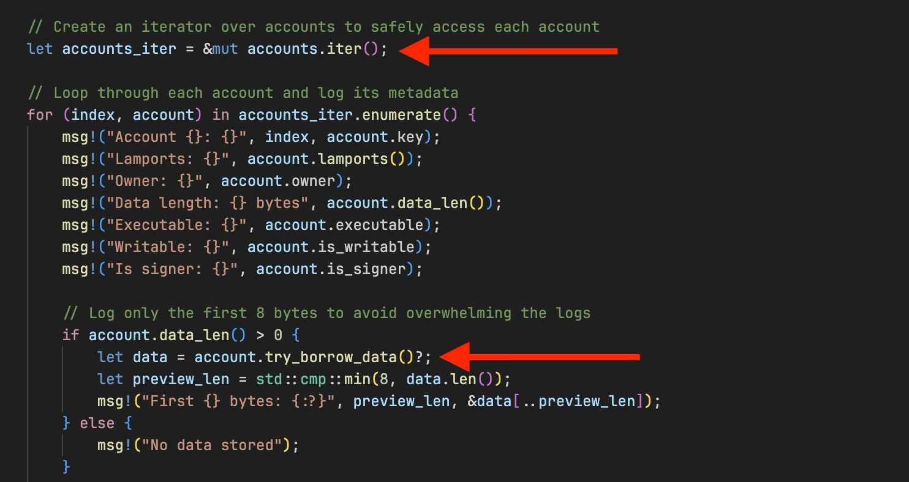
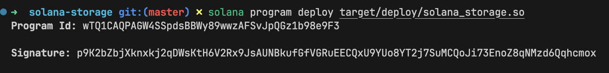
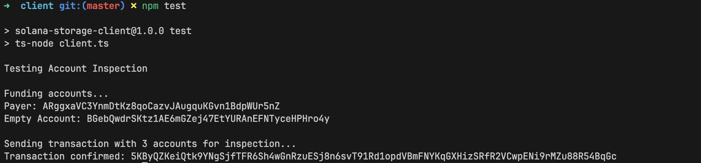
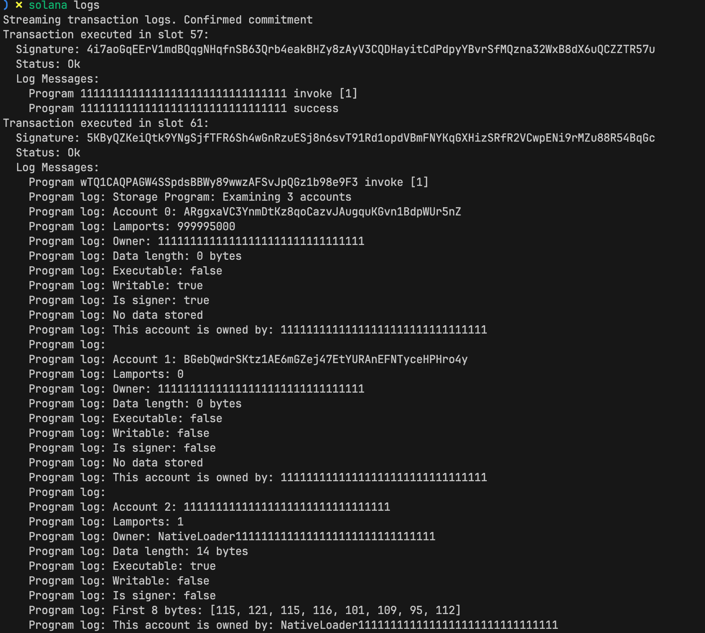

# Native Solana: Reading Account Data

As we discussed in the previous tutorial, the entrypoint is the "front door" of your Solana program and it handles all incoming instructions to the program.

In this tutorial, we'll learn how to read accounts passed to our native Rust Solana program via the entrypoint.

In Anchor, you define the accounts your program expects using the `#[derive(Accounts)]` macro:

```rust
#[derive(Accounts)]
pub struct Initialize<'info> {
    #[account(init, payer = user, space = 8 + 32)]
    pub data_account: Account<'info, MyData>,
    #[account(mut)]
    pub user: Signer<'info>,
    pub system_program: Program<'info, System>,
}

#[account]
pub struct MyData {
    pub value: u64,
}

```

Then you access those accounts in your instruction handler through the `Context`:

```rust
#[program]
pub mod my_program {
    pub fn initialize(ctx: Context<Initialize>) -> Result<()> {
				// other function logic
        ctx.accounts.data_account.value = 100;
        Ok(())
    }
}

```

Anchor handles account validation and provides typed access through `Context`. In native Rust, you work directly with the raw `accounts` slice passed to your instruction processor function (we saw this in the previous tutorial).

If you need a refresher on Solana accounts, see [Initializing Accounts in Solana and Anchor](https://rareskills.io/post/solana-initialize-account) and [Solana Counter Program](https://rareskills.io/post/solana-counter-program).

## **Building the Rust Program**

Let's build a program that reads and logs the accounts passed to the instruction processor function.

First, set up the project:

```bash
mkdir solana-storage
cd solana-storage
cargo init --lib solana-storage
```

Update your `Cargo.toml` to this:

```toml
[package]
name = "solana-storage"
version = "0.1.0"
edition = "2021"

[lib]
crate-type = ["cdylib", "lib"]

[dependencies]
solana-program = "3.0.0"
borsh = "0.10"

```

We've added `borsh = "0.10"` for future tutorials where we'll serialize account data.

## **Reading Accounts in the Entry Point Function**

Replace the code in `src/lib.rs` with the following. This program iterates over each provided account and logs its public key, lamport balance, owner, data length, and whether the account is executable, writable, or a signer. It accesses these accounts through the `accounts` parameter passed into `process_instruction`, which is an array of `AccountInfo` structs. `AccountInfo` is the native Solana type used to represent on-chain accounts. To avoid logging large amounts of data, the program only prints the first 8 bytes of each account’s data as a preview of what’s stored.

```rust
use solana_program::{
    account_info::AccountInfo,
    entrypoint,
    entrypoint::ProgramResult,
    msg,
    pubkey::Pubkey,
};

entrypoint!(process_instruction);

pub fn process_instruction(
    _program_id: &Pubkey,
    accounts: &[AccountInfo],
    _instruction_data: &[u8],
) -> ProgramResult {
    msg!("Storage Program: Examining {} accounts", accounts.len());

	  *// Create an iterator over accounts to safely access each account*
    let accounts_iter = &mut accounts.iter();

		*// Loop through each account and log its metadata*
    for (index, account) in accounts_iter.enumerate() {
        msg!("Account {}: {}", index, account.key);
        msg!("Lamports: {}", account.lamports());
        msg!("Owner: {}", account.owner);
        msg!("Data length: {} bytes", account.data_len());
        msg!("Executable: {}", account.executable);
        msg!("Writable: {}", account.is_writable);
        msg!("Is signer: {}", account.is_signer);

				*// Log only the first 8 bytes to avoid overwhelming the logs*
        if account.data_len() > 0 {
            let data = account.try_borrow_data()?;
            // Take the smaller value between 8 and data.len() so we never slice past the buffer.
						// This caps the preview to at most 8 bytes while staying within bounds.
            let preview_len = std::cmp::min(8, data.len());
            msg!("First {} bytes: {:?}", preview_len, &data[..preview_len]);
        } else {
            msg!("No data stored");
        }

        msg!(""); // Empty line for readability
    }

    Ok(())
}
```

In our previous Anchor-based tutorials, we've used this type in account validation contexts. In native programs, `AccountInfo` gives us access to all the account metadata that Solana maintains - including the account's public key, lamports (balance), owner program, data field, and flags like whether it's executable, writable, or a signer.

Some key concepts in this code are highlighted in the diagram below:



- `accounts.iter()`: Creates an iterator over the accounts slice
- `account.try_borrow_data()?`: Returns a read-only reference to the account's data field. We use `try_borrow_data()` to safely borrow the account data. It returns an error if the data is already borrowed mutably.

When you construct a transaction from the client and specify accounts in the `keys` array:

```tsx
  const ix = new TransactionInstruction({
    keys: [
      { pubkey: payer.publicKey, isSigner: true, isWritable: false },
    ],
    programId: PROGRAM_ID,
    data: Buffer.alloc(0),
  });
```

all the specified accounts get passed to your program's `process_instruction` as the `accounts` parameter. This is how your program receives and can inspect any accounts the client wants it to work with—whether they're signers, writable accounts, or just accounts you need to read from.

Now build and deploy the program:

```bash
cargo build-sbf
solana-test-validator # in another terminal
solana program deploy target/deploy/solana_storage_tutorial.so
```



Copy the program ID, we’ll use it when we test the program. 

After deploying the program to the local Solana validator, we’re now ready to test our program. 

### **Testing Account Inspection**

Let’s create a client that passes multiple accounts to our program and logs their metadata.

Set up the client environment from our project root directory:

```bash
mkdir client && cd client
npm init -y
npm install @solana/web3.js typescript ts-node @types/node
```

Update `client/package.json`:

```json
{
  "scripts": {
    "test": "ts-node client.ts"
  }
}
```

Create `client/tsconfig.json`:

```json
{
  "compilerOptions": {
    "target": "ES2020",
    "module": "commonjs",
    "moduleResolution": "node",
    "strict": true,
    "esModuleInterop": true,
    "skipLibCheck": true,
    "types": ["node"]
  },
  "include": ["*.ts"]
}
```

Now create `client/client.ts` and add the following code. In this client, we:

1. Import the necessary dependencies from `@solana/web3.js`
2. Create a `testAccountInspection` function that:
    - Creates two keypair accounts (`payer` and `emptyAccount`)
    - Funds the payer account with SOL
    - Passes these accounts, including the system program, to our program to read and log their metadata

```tsx
import {
  Connection,
  Keypair,
  LAMPORTS_PER_SOL,
  PublicKey,
  SystemProgram,
  Transaction,
  TransactionInstruction,
  sendAndConfirmTransaction,
} from '@solana/web3.js';

const PROGRAM_ID = new PublicKey('YOUR_PROGRAM_ID_HERE');// Replace with your actual program IDconst connection = new Connection('http://localhost:8899', 'confirmed');

async function testAccountInspection() {
  console.log('Testing Account Inspection\n');

// Create accounts to inspect
	const payer = Keypair.generate();
  const emptyAccount = Keypair.generate();

// Fund the payer account
	console.log('Funding accounts...');
  await connection.requestAirdrop(payer.publicKey, LAMPORTS_PER_SOL);

// Wait for airdrops
await new Promise(resolve => setTimeout(resolve, 2000));

  console.log(`Payer: ${payer.publicKey.toString()}`);
  console.log(`Empty Account: ${emptyAccount.publicKey.toString()}\n`);

// Create instruction with multiple accounts
const instruction = new TransactionInstruction({
    keys: [
      { pubkey: payer.publicKey, isSigner: true, isWritable: false },
      { pubkey: emptyAccount.publicKey, isSigner: false, isWritable: false },
      { pubkey: SystemProgram.programId, isSigner: false, isWritable: false },
    ],
    programId: PROGRAM_ID,
    data: Buffer.alloc(0),
  });

  const transaction = new Transaction().add(instruction);

  console.log('Sending transaction with 3 accounts for inspection...');
  const signature = await sendAndConfirmTransaction(connection, transaction, [payer]);

  console.log(`Transaction confirmed: ${signature}`);
  console.log('Check the logs to see detailed account information!');
  console.log('Run: solana logs');
}

testAccountInspection().catch(console.error);
```

Update the `PROGRAM_ID` variable to your program ID.  

Before we run the test, ensure your local Solana validator is running and the program has been deployed to it. 

Now run the test:

```bash
cd client
npm run test
```

It runs successfully.



In your `solana logs` terminal, you should see detailed information for each account, including balances, owners, and metadata:



*This article is part of a tutorial series on [Solana development](https://rareskills.io/solana-tutorial).*