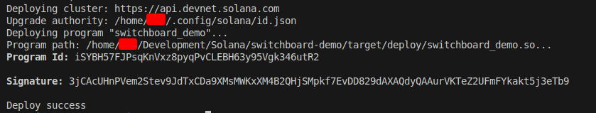
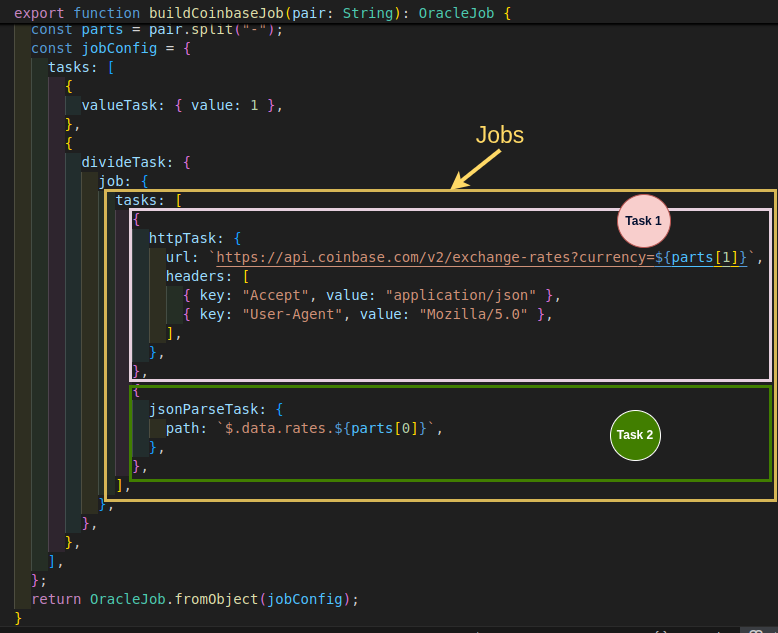
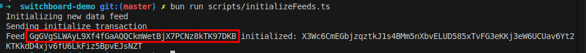
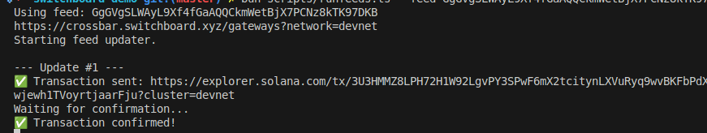
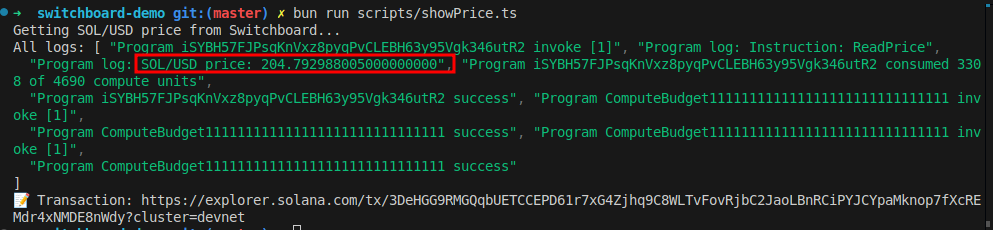

# Switchboard

On-chain programs can’t access off-chain data directly. They rely on oracles to bring in information such as asset prices, event outcomes, or API responses. Without these oracles, programs are limited to state already stored on-chain.

[Switchboard](https://switchboard.xyz) is a multi-chain decentralized oracle network, originally built on Solana to provide smart contracts with reliable off-chain data such as price, weather, and event dat. In this tutorial, we'll build a Solana program that reads the current `SOL/USD` price from Switchboard.

We'll do three things in this tutorial:

1. Build and deploy a Solana program that reads data from Switchboard.
2. Initialize and configure a new Switchboard price feed for our program
3. Write a client script that interacts with our program on Devnet to display the price.

Before we build the Solana program let’s first understand how Switchboard works.

## How Switchboard works

Switchboard uses the following 4 key components to allow Solana programs to read off-chain data:

1. **Jobs:** A job in Switchboard is a collection of sequential tasks. Each task performs a specific operation. For example, one task can fetch data from an external API endpoint while another task parses the response. 
2. **Data Sources:** These are where the off-chain data comes from, like Binance, Coinbase, and Pyth. Switchboard jobs fetch data from these sources.
3. **Oracles:** These are Switchboard network nodes that execute your jobs. Each oracle fetches data from all the configured data sources, aggregates them, and submits a single `i128` value to the feed on-chain.
4. **Feed: T**he feed is the on-chain account that stores the oracle submissions. When your program reads the feed, it receives the aggregated value produced from individual oracle results, which the Switchboard SDK converts to a `Decimal` type for decimal arithmetic.

In summary, here is how the above components work together:

- You define jobs that specify where to fetch data (data sources)
- Oracle nodes execute these jobs and submit their results in the feed account on-chain
- The feed aggregates oracle submissions into a single `i128` value
- Your program reads from the feed

We’ll learn how these processes work in the course of this tutorial. Let’s get started with our price feeds implementation.

## Prerequisites

To follow along, you’ll need a working Solana development environment with the following tools installed:

- **Solana CLI and Anchor**: required to write, build, and deploy Solana programs. If you don’t already have them set up, read [the first article in this series](https://rareskills.io/post/hello-world-solana).
- **Bun**: as a package manager for running the client script. Run this command on your Terminal `curl -fsSL https://bun.sh/install | bash` to install bun.

We’ll interact with our deployed program using standalone scripts rather than unit tests. This is because price feeds update on Devnet, and we want to demonstrate how real-time oracle data flows into on-chain logic. 

Set your Solana cluster to Devnet by running the command below on your terminal:

```bash
solana config set --url [https://api.devnet.solana.com](https://api.devnet.solana.com/)
```

You’ll also need some SOL on Devnet to pay for transactions. You can request test SOL from the faucet using `solana airdrop`:

```bash
solana airdrop 2 # for 2 devnet SOL.
```

You can only request `2` SOL on the Devnet faucet at a time. You can request 2, wait for a moment and request another one later as it’s rate-limited.

### Solana slots

In Solana, time is measured in slots, which are sequential intervals of network time during which the chain advances; a slot number increases as the network progresses and is used as a simple clock for ordering events on-chain. This is similar to the the Ethereum’s Block number (`block.number`) only because they both represent the progression of time and the ordering of events.

Hold on to this idea of slots, Switchboard uses it to measure staleness of data, we’ll see how it’s used later in this article.

## Program setup

We’ll start by creating an Anchor project that defines the Solana program which will pull the price data from Switchboard.

```bash
anchor init switchboard-demo
cd switchboard-demo
```

Update the `cluster` field in your Anchor.toml provider to use `Devnet`, since we’ll be working on Devnet:

```bash
[provider]
cluster = "Devnet"
wallet = "~/.config/solana/id.json"
```

Next, we’ll add `switchboard-on-demand` crate to the dependency section of our `programs/switchboard-demon/src/Cargo.toml` file. It’s the Switchboard crate we’ll be working with.

```json
[dependencies]
anchor-lang = "0.31.1"
switchboard-on-demand = "0.5.3"
```

Inside `programs/switchboard-demo/src/lib.rs`, we write a program that:

1. Reads the Switchboard on-demand feed account data as raw bytes.
2. Parses the feed's raw bytes into a `PullFeedAccountData` struct from the `switchboard-on-demand` crate.
3. Calls `get_value` method on the parsed feed with the following parameters to validate and extract the latest price:
    - `max_stale_slots`: sets the maximum number of Solana slots since the feed account was last updated. If the feed is older than this, `feed.get_value` fails.
    - `min_samples`: sets the minimum number of oracle submissions required for a valid price.
    - `only_positive`: when true, rejects non-positive values (≤ 0). Useful for prices or quantities that must always be positive.
4. Logs the SOL/USD price with `msg!`.

```rust
use anchor_lang::prelude::*;
use switchboard_on_demand::{
    on_demand::accounts::pull_feed::PullFeedAccountData,
    prelude::rust_decimal,
};
use rust_decimal::Decimal;

declare_id!("iSYBH57FJPsqKnVxz8pyqPvCLEBH63y95Vgk346utR2");

#[program]
pub mod switch_on_demand_price_feed {
    use super::*;

    pub fn read_price(ctx: Context<ReadPrice>) -> Result<()> {
        // Step 1: READS THE FEED ACCOUNT's RAW BINARY (bytes)
        let data_slice = ctx.accounts.feed.data.borrow();

        // Step 2: PARSE FEED ACCOUNT DATA
        let feed = PullFeedAccountData::parse(data_slice).unwrap();

        // Step 3: RETRIEVE FEED VALUE WITH SLOT, SAMPLING CONSTRAIN, 
        //         AND THE PARAMETER THAT DETERMINES WHETHER THE RECEIVED VALUE 
        //         IS POSITIVE OR NEGATIVE
        let price: Decimal = feed.get_value(
            &Clock::get()?,
            /*max_stale_slots=*/ 100,
            /*min_samples=*/ 3,
            /*only_positive=*/ true,
        ).unwrap();
        
        // Step 4: LOGS THE SOL/USD PRICE WITH `msg!`.
        msg!("SOL/USD price: {}", price);
        Ok(())
    }
}

#[derive(Accounts)]
pub struct ReadPrice<'info> {
    /// CHECK: This is a Switchboard on-chain feed (PullFeedAccount)
    pub feed: AccountInfo<'info>,
}
```

Notice the comment about slot staleness and sampling constraints in step 3. Every time Switchboard writes a new value on-chain, it records the slot number. When you call `feed.get_value(&Clock::get()?, max_stale_slots, ...)`, Switchboard compares the current slot with the feed’s last update slot.

If the difference exceeds `max_stale_slots` (100 in our code), `get_value` returns an error. The instruction fails and the transaction is rejected.

Also, the `min_samples` parameter ensures that we aggregate responses from enough oracles to increase accuracy. In our example, we've set it to `3`, which means the result must include data from at least 3 oracle responses. We will see how to configure these oracles later in this article when we discuss off-chain initialization.

Next, build and deploy the program by running the command below:

```bash
anchor build && anchor deploy
```

A successful deployment will return the program Id and signature as shown below:



Our on-chain program is now deployed and can log the price of `SOL/USD`, but we can’t use it yet because while the program is ready to read a price from the `feed` account, it doesn't have a specific feed to read from yet. We’ll address this next by setting up the off-chain feed.

## Off-chain feed setup

Recall that the feed is the on-chain account that stores the oracle submissions. 

Setting up a feed involves two steps, which we’ll cover next:

1. Feed configuration and initialization
2. Feed updates

### **1/2 Feed configuration and initialization**

**Feed configuration** defines the data sources and aggregation rules for your oracle (like the ones on-chain e.g `max_stale_slots`). You specify which external APIs or on-chain oracles to query, how many responses you need, and the acceptable variance between sources. This configuration exists as a JavaScript object before anything goes on-chain.

**Feed initialization** takes the configuration and creates the actual account on-chain. The initialization transaction stores your feed's metadata, binds it to a pool of oracle nodes (referred to as “oracle queue” in Switchboard), and generates the public key that your program must reference when requesting price data.

Unlike Chainlink oracles, Switchboard feeds do not update automatically. It uses a pull model. You program must trigger a job through an off-chain script to fetch new data and update the on-chain feed.

Each job consists of:

1. **Tasks array**: A list of tasks containing operations to execute sequentially
2. **Task types**: Different tasks in the **Tasks array** such as:
    - `httpTask`: which fetches feed data from a URL
    - `jsonParseTask`: Extracts specific values from the return JSON response from `httpTask` using a path query

The example below shows a job with two-tasks: one that fetches exchange rate data from the Coinbase API and another that parses the response.



Typically, you would implement these jobs yourself, using one function per job. However, we won't manually implementing the fetching logic in this example for simplicity. 

The Switchboard team has already provided a public [utils.ts](https://github.com/switchboard-xyz/sb-on-demand-examples/blob/main/solana/feeds/basic/scripts/utils.ts) file containing common job-fetching implementations. We will use those instead. Open the [utils file on GitHub](https://github.com/switchboard-xyz/sb-on-demand-examples/blob/main/solana/feeds/basic/scripts/utils.ts), copy the content, and paste it into `/scripts/utils.ts`.

**Setting up multiple data sources**

The diagram above shows a task with just one source. In a real program, you'll need multiple sources, that means, you’ll have multiple jobs. Multiple sources prevent single-point failures and let the feed filter out outliers through variance checks.

**Creating the initialization script**

Create an `initializeFeeds.ts` file in the `/scripts` folder and run the command below to install the dependencies we’ll need to interact with the Switchboard network. We'll also use `@solana/web3.js`, included with our Anchor installation.

```rust
yarn add @switchboard-xyz/on-demand @switchboard-xyz/common
```

Our script executes 5 steps:

1. Defines four jobs to read `SOL/USD` price: one reads from Pyth's on-chain oracle, three read from REST APIs
2. Configures the feed with aggregation rules (`maxStaleness`, `minimumSamples`, etc)
3. Generates a new feed account keypair to create a unique on-chain address to store the feed's price data
4. Uses Crossbar, Switchboard's service for uploading to [IPFS](https://en.wikipedia.org/wiki/InterPlanetary_File_System), to store the job definitions off-chain. This avoids on-chain storage costs. Crossbar returns the IPFS content hash that oracles will use to fetch stored job definitions. We'll see how oracles use this hash in the ***feed updates*** section.
5. Builds and sends the feed initialization transaction to create the feed on-chain

```rust
import { PublicKey } from "@solana/web3.js";
import * as sb from "@switchboard-xyz/on-demand";
import { AnchorUtils, PullFeed } from "@switchboard-xyz/on-demand";
import { CrossbarClient, decodeString } from "@switchboard-xyz/common";
import {
  buildCoinbaseJob,
  buildBinanceJob,
  buildPythJob,
  buildBybitJob,
  TX_CONFIG,
} from "./utils";

const crossbarClient = new CrossbarClient(
  "https://crossbar.switchboard.xyz",
  /* verbose= */ true
);

// 1. DEFINE FOUR FEED JOBs to READ SOL/USD PRICE
const FEED_JOBS = [
  // Pyth oracle passing the SOL/USD price feed public key
  buildPythJob("H6ARHf6YXhGYeQfUzQNGk6rDNnLBQKrenN712K4AQJEG"),
  
  // Web API Endpoints
  buildCoinbaseJob("SOL-USD"),
  buildBinanceJob("SOLUSDT"),
  buildBybitJob("SOLUSDT"),
];

(async function main() {
   // Load wallet and RPC connection from Solana CLI config (~/.config/solana/id.json)
   // Then fetch the network's default oracle queue
  const { keypair, connection, program } = await AnchorUtils.loadEnv();
  const queueAccount = await sb.getDefaultQueue(connection.rpcEndpoint);
  const queue = queueAccount.pubkey;

  // 2. FEED CONFIGURATION
  const conf: any = {
    name: "SOL-USD Price Feed", // the feed name (max 32 bytes)
    queue: new PublicKey(queue), // the queue of oracles to bind to
    maxVariance: 1.0, // allow 1% variance between submissions and jobs
    minResponses: 3, // minimum number of responses of jobs to allow
    numSignatures: 3, // number of signatures to fetch per update
    minSampleSize: 3, // minimum number of responses to sample for a result
    maxStaleness: 100, // maximum stale slots of responses to sample
  };

  // 3. GENERATE FEED KEYPAIR
  console.log("Initializing new data feed");
  const [pullFeed, feedKp] = PullFeed.generate(program!);
  
  // 4. STORE JOB DEFINITIONS ON IPFS
  conf.feedHash = decodeString(
    (await crossbarClient.store(queue.toString(), FEED_JOBS)).feedHash
  );
  
   // 5. BUILD AND SEND THE INITIALIZATION TRANSACTION 
   //    WITH THE FEED CONFIGURATION
  const initTx = await sb.asV0Tx({
    connection,
    ixs: [await pullFeed.initIx(conf)],
    payer: keypair.publicKey,
    signers: [keypair, feedKp],
    computeUnitPrice: 75_000,
    computeUnitLimitMultiple: 1.3,
  });
  
  console.log("Sending initialize transaction");
  const sig = await connection.sendTransaction(initTx, TX_CONFIG);
  await connection.confirmTransaction(sig, "confirmed");
  console.log(`Feed ${feedKp.publicKey} initialized: ${sig}`);
  
})();
```

Let’s explain key Switchboard specific parts of the above code:

**Oracle queues**

The script retrieves the default oracle queue for your network using `sb.getDefaultQueue()`. The queue is Switchboard's coordination mechanism for oracle nodes. When you bind a feed to a queue, you're telling the Switchboard network which pool of oracles can fulfill update requests for your feed. Each queue has its own set of registered oracles, reward parameters, and operational rules. On Devnet, this returns the public test queue that all developers share.

**The feed configuration**

In the above code, the feed configuration is the set of rules that aggregates the results from our jobs into a single, trusted value. This trust comes from multiple layers of validation from our configuration:

- `minResponses`: We require at least 3 successful responses per update, and we sample at least 3 submissions when computing the result. This lines up with `min_samples = 3` in our on-chain call to `get_value`.
- `maxVariance`: We set this to `1.0`, meaning if one source reports a price that is more than 1% different from the others, it can be discarded as inconsistent.
- `maxStaleness`: This ensures the data is recent, corresponding to the `max_stale_slots` value in our on-chain program.

Run the script using `bun`, the JavaScript runtime we installed earlier:

```bash
bun run scripts/initializeFeeds.ts
```

The result will contain the feed public key from the feed account in the program as shown below:



This feed is now live on Devnet, but it's still empty. In the next section, we’ll start populating it with data using this public key.

### **2/2 Feed update**

Now that our feed account is initialized, we need a process to continuously populate it with fresh data. The feed update is the part of the process that ensures the feed account always contains up-to-date data

We'll create a script, `runfeeds.ts`, that runs an infinite loop. In each iteration, it requests the latest prices for our jobs from the Switchboard network using the feed public key. The data from all oracles is aggregated, and the script then sends a transaction to store the validated result in our on-chain feed account.

```rust
import * as sb from "@switchboard-xyz/on-demand";
import { CrossbarClient } from "@switchboard-xyz/common";
import yargs from "yargs";
import { TX_CONFIG, sleep } from "./utils";
import { PublicKey } from "@solana/web3.js";

/// Parse command-line arguments - requires the feed account public key '--feed'
const argv = yargs(process.argv).options({ feed: { required: true } })
  .argv as any;

  console.log(`Using feed: ${argv.feed}`);

// The main function is wrapped in an immediately-invoked async function expression (IIFE).
(async function main() {
  // Load wallet keypair, RPC connection, and program
  const { keypair, connection, program } = await sb.AnchorUtils.loadEnv();
  
  // Load the default Switchboard queue account for the specified network (devnet or mainnet).
  const queue = await sb.Queue.loadDefault(program!);
  
  // Initialize a 'PullFeed' object to interact with the 
  // on-chain data feed public key specified in the terminal.
  const feedAccount = new sb.PullFeed(program!, argv.feed!);
  
  // Connect to Switchboard's off-chain infrastructure
  const crossbar = new CrossbarClient("https://crossbar.switchboard.xyz");
  const gateway = await queue.fetchGatewayFromCrossbar(crossbar as any);
  
  // Cache address lookup tables to reduce transaction size
  await feedAccount.preHeatLuts();
  let runCount = 0;

  console.log("Starting feed updater.");

  // Start an infinite loop to continuously update the data feed.
  while (true) {
    try {
      console.log(`\n--- Update #${++runCount} ---`);
      
      // Request fresh oracle data. The gateway reads the feedHash from the feed account,
      // retrieves job definitions from IPFS, distributes them to oracles, and returns
      // their aggregated responses
      const [pullIx, responses, _ok, luts] = await feedAccount.fetchUpdateIx({
        gateway: gateway.gatewayUrl,
        crossbarClient: crossbar as any,
      });

      // Check for oracle errors
      let hasError = false;
      for (const response of responses) {
        const shortErr = response.shortError();
        if (shortErr) {
          console.log(`Oracle response error: ${shortErr}`);
          hasError = true;
        }
      }

      // Skip update if errors occurred or no instructions returned
      if (hasError || !pullIx || pullIx.length === 0) {
        console.log("Skipping update due to oracle errors or no instructions generated.");
        await sleep(5000); // Wait longer before retrying if there are errors.
        continue;
      }

      // Assemble the update instructions into a versioned transaction (v0).
      const tx = await sb.asV0Tx({
        connection,
        ixs: [...pullIx!],
        signers: [keypair], // The payer's keypair must sign the transaction.
        computeUnitPrice: 200_000, // Set a priority fee to get the transaction processed faster.
        computeUnitLimitMultiple: 1.3, // Add a buffer to the compute unit limit to prevent failure.
        lookupTables: luts, // Include the pre-heated LUTs.
      });

      // Send transaction to update the feed on-chain
      const sig = await connection.sendTransaction(tx, TX_CONFIG);
      console.log(`✅ Transaction sent: https://explorer.solana.com/tx/${sig}?cluster=devnet`);
      
      console.log("Waiting for confirmation...");
      await connection.confirmTransaction(sig, "confirmed");
      console.log("✅ Transaction confirmed!");

    } catch (e) {
        console.error("❌ An error occurred in the main loop:", e);
    } finally {
        // Pause execution for a few seconds before starting the next update cycle.
        await sleep(5000);
    }
  }
})();

```

**How the IPFS content hash is used**

When `feedAccount.fetchUpdateIx()` is called:

1. It reads the feed account data from Solana, which contains the `feedHash` (the IPFS content hash stored during initialization)
2. It sends a request to the gateway with this `feedHash`
3. The gateway (and oracles) use the `feedHash` to retrieve the job definitions from IPFS
4. Oracles execute those jobs (fetch from Pyth, Coinbase, Binance, Bybit)
5. Oracles return their results to the switchboard gateway, which aggregates them
6. `fetchUpdateIx()` returns instructions (`pullIx`) that write the aggregated oracle data to the feed account if the transaction is successful.

We’ll run the script with the feed public key as a command line argument as shown below:

```rust
bun scripts/runfeeds.ts --feed GgGVgSLWAyL9Xf4fGaAQQCkmWetBjX7PCNz8kTK97DKB
```

And the result will look like this:



We’ll keep this script running continuously to ensure we always receive fresh data

## Reading the price of SOL/USD

Now that we have the program deployed and the feed continuously updating, let's write a script to read the SOL/USD price.

Here is what the script below does:

1. **Define the feed account:** You provide the feed account public key created earlier through our feed initialization script (`GgGVgSLWAyL9Xf4fGaAQQCkmWetBjX7PCNz8kTK97DKB`).
2. **Build the instruction:** The ****`.readPrice()` method from Switchboard refers to the on-chain `read_price` method. The `.accounts({ feed })` step binds the feed account to the instruction.
3. **Build the transaction:** Wraps the instruction in a versioned transaction with signatures and compute limits.
4. **Simulate transaction:** First simulates the transaction to preview logs and catch errors before spending transaction fees. The `msg!` output from your on-chain program appears here, which the script captures and displays.
5. **Send the transaction to the Solana network:** Finally, the script sends the transaction on-chain and prints a link to view it in Solana Explorer.

```rust
import { PublicKey } from "@solana/web3.js";
import * as sb from "@switchboard-xyz/on-demand";
import * as anchor from "@coral-xyz/anchor";
import { TX_CONFIG } from "./utils";

(async function main() {
  try {
    console.log("Getting SOL/USD price from Switchboard...");
    
    // Load keypair and connection from local environment
    const { keypair, connection } = await sb.AnchorUtils.loadEnv();
    
    // Create Anchor provider and attach it
    const provider = new anchor.AnchorProvider(
      connection,
      new anchor.Wallet(keypair),
      { commitment: "confirmed" }
    );
    anchor.setProvider(provider);
    
    // Load the deployed program using Anchor's workspace
    const program = anchor.workspace.switchOnDemandPriceFeed;
    
    // ====== 1. DEFINE FEED ACCOUNT ======
    // Replace with YOUR feed account address from initializeFeeds.ts output
    const feedAccount = new PublicKey("GgGVgSLWAyL9Xf4fGaAQQCkmWetBjX7PCNz8kTK97DKB");
    
    // 2. **BUILD THE INSTRUCTION**
    // Build the instruction to call the 'read_price' method on-chain
    const ix = await program.methods
      .readPrice()
      .accounts({
        feed: feedAccount,
      })
      .instruction();
      
    // ====== 3. BUILDING THE TRANSACTION ======
    // Wrap in a versioned transaction, with the payer signing
    const tx = await sb.asV0Tx({
      connection,
      ixs: [ix],
      payer: keypair.publicKey,
      signers: [keypair],
      computeUnitPrice: 200_000,
      computeUnitLimitMultiple: 1.3,
    });
    
    // ====== 4. TRANSACTION SIMULATION ======
    // Simulate the transaction to capture logs (including our price output)
    const sim = await connection.simulateTransaction(tx, TX_CONFIG);
    
    if (sim.value.logs) {
      const priceLog = sim.value.logs.find(log => 
        log.includes("SOL/USD price:"));
      
      if (priceLog) {
        console.log(`✅ ${priceLog}`);
      } else {
        console.log("All logs:", sim.value.logs);
      }
    }
    
    // ====== 5. SENDING THE TRANSACTION TO THE SOLANA NETWORK ======
    // Send the actual transaction and log its signature link
    const sig = await connection.sendTransaction(tx, TX_CONFIG);
    console.log(`📝 Transaction: https://explorer.solana.com/tx/${sig}?cluster=devnet`);
    
  } catch (error) {
    console.error("❌ Error getting price:", error);
  }
})();
```

Now, with `runfeeds.ts` active in one terminal, open a second terminal and run the reader script:

```bash
bun run scripts/showPrice.ts
```

You should see the SOL/USD price logged directly from your on-chain program, which confirms that the entire data pipeline is working.



In our example, we are just fetching price and displaying it. You could build anything that uses the data from Switchboard on-chain.

## Conclusion

We’ve learned how to interact with the Switchboard oracle workflow to obtain reliable data from multiple sources and use it on-chain. The steps involved in this process are:

- writing your on-chain program which should interact with the data from Switchboard feed account.
- initializing and configuring Switchboard feeds off-chain, which generates a feed account public key on-chain that your app feed runner can use to continuously update the data.
- running client scripts to read from the feed using the public key

### Follow-Up Exercise

Create a program that calculates price impact, assessing how trading slippage would affect trades. The function should utilize Switchboard price feed data.

- Retrieve the current SOL/USD price from Switchboard
- Implements a tiered slippage model based on trade size
- Calculates the actual execution price after slippage
- Reports original trade size, current market price, calculated price impact and effective execution price after slippage.